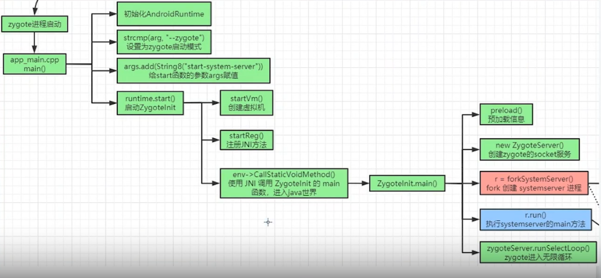
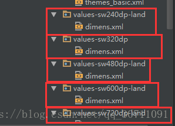
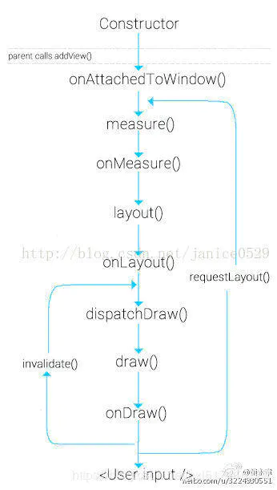
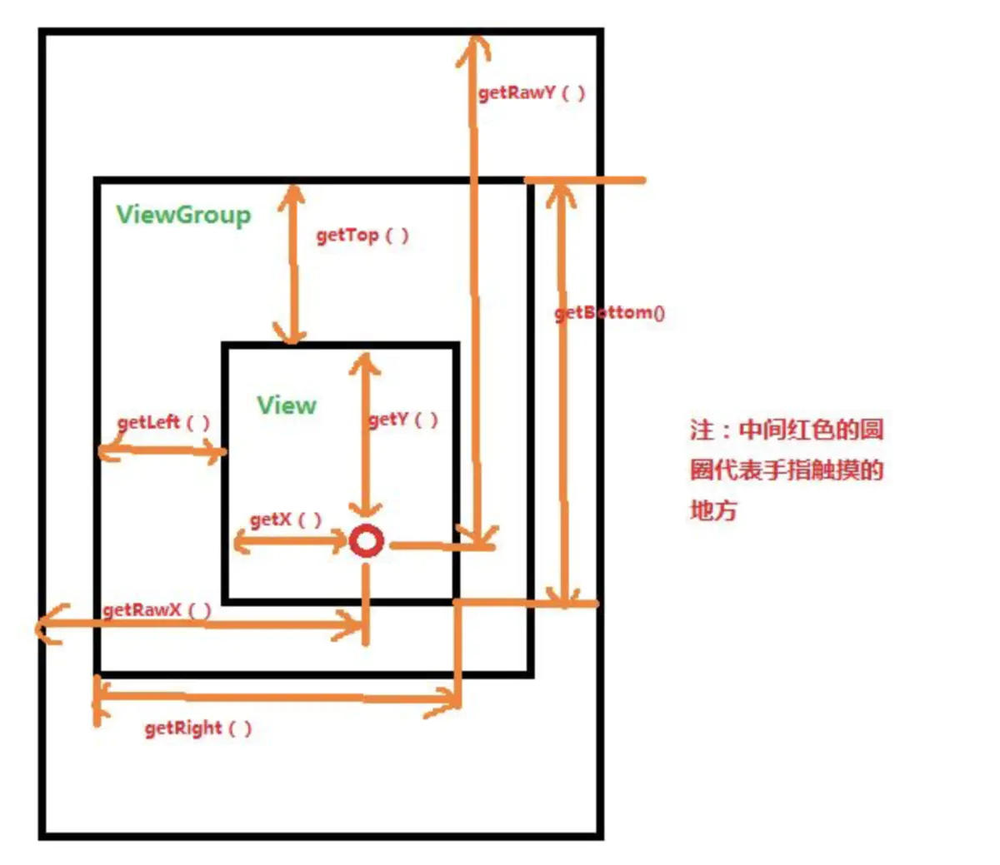
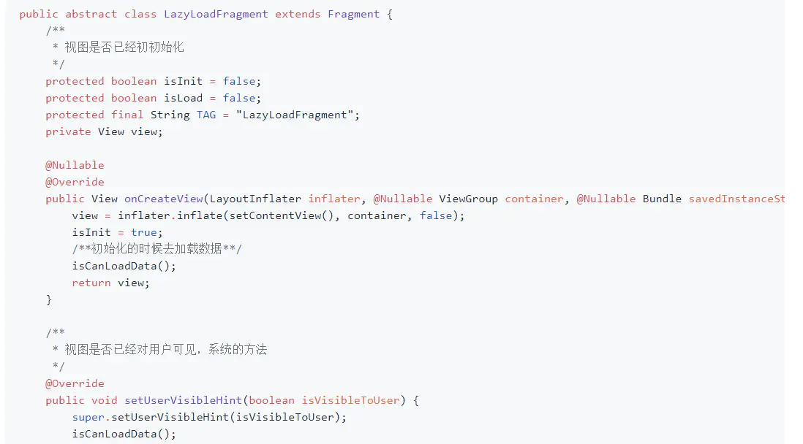

# 0.基础

## 0.1 android体系结构

Andrid系统的体系结构设计为多层结构，这种结构在给用户提供安全保护的同时还保持了开放平台的灵活性。如下图所示：

官方图


Google官方提供的Android系统的四层架构图
应用层，framework，第三方c++库+安卓虚拟机 + java核心库，linux内核层。

正常来说在native层应该还需要加上一层HAL硬件抽象层，硬件厂商驱动可以不开源的情况下提供接口给android系统调用
![[截图20230814163045.png]]
### 一、应用层 Applications

应用层由运行在Android设备上的所有应用构成，包括预装的系统应用和自己安装的第三方应用。**大部分是由Java语言编写并运行在Dalvik虚拟机中，另一部分应用是通过c++/c语言编写的本地应用**。但无论采用何种编程语言，**两类应用运行的安全环境相同，都在应用沙箱中运行**。而程序员正是在这层中，通过Android提供的组件和API进行开发，从而编写出形形色色的app。

### 二、应用框架层 Application Framework

集中体现Android系统系统的组件设计思想，是Android应用开发的核心，为开发者开发应用时提供基础的API框架。框架层由多个系统服务组成。我们知道Android应用是由若干个组件构成，组件与组件之间的通信是通过框架层提供的服务集中调度和传递消息实现的，而不是组件之间直接进行的。

- **View System  主要用于UI设计，包括List、Grid、Text、Button、Webview等。**
- **Activity Manager Service -AMS 负责管理应用程序中的activity的生命周几以及提供activity之间切换功能等 Intent相关。**
- **Windows Manager Service-WMS 用于管理所有的窗口程序，如Dialog、Toast等。**
- Recource Manager 提供非代码资源的管理 如布局文件、图形、字符串资源文件等。
- Location Manager 负责与定位功能相关功能
- Content Providers 提供了一组通用的数据访问接口，可用于应用程序间的内容交互，比如获取手机联系人数据等。
- Notification Manager 用户管理手机状态栏中的自定义信息等。
- Telephony Manager  手机底层功能管理模块，可用于获取手机串号或者调用短信功能
- Pacakage Manager Android系统内的包管理模块，负责管理安装的应用程序。
- XMPP Service 用于主持XMPP协议的服务，比如与Google Talk通信等

### 三、类库层：

主要由类库 Libraries 和Android运行时 Android Runtime 两部分组成：

##### 1.类库 Libraries

 由一系列的二进制**动态库**构成，大部分来源于优秀的第三方类库，另一部分是系统原生类库，通常使用c/c++语言开发。（因为java代码无法直接调用c/c++驱动代码,所以在这一层,系统通过封装了一系列的函数库供上层使用.）以下列举一些比较重要的类库的功能，以供了解：

- Surface Manager: 负责管理显示与存取操作间的互动，另外也负责将2D绘图与3D绘图进行显示上的合成
- Media Framework: 一个开源的多媒体框架,允许我们创造出更高质量与全新的播放器效果
- SQLite: 安卓自带的数据库，是一个嵌入式的数据库
- OpenGL ES: 是 OpenGL 三维图形 API 的子集，针对手机、PDA和游戏主机等嵌入式设备而设计。3D效果库
- FreeType: 一个完全免费（开源）的、高质量的且可移植的字体引擎。支持位图、矢量、字体等
- SGL: 2D图形引擎库
- SSL: 位于TCP/IP协议与各种应用层协议之间，为数据通信提供支持。是安全数据通信的支持。
- WebKit: 是一个开源的浏览器引擎。
- Libc: c层中最基本的函数库

##### 2.Android运行时 Android Runtime 

是由**Java核心类库（Core Libraries）**和**Android虚拟机（Dalvik）**共同构成。

- Java核心类库包括框架层和应用层所用到的基本Java库。
- Dalvik是为Android量身打造的Java虚拟机，它与标准Java虚拟机JVM的差别在于Dalvik是基于寄存器设计的，而JVM是基于栈结构设计的；JVM通过解码class文件（java编译生成的的:.java---.class 的class文件）中的内容来运行程序；而Dalvik运行时是由java字节码文件进一步转化而来的文件，，并被打包成一个DEX可执行文件，Dalvik虚拟机通过解释DEX文件来执行这些字节码 ，即android的class 文件实际上只是编译过程中的中间目标文件，需要链接成dex 文件后才能在dalvik 上运行；Dalvik能够更快的编译较大的应用程序，允许在有限的内存空间中同时运行多个虚拟机的实例，每一个Dalvik应用作为一个独立的Linux进程执行，这样可以防止某一虚拟机崩溃时所有的应用都被关闭。

### 四、系统内核层 Linux Kernel

Android内核 具有和标准的Linux内核 一样的功能，主要实现 
内存管理、
进程调度、
进程间通信（Android增加了一种进程间的通信机制IPC Binder）、
设备驱动（Display Driver: 显示驱动；Camera Driver: 照相机驱动；
Flash Memory Driver: 闪存驱动；
Binder Driver: IPC通讯驱动；
KeyPad Driver: 键映射驱动；
Wifi Driver:Wifi驱动；
Audio Driver:音频驱动；P
ower Management:电量管理驱动）等

###  五,系统启动流程


![[20230814063644.png]]

boot Rom
→ bootloader驱动引导操作系统启动(类似bios）

 - →linux内核启动idle （pid=0）进程（到此启动了linux, 启动各类驱动包括binder，注意此处并不是驱动抽象层）
补充
	- 内核态（Kernel Mode）：运行操作系统程序，操作硬件
	- 用户态（User Mode）：运行用户程序
补充2
	- idle进程，或者也称为swapper进程,0号进程。：
	- 该进程是Linux中的第一个进程（线程），PID为0；
	- idle进程是init进程和k thread d进程（叫 内核线程，用于控制内核相关）的父进程；


- →(navite层) 启动 `init `进程（pid=1），执行Main.cpp ，挂载各种文件（ 用户空间在此初始化
	```cpp
	...
	CHECKCALL(mount("tmpfs", "/dev", "tmpfs", MS_NOSUID, "mode=0755"));
	
	CHECKCALL(mkdir("/dev/pts", 0755));
	
	CHECKCALL(mkdir("/dev/socket", 0755));
	
	CHECKCALL(mkdir("/dev/dm-user", 0755));
	
	CHECKCALL(mount("devpts", "/dev/pts", "devpts", 0, NULL));
	...
	```

- ->(navite层)`init` 进程解析并处理 init.rc
	- init.rc，执行脚本用于后续启动进程（比如zygote以及其启动参数， serviceManager以及其启动参数）和构建文件[init.rc文件概述](#^4cae1a)

- -> 启动serviceManager进程（保存各种binder），早期启动serviceManager为了进程通信 
	- **1）初始化binder驱动**
	- **2）将自身以“manager” 添加到 servicemanager 中的map集合中**
	- **3）注册成为binder驱动的上下问管理者**
	- **4) 给Looper设置callback,进入无限循环，处理client端发来的请求**

- -> 启动zygote（通过init.rc各种参数启动的）（即java进程的鼻祖）并且初始化了一个binder。

- -> zygote启动dvm 虚拟机( AndroidRuntime.startVm()方法，该方法中设置了很多虚拟机参数，比如堆大小等等 )
- -> zygote初始化注册jni（各种动态注册常用jni，例如messagequeue的pollNativeOnce，Bitmap的处理）
	```cpp
	//frameworks/base/core/jni/AndroidRuntime.cpp
	JNIEnv* env;
	if (startVm(&mJavaVM, &env, zygote, primary_zygote) != 0) {//启动虚拟机
	return;
	}
	onVmCreated(env);
	if (startReg(env) < 0) {//注册jni
	ALOGE("Unable to register all android natives\n");
	return;
	}
	```

- -> 反射执行 ZygoteInit.main() 进入java层，執行java代碼

- -> zygoteInit  **perload()加载系统类（各种应用层组件例如Textview），resources资源（例如 字体）
	- peload是一个耗时操作，优化系统启动可以从这里出手
		预加载类和资源
		ZygoteInit#preload()
		
		static void preload() {
		beginIcuCachePinning();
		preloadClasses(); //加载所需的各种class文件
		preloadResources(); //加载资源文件
		preloadOpenGL(); //初始化OpenGL
		preloadSharedLibraries(); //加载系统Libraries
		preloadTextResources(); //加载文字、字體资源


- -> **zygoteInit 创建zygoyeServicer（zygoyeService基于socket通信）*

- -> zygoteInit 通過jni調用  **forkSystemServer()进程 (创建第一个system server进程，之后的ams， atms(API29新增)，pks，wms都是由它创建)
	- **SystemSever负责启动系统的各项服务,Android系统中Java世界的核心 Service都在这里启动**

- -**> 执行systemServer main()
- -> 调用zygote进入死循环监听  socket事件（比如frok app進程）（此处开始产生一些进程lancher，app等）



相关扩展：[[#2.2.1 app启动流程]]
相关扩展：[[#2.2.2 activity启动流程]]

#### 补充点
- （1）新进程fork zygote，能fork zygote中的资源的，dvm，jni等，每个进程就一个binder

- （2）app请求zygote fork进程使用socket而不是用binder，因为binder支持异步调用（是有綫程池的），binder只有一个，调用的是zygote的binder，这个时候可能会等待binder的锁，**這時fork一個新进程，那麽他的的binder也可能在锁，但是无人通知，就会造成新进程binder死锁。


##### ServiceManager
//一个独立的守护进程，管理了所有binder，即binder服务管家
	- **1）初始化binder驱动**
	- **2）将自身以“manager” 添加到 servicemanager 中的map集合中**
	- **3）注册成为binder驱动的上下问管理者**
	- **4) 给Looper设置callback,进入无限循环，处理client端发来的请求**
##### Systemserver
- 系统服务进程，启动了systemService
- systemServerManager管理SysytemService
- **各类service由`systemServerManager`管理，创建就添加到systemservicemanger中，获取也是通过systemservicemanger的binder获取service**
- 所有服务继承SysytemService
- 各类service创建后 publish 他的 binder 到`ServiceManager`进程
- 问题就存在了，各类service都是在`Systemserver`进程中的，通过Binder通信，binder由`ServiceManager`进程的`servicemanager`管理。


####（4 init.rc概述 ^4cae1a

init是由Android的Linux内核启动的第一个第一个进程，这个进程非常特殊，**它的PID永远是1**，并且这个进程是不会死亡的，如果它死亡，内核就会崩溃，
init.rc是一个规定init进程行为和动作的配置文件。init进程可以做哪些事情，都由它规定。
init.rc 文件并不是普通的配置文件，而是由一种被称为“Android初始化语言”（Android Init Language，这里简称为AIL）的脚本写成的文件。
该文件在ROM中是只读的，即使有了root权限，可以修改该文件也没有。
因为我们在根目录看到的文件只是内存文件的镜像。也就是说，android启动后，会将init.rc文件装载到内存。而修改init.rc文件的内容实际上只是修改内存中的init.rc文件的内容。
一旦重启android，init.rc文件的内容又会恢复到最初的装载。想彻底修改init.rc文件内容的唯一方式是**修改Android的ROM中的内核镜像。init.rc只是语法文件，并不是程序，真正的入口则是上面提到的system/core/init/init.c 。**

## 1.Android 四大组件,五大存储，六大布局

### 1.总体简介：
https://www.cnblogs.com/tsingke/p/9007563.html

### 2.Content Provider
由于Android系统中，数据基本都是私有的，处于一个沙箱环境，都是存放于“data/data/程序包名”目录下，所以要实现数据共享contentprovider是正确操作。
底层也是通过binder进行app进程间通信

[content Provide](https://www.jianshu.com/p/5e13d1fec9c9)
声明：
```xml
  <provider
	        android:authorities="com.jrmf360.studentProvider"//主机地址
        android:name=".MyContentProvider"
        android:exported="true"/>
```

```java
//服务端
public class MyContentProvider extends ContentProvider {
    public MyContentProvider() {
    }

    @Override
    public boolean onCreate() {
        // TODO: Implement this to initialize your content provider on startup.
        return false;
    }

    @Override
    public Cursor query(Uri uri, String[] projection, String selection,
                        String[] selectionArgs, String sortOrder) {
        // TODO: Implement this to handle query requests from clients.
        throw new UnsupportedOperationException("Not yet implemented");
    }

    @Override
    public String getType(Uri uri) {
        // TODO: Implement this to handle requests for the MIME type of the data
        // at the given URI.
        throw new UnsupportedOperationException("Not yet implemented");
    }

    @Override
    public Uri insert(Uri uri, ContentValues values) {
        // TODO: Implement this to handle requests to insert a new row.
        throw new UnsupportedOperationException("Not yet implemented");
    }

    @Override
    public int delete(Uri uri, String selection, String[] selectionArgs) {
        // Implement this to handle requests to delete one or more rows.
        throw new UnsupportedOperationException("Not yet implemented");
    }

    @Override
    public int update(Uri uri, ContentValues values, String selection,
                      String[] selectionArgs) {
        // TODO: Implement this to handle requests to update one or more rows.
        throw new UnsupportedOperationException("Not yet implemented");
    }
}
```

客户端访问:通过ContentResolver和uri访问对应的方法

```java
//根据号码获取联系人的姓名
public void getContactNameByNumber() throws Exception {
    ContentResolver resolver = getContentResolver();
    Cursor cursor = resolver.query(ContactsContract.Contacts.CONTENT_URI, new String[]{ContactsContract.Data.DISPLAY_NAME}, null, null, null);
    if(cursor.moveToFirst()){
        String name = cursor.getString(0);
        Log.i(TAG, name);
    }
    cursor.close();
}
```


### sharedPrefenrence:(简介， 详细对比见39)

 SP 的底层是由Xml来实现的，操作SP的过程就是Xml的序列化和解析的过程。Xml是存储在磁盘上的，因此当我们频繁进行SP操作时，就是频繁进行序列化与解析，这就频繁进行I/O的操作，所以肯定会导致性能消耗。同时**序列化Xml是就是将内存中的数据写到Xml文件中**，由于DVM 的内存是很有限的，因此单个SP文件不建议太大，具体多大是没有一个具体的要求的，但是我们知道DVM 堆内存也就是**16M**，因此数据大小肯定不能超过这个数字的。其实 SP 设置的目的就是为了保存用户的偏好和配置信息的

post，commit，同步和异步，都会阻塞
【相关联系】
[[#17.SharedPreferences]]
[[#39.MMKV 与SP]]


### SQLite
SQLite是一个轻量级的数据库，支持基本SQL语法，是常被采用的一种数据存储方式。Android为此数据库提供了一个名为SQLiteDatabase的类，封装了一些操作数据库的API
### 3. 布局面试
[布局对比和常见面试问题](https://www.dandelioncloud.cn/article/details/1546584614565527554)
- xmlns：android是XML中的命名空间，为了防止属性冲突。类似于Java中的package。xmlns：android的值是不允许任意设置的。xmlns：android的是必须是以“http://schemas.android.com/apk/res”开始，后面的部分表示定义属性R.java文件所在的包名。在R.java文件中包含了属性名的定义。例如，如果使用系统属性，需要指定系统R.java文件的位置。该文件位于res\android目录中，因此，xmlns：android值的最后是android。


### 广播BroadCastReciever: 

7.0 开始移除了三项隐式广播，其中包括了网络状态的广播

**Android8.0开始，Android将不支持大部分隐式广播，包括自定义的广播和系统的。
	**1.改为带签名权限的广播。因为这些广播只会发送到使用相同证书签名的应用，而不是发送到设备上的所有应用。
	2.动态注册而不是在清单文件中注册

**需要通过context.regeister的方式注册。**

## 1.1 存储路径

### 一.getCacheDir、getCacheDir

> getCacheDir()方法用于获取/data/data//cache目录 
>  getFilesDir()方法用于获取/data/data//files目录


### 二.getExternalFilesDir、getExternalCacheDir(android10之后的方式)


应用程序在运行的过程中如果需要向手机上保存数据，一般是把数据保存在SDcard中的。大部分应用是直接在SDCard的根目录下创建一个文件夹，然后把数据保存在该文件夹中。这样当该应用被卸载后，这些数据还保留在SDCard中，留下了垃圾数据。如果你想让你的应用被卸后，与该应用相关的数据也清除掉，该怎么办呢？

- 通过Context.getExternalFilesDir()方法可以获取到 SDCard/Android/data/你的应用的包名/files/ 目录，一般放一些长时间保存的数据
通过Context.getExternalCacheDir()方法可以获取到  SDCard/Android/data/你的应用包名/cache/目录，一般存放临时缓存数据.如果使用上面的方法，当你的应用在被用户卸载后，SDCard/Android/data/你的应用的包名/ 这个目录下的所有文件都会被删除，不会留下垃圾信息。


而且上面二个目录分别对应 设置->应用->应用详情里面的”清除数据“与”清除缓存“选项 
如果要保存下载的内容，就不要放在以上目录下

#### filePath放在哪个文件夹

```java
Environment.getDataDirectory() = /data


Environment.getDownloadCacheDirectory() = /cache(android10 api29之前)
Environment.getExternalStoragePublicDirectory() = /mnt/sdcard(android10 api29之前)
Environment.getExternalStoragePublicDirectory(“test”) = /mnt/sdcard/test(android10 api29之前)

/**
在使用Android SDK 版本超过29编译的时候，Android Studio会提示Environment.getExternalStorageDirectory()过时了，要用Context#getExternalFilesDir代替，Android Q以后Environment.getExternalStorageDirectory()返回的路径可能无法直接访问，所以改成了Context#getExternalFilesDir
**/

Environment.getRootDirectory() = /system

getPackageCodePath() = /data/app/com.my.app-1.apk
getPackageResourcePath() = /data/app/com.my.app-1.apk
getCacheDir() = /data/data/com.my.app/cache
getDatabasePath(“test”) = /data/data/com.my.app/databases/test
getDir(“test”, Context.MODE_PRIVATE) = /data/data/com.my.app/app_test
getExternalCacheDir() = /mnt/sdcard/Android/data/com.my.app/cache(android10 api29之后)
getExternalFilesDir(“test”) = /mnt/sdcard/Android/data/com.my.app/files/test(android10 api29之后)
getExternalFilesDir(null) = /mnt/sdcard/Android/data/com.my.app/files(android10 api29之后)
getFilesDir() = /data/data/com.my.app/files
```

应用包下的存储都不需要存储权限申请

### 1.1.3 分区存储


Android 10 /11之后，Google首次引入了分区存储，将公共区域划分成了不同的集合，并且在媒体文件和其他文档之间建立了清楚的分割。**经过划分之后应用不可以随意访问外部存储区中的文件，而只能访问媒体文件**。
 * 1.应用私有目录：存储应用私有数据，外部存储应用私有目录对应Android/data/packagename，内部存储应用私有目录对应data/data/packagename；
 * 2.共享目录：**存储其他应用可访问文件**， 包含媒体文件、文档文件以及其他文件，对应设备DCIM、Pictures、Alarms, Music, Notifications,Podcasts, Ringtones、Movies、Download等目录。
 * Android 11 (API 级别 30) 进一步增强了平台功能，为外部存储中的应用和用户数据提供了更好的保护。
 * 从 Android 11 开始，使用 分区存储模式 的应用即使拥有 READ_EXTERNAL_STORAGE 权限，**也无法再访问 外部存储 中的任何其他应用的 专属目录（Android\data） 中的文件**，受此影响应用间分享就需要使用通过应用间共享文件**适配的方式（ FileProvider进行分享），通过FileProvider，就允许第三方应用读取你的应用所分享的文件，而不会受到分区存储的限制**。

## 2.java和android的字节

Java的数据类型：

1. 整型

byte     1个字节
short   2个字节
int        4个字节
**long    8个字节**

2. 实型

float      4个字节
double 8个字节

3.字符型

**char      2个字节**

3.对象型

Java中数组和String类型的都被解释为对象

4.其它

Boolean 可以认为boolean型占八分之一个字节,即1bit，但是它的大小是不明确的，视编译器而定

 

android数据类型所占字节数：

 **1.char             1个字节**

 2.int                 4个字节  （默认有符号）

 3. **long            4个字节** 

 4.long long    8个字节

 5.short            2个字节

 6.int 64_t        8个字节

 7.uint 8_t        1个字节

原文链接：https://blog.csdn.net/ludongdong/article/details/20839531

## 3. Android版本特性简述

- ### **5.0 art**

- ### 6.0

动态权限 ，引入了Doze机制和应用程序待机。当屏幕关闭且设备静止时, 打盹模式会限制应用程序的行为。应用程序待机将未使用的应用程序置于限制其网络访问、作业和同步的特殊状态。

- ### 7.0

分屏 分享私有要使用fileprovider

- ### 8.0多显示器

系统不允许后台应用创建后台服务（service）。因此Android 8.0引入了一种全新的方法，即 Context.startForegroundService()，以在前台启动新服务。
workmanager和schedulerjob进行轮询。
在系统创建服务后，应用有五秒的时间来调用该服务的 startForeground()方法以显示新服务的用户可见通知。如果应用在此时间限制内未调用startForeground()，则系统将停止服务并声明此应用为ANR。
原文链接：https://blog.csdn.net/haoyuegongzi/article/details/112000275

- ### 9.0支持刘海屏


10.0  android10以上禁止获取deviceId，可以通过获取AndroidID(无需权限，缺点时重置系统会重置)

```
private fun getAndroidID() {
    val androidID = Settings.System.getString(
        contentResolver, Settings.Secure.ANDROID_ID
    )
    Log.i(TAG, "AndroidID为:$androidID")
}

```

5G和可折叠 

分区存储

- ### 10.0 

10.0  android10以上禁止获取deviceId，可以通过获取AndroidID(无需权限，缺点时重置系统会重置)

```
private fun getAndroidID() {
    val androidID = Settings.System.getString(
        contentResolver, Settings.Secure.ANDROID_ID
    )
    Log.i(TAG, "AndroidID为:$androidID")
}

```


 5G和可折叠

- 对储存的更新：分区储存

	**旧版本：**
	**获取外部存储目录**

	**函数使用：**getExternalStorageDirectory()

	**获取外部存储公共目录**
	**函数使用：**getExternalStoragePublicDirectory()

	**新版本**
	在使用Android SDK 版本超过29编译的时候，Android Studio会提示[Environment](https://so.csdn.net/so/search?q=Environment&spm=1001.2101.3001.7020).getExternalStorageDirectory()过时了，要用Context#getExternalFilesDir代替，Android Q以后Environment.getExternalStorageDirectory()返回的路径可能无法直接访问，所以改成了Context#getExternalFilesDir

Android 10 之前的文件系统 , 内存分为两块 , 应用私有目录 , 和 [共享存储](https://cloud.tencent.com/product/cfs?from_column=20421&from=20421)空间 ;

**私有目录 :** 只能保存本应用的数据 , 其它应用无法读写该目录中的数据 , 应用卸载时 , 该目录自动删除 ;

**共享存储空间 :** 所有的应用都可以随意访问 , 随意读写该区域内的数据 , 数据可以任意放置 , 删除 , 修改 ; 应用卸载时写出到该区域的数据不会被删除 ;

任何目录可以存储任何类型文件 , 可以将图片存储到 Movies , 视频存储到 Music 目录中 ;

共享存储空间 绝对是个 天坑 , 能不用尽量不用

**Android** 10 **及以后的文件系统 :**

**私有目录 :** 与之前保持一致 , 只能保存本应用的数据 , 其它应用无法读写该目录中的数据 , 应用卸载时 , 该目录自动删除 ; 即沙盒目录。/data/data/#apppackname#下的目录

**共享存储空间 :** Google 官方对该存储区域进行了统一规划 , Android 11 中 , 每个目录存储什么类型的文件 , 都有相应规范 , 文件不能乱放置 ;

[**文件存储**](https://cloud.tencent.com/product/cfs?from_column=20421&from=20421)**类型限制 :** 文件一旦放错位置 , 就会抛异常 ;

	- 专门存储 图片文件 的目录 Pictures , 只能存放图片 , 不能存放其它类型文件 ,
	- 专门存储 视频文件 的目录 Movies , 只能存视频文件 ;
	- 专门存储音频文件的目录 Music , 只能存储音频文件 ;
	- 专门存储文档文件的目录 Document , 只能存储文档相关文件 ;
	- Download 目录可以放置任何类型的文件 ;

- ### 11 
	-支持一次性权限

强制分区存储

强制分区存储

https://www.jianshu.com/p/7875ac6139a3

https://www.jianshu.com/p/7155b224ddfc

Android 11之后，储存权限更加严格，添加了一条叫做`MANAGE_EXTERNAL_STORAGE`的权限，用来管理整个文件系统，才能访问文件。
我们不难发现当我们申请 ==MANAGE_EXTERNAL_STORAGE 管理外部存储权限== 后，完全可以当做之前外部存储的方式去读取，完美解决沙盒模式对拿取外部的非APP创建的文件的困扰。

代码中用 ==Environment.isExternalStorageManager()== 来判断APP是否拥有该权限，若无此权限，则将页面手动跳转至设置页面，让用户手动打开该权限，

==PS.若小伙伴们需要把APP发布到谷歌商店中，慎重使用该权限，因为该权限本为浏览器或本地文件操作器类型的APP设计，所以一般APP申请该权限，谷歌可能不会同意。==

**Android** 11**（API 级别** 30**） 之后的存储机制 :
** Android 中所有文件存储 , 都会将文件的索引存储在[数据库](https://cloud.tencent.com/solution/database?from_column=20421&from=20421)中 , 在 /data/data/com.android.providers.media **目录下的文件就是专门用于管理该数据库的 ;需要使用 MediaStore 进行文件操作,无法直接使用new file()，但是可以复制到沙盒空间中（data下)进行new file**


- 13.0

## 4.apk打包流程

![[61ba2c433839491ea9256f81bf4dabd3.png]]

dex生成、instant run等看 [[#45.热修复]]


### 1.打包资源文件，生成R.java文件

aapt（打包工具Android Asset Packaging Tool）来打包res资源文件，生成R.java、resources.arsc和res文件。

**AAPT2**（Android 资源打包工具）是一种构建工具，Android Studio 和 Android Gradle 插件使用它来编译和打包应用的[资源](https://link.zhihu.com/?target=https%3A//developer.android.com/guide/topics/resources/providing-resources)。AAPT2 会解析资源、为资源编制索引，并将资源编译为针对 Android 平台进行过优化的二进制格式。

Android Gradle 插件 3.0.0 及更高版本默认情况下会启用 AAPT2，因此您通常不需要自行调用 aapt2。不过，如果您更愿意使用自己的终端和构建系统而不是 Android Studio，则可以从命令行使用 AAPT2。


### 2.处理aidl文件，生成相应的Java文件

aidl（Android Interface Definition Language，Android接口描述语言），位于android-sdk/platform-tools目录下。aidl工具解析接口定义文件然后生成相应的Java代码接口供程序调用。如果项目没用到aidl则跳过这一步。

### 3.编译项目源代码，生成class文件

Java Compiler阶段。项目中所有的Java代码，包括R.java和.aidl文件，都会变Java编译器（javac）编译成.class文件，生成的class文件位于工程中的bin/classes目录下。

### 4.转换所有的class文件，生成classes.dex文件

dex阶段。通过dx工具，将.class文件和第三方库中的.class文件处理生成classes.dex文件。该工具位于android-sdk/platform-tools 目录下。dx工具的主要工作是将Java字节码转成成Dalvik字节码、压缩常量池、消除冗余信息等。

### 5.打包生成APK文件

apkbuilder阶段。通过apkbuilder工具，将aapt生成的resources.arsc和res文件、assets文件和classes.dex一起打包生成apk。打包的工具apkbuilder位于 android-sdk/tools目录下。

### 6.对APK文件进行签名

Jarsigner阶段。通过Jarsigner工具，对上面的apk进行debug或release签名。


### 7. 对签名后的APK文件进行对齐处理

通过zipalign工具，将签名后的apk进行对齐处理。工具位于android-sdk/tools目录下。对齐的主要过程是将APK包中所有的资源文件距离文件起始偏移为4字节整数倍，这样通过内存映射访问apk文件时的速度会更快。对齐的作用就是减少运行时内存的使用。


## 5.apk文件结构

 

apk是一个压缩包，里面有lib，META-INF，classes.dex，res，resources.arsc文件夹和文件 

**lib**	放的是so动态链接库	apk打包不需要处理的动态库
**META-INF**	签名文件夹	三个签名证书（MANIFEST.MF、CERT.SF、CERT.RSA）。MANIFEST.MF文件是对每个文件的SHA-256-Digest；CERT.SF是对每个文件的头3行进行SHA-256-Digest；CERT.RSA这个文件保存了签名和公钥证书。
**classes.dex**	执行文件	java编译后的Android可执行的dex文件
**AndroidManifest.xml**	声明文件	记录应用的名字、版本、权限、引用的库文件等信息
**res**	资源文件	有**animator,anim,color,drawable,layout,menu，raw等文件夹**
**resources.arsc**	编译后的二进制资源文件	记录了所有的**应用程序资源目录的信息**，包括每一个资源名称、类型、值、ID以及所配置的维度信息。 这是一个索引文件。

## 6.build优化加速

https://developer.android.com/studio/build/optimize-your-build?hl=zh-cn
#### 避免编译不必要的资源

避免编译和打包不测试的资源（例如，其他语言本地化和屏幕密度资源）。您可以仅为“dev”变种的版本指定一个语言资源和屏幕密度，如下面的示例中所示：比如某个版本不需要某些语言，那么配置对应productFlavors，debug下可能很多都不需要都可以去除

```java
android {    ...  
productFlavors {        
		dev {      
			// The following configuration limits the "dev" flavor to using            
			// English stringresources and xxhdpi screen-density resources.            
			resourceConfigurations "en", "xxhdpi"        }     
	...    }  
}
```

### 代码仓库
优先使用国内仓库，依赖的版本也写成固定的版本号，而不是动态的版本号，这样不用每次都打包都会去检查更新，而且最新版可能会导致一些报错或者bug。


### 将图片转换为 WebP 格式
[WebP](https://developers.google.com/speed/webp/?hl=zh-cn) 是一种既可以提供有损压缩（像 JPEG 一样）也可以提供透明度（像 PNG 一样）的图片文件格式，不过与 JPEG 或 PNG 相比，WebP 格式可以提供更好的压缩。

减小图片文件大小可以加快构建速度（无需在构建时进行压缩），尤其是当应用使用大量图片资源时。不过，在解压缩 WebP 图片时，cpu使用率会有所上升。

### 开启并行编译
开启后可以多个编译task并行运行·
只需要在gradle.properties中添加：

> org.gradle.parallel=true

### 增量式编译
Gradle的增量式构建特性紧紧的与生命周期相结合。Gradle的增量式构建支持自动鉴别不需要被运行的任务。这些任务会被标记为 UP-TO-DATE。特别是在大型的企业级项目，这个特性是节约时间的好帮手。

**Gradle通过比较两次构建task的inputs和outputs来决定task是否是最新的。自从最后一次task执行以来，如果inputs和outputs没有发生变化，则认为task是最新的。**

### **增大编译内存**

由于大家的电脑配置都不一样，因此具体设置多大内存需要根据个人情况进行合理配置，一般在**gradle.properties**里已经有相关配置，可以对该配置进行修改，例如

```java
org.gradle.jvmargs=-Xmx4096m -XX:MaxPermSize=512m -XX:+HeapDumpOnOutOfMemoryError -Dfile.encoding=UTF-8

```

同时在主工程模块的build.gradle中进行修改：

```java
    dexOptions {
        javaMaxHeapSize "4g"
    }

```
### 组件化
可以采用组件化的形式，只打包对应的模块。这样debug的时候就不用整个项目都运行。
### **开启按需构建**  
对没有更改的模块不再进行编译，非常适合已经组件化的项目，在gradle.properties中添加：

```java
org.gradle.configureondemand=true
```
### **关闭R文件传递**  
在 apk 打包的过程中，module 中的 R 文件采用对依赖库的R进行累计叠加的方式生成。如果我们的 app 架构如下：

编译打包时每个模块生成的R文件如下：

```java
1. R_lib1 = R_lib1;
2. R_lib2 = R_lib2;
3. R_lib3 = R_lib3;
4. R_biz1 = R_lib1 + R_lib2 + R_lib3 + R_biz1(biz1本身的R)
5. R_biz2 = R_lib2 + R_lib3 + R_biz2(biz2本身的R)
6. R_app = R_lib1 + R_lib2 + R_lib3 + R_biz1 + R_biz2 + R_app(app本身R)

```

** 1.关闭R文件传递可以通过编译避免的方式获得更快的编译速度  **
2.关闭R文件传递有助于**确保每个模块的R类仅包含对其自身资源的引用**，避免无意中引用其他模块资源，**明确模块边界**。  
3.关闭R文件传递也可以**减少很大一部分包体积与dex数量**

从 Android Studio Bumblebee 开始，新项目的非传递 R 类默认处于开启状态。即
gradle.properties
文件中都开启了如下标记

```java
android.nonTransitiveRClass=true
```
### **开启Kotlin跨模块增量编译**  
使用组件化多模块开发的同学都有经验，当我们修改底层模块(比如util模块)时，所有依赖于这个模块的上层模块都需要重新编译，Kotlin的增量编译在这种情况往往是不生效的，这种时候的编译往往非常耗时。

在Kotlin 1.7.0中，Kotlin编译器对于跨模块增量编译也做了支持，并且与Gradle构建缓存兼容，对编译避免的支持也得到了改进。这些改进减少了模块和文件重新编译的次数，让整体编译更加迅速。

在 gradle.properties 文件中设置以下选项即可使用新方式进行增量编译：

```java
kotlin.incremental.useClasspathSnapshot=true // 开启跨模块增量编译
kotlin.build.report.output=file // 可选，启用构建报告

```


### **Module源码转aar**  
随着业务量的增大，module的引入也会增多，每个module在编译的时候都需要花费一定的时间。把module转化成aar后就不再需要每次都进行编译或者取缓存，可以减少一部分时间。
### KAPT升级到KSP
如果用了很多注解框架，ARouter，butterknife，retrofit等等，可以将kapt升级到ksp，生成代码的过程中少了生产java stub的中间类的过程，节省了时间空间。
### transform 优化

#### 背景

transform 作为 Android gradle plugin 提供给开发者的 API，用于在 apk 构建过程中，对 class 字节码，resources 等文件内容进行插桩修改，例如官方的 dex, proguard 等功能均由此 api 实现。

对于今日头条这种大型工程来说，有很多诸如性能插桩、自动埋点插桩等相关需求，因此基于此 api 开发了大量 transform，用于实现特定功能，但是这些 transform 基本上都是不支持增量编译的，即使只改动了一行代码，这 些 transform 都会遍历所有 class 文件，解析字节码中的方法字段信息，关键是这类 transform 数量有十几个，将这些遍历耗时乘以 10 累加之后，增量编译耗时自然居高不下。

根据分析，**其中性能插桩等相关 transform 做的一些面向线上的插桩方案是完全可以只在 release 打包时打开的，因此可以直接在 debug 编译时禁用这些功能，用于提升开发期间的编译速度。**而剩下的 9 个 transform 特征比较相似，可能在一些插桩细节上有所不同，它们大致的处理逻辑为：

  
1. 在各个模块中使用 apt processor 收集模块 xx 注解的 class 信息然后生成一个 xxCollect 类，该类的作用是收集好 apt 阶段解析到的本模块的类信息
    
2. 将所有模块收集到的信息进行汇总，利用 transform 阶段扫描出所有的 xxCollect 信息，通过 javaassit 或者 asm 往一个 xxCollectMgr 的某个 collectXxx 方法插桩注入之前收到的信息
    

3. 业务代码可通过 xxCollectMgr 的 collectXxx 方法获取到在各个模块动态生成的所有 xxCollect 信息。（例: 页面路由相关框架便是通过该逻辑收集到所有子模块的路由注册信息)

由于这 9 个自定义 transform 的功能如此类似，便决定将这些 transform 合并成一个，这样同一个文件的读写操作只执行一次，并且可以做定制化的增量编译优化。虽然公司内有类似的 transform 合并优化方案 byteX ( 已在 github 开源），但是由于今日头条项目在 debug 阶段未开启该功能，且 ByteX 做了一些诸如 ClassGrapth 的构建，对类文件做两次遍历等操作，对于实现类信息收集和信息注入 这个功能来说，byteX 显得比较重 ，于是仍然针对类信息收集注入功能这个细分场景开发了一个收敛框架。
## 7.ADB常用命令

——查看ADB版本：adb version

——查看手机设备：adb devices

——查看设备型号：adb shell getprop ro.product.model

——查看电池信息：adb shell dumpsys battery

——查看设备ID：adb shell settings get secure android_id

——查看设备IMEI：adb shell dumpsys iphonesubinfo

——查看Android版本：adb shell getprop ro.build.version.release

——查看手机网络信息：adb shell ifconfig

——查看设备日志：adb logcat

——重启手机设备：adb reboot

——安装一个apk：adb install /path/demo.apk

——卸载一个apk：adb uninstall

——查看系统运行进程：adb shell ps

——查看系统磁盘情况：adb shell ls /path/

——手机设备截屏：adb shell screencap -p /sdcard/aa.png
https://blog.51cto.com/u_15296378/3087781

## 8. 唯一标识符

AndroidID：根据硬件信息系统信息和操作系统版本号等等。Android ID是在设备首次启动时生成的。获取无需权限。

IMEI,MEID（deviceid一般是）: 和手机支持的网络制式相关，注意：Android10以上禁止获取IMEI，因为需要READ_PRIVILEGED_PHONE_STATE权限，而该权限只能是系统应用才可以获取到。

OAID(推荐):移动安全联盟（中国通讯院）和各个国内厂商推出的设备识别字段。不需要权限，引入lib支持，仅安卓10以上。

# 1. Context

上下文，可以这么理解，context是存储了当前activity/application中的各种配置信息，资源读取等等，是与参与app内容和资源管理的代理者。

# 2. Activity

## 2.1 app启动方式

**冷启动**：当启动应用时，**后台没有该应用的进程**，这时系统会重新创建一个新的进程分配给该应用，这个启动方式就是冷启动。冷启动因为系统会重新创建一个新的进程分配给它，所以会先创建和初始化Application类，再创建和初始化MainActivity类（包括一系列的测量、布局、绘制），最后显示在界面上。 


**热启动：**当启动应用时，后台**已有该应用的进程（例：按back键、home键，应用虽然会退出，但是该应用的进程是依然会保留在后台，可进入任务列表查看）**，所以在已有进程的情况下，这种启动会从已有的进程中来启动应用，这个方式叫热启动。

热启动因为会从已有的进程中来启动，所以热启动就不会走Application这步了，而是直接走MainActivity（包括一系列的测量、布局、绘制），所以热启动的过程只需要**创建和初始化一个MainActivity就行了**，而不必创建和初始化Application，因为一个应用从新进程的创建到进程的销毁，Application只会初始化一次。 


## 2.2 Activity生命周期和启动流程
相关扩展：[[#五,系统启动流程]]

onCreate  onStar() onResume  开始绘制 -> 切换界面->onPasue

->onStop ->onDestory

onCreate（saveInstanceState）  参数里-> 恢复

锁屏 onPause()->onStop()


onSaveInstanceState()在生命周期结束前会调用该方法保存状态，

将状态数据以key-value的形式放入到savedInstanceState中 


onCreat() 不可见不可交互 创建时调用

onStart()是activity界面被显示出来的时候执行的，用户可见，包括有一个activity在他上面，但没有将它完全覆盖，用户可以看到部分activity但不能与它交互    创建时或者从后台重新回到前台时调用


下面这三个状态是静态（static）的，意味着activity只有在这三个状态下能停留一段时间：

onResume()是该activity与用户能进行交互时被执行，用户可以获得activity的焦点，能够与用户交互。

​            创建或者从被覆盖、后台重新回到前台时被调用 

onPause() 可见不可交互（部分可见），不能接收用户输入也不能执行代码，另一个半透明或者小的activity正挡在前面。

​                        被覆盖到下面或者锁屏时被调用 

onStop() 不可见不可交互失去焦点，activity完全被遮挡，不能被用户看到，activity被认为在background，当Stopped的时候，activity实例的状态信息被保留，但是不能执行任何代码。

​                         退出当前Activity或者跳转到新Activity时被调用 


onRestart() 从不可见到可见   

onDestory() 销毁activity     退出当前Activity时被调用,调用之后Activity就结束了


### 2.2.1 app启动流程
相关扩展[[#五,系统启动流程]]
相关扩展[[#2.2.2 activity启动流程]]
#### 流程：

**app启动流程** 
- >** launcher通过SERVICE_MANAGER获取ams**
- >通知ams通知要启动一个activity 
- > ams通过binder通知**launcher进入** **pause状态**
- > launcher通过binder**通知准备就绪** 
- > **AMS创建一个ActivityThread实例**(其实是一个binder) 
 - > acitvitythread返回一个**applicationThread类型的binder**用于activityThread与ams通信。(调用ams attch （）进行绑定)

- > ams通知activityThread调用mian方法 

- > ams将入口activity信息传递给app

 - > app启动对应入口的activity , 并创建对应applicationContext，并调用onCreate方法


#### 常见问题：

App启动白屏或黑屏的原因：是因为已进入到Activity,但是布局未加载到window中，**就先显示来windows窗口的背景。黑屏/白屏就是显示的windows背景（这个就是theme的设置）**

**App启动白屏或黑屏解决方案**：

(1) 为Theme设置背景图(会给人一种快速加载的感觉)

<stylename="Theme.AppStartLoad"parent="android:Theme">

<itemname="android:windowBackground">@drawable/ipod_bg</item>

<itemname="android:windowNoTitle">true</item>

</style>

(2) 为Theme设置透明属性(会给人较慢加载出来感觉)

<stylename="Theme.AppStartLoadTranslucent"parent="android:Theme">

<itemname="android:windowIsTranslucent">true</item>

<itemname="android:windowNoTitle">true</item>

</style>

App的启动优化：

	(1) Application的创建过程中尽量少的进行耗时操作（創建application）

	(2) 如果用到SharePreference,尽量在异步线程中操作

	(3) 减少布局的层次,并且生命周期回调的方法中尽量减少耗时的操作（解析viewtree）


### 2.2.2 activity启动流程

如果是桌面图标
->那么就是通过lancher.java
->strartctivtiy
-》execStartActivities
-》ActivtiyThread
-》handleLaunchActivity()
-》performLanchActivity()
-》mInstrumentation。newActivtiy创建对象activtiy
-》创建appliction（现有activity再有appliction）
-》（調用activtiy.ATTCH（传入了大量参数，instrument等等）**在attch中創建phonewindo，wm**）

-》(mInstrumentation.callActivityOnCreate
-》setContentView解析xml構建viewtree))
-》**ActivtiyThread.handlePerfromResume()
-> 进入ui绘制流程，此时decodview才添加到**wm中，开始显示界面

- （1）黑白屏原因在创建appliction+oncreate+setcontentview

- （2）子线程setTextview不一定报错，如果在onCreate中，不会报错，但是等到resume之后就会报错


### 2.2.3 **ActivityServiceManger/AMS**
Framework层非常重要的一个service。用于启动和管理四大组件以及他们的生命周期


## 2.3 APP重启

```JAVA
// android.os.Process.killProcess(android.os.Process.myPid());//清空所有资源，包括线程
//但会保留某些后进程,例如:Service,Notifications等
//如果使用system.exit()是重启java虚拟机
//如果在activity栈顶，则会直接退出，否则framework会重新创建进程

//ActivityManager manager = (ActivityManager)context.getSystemService(ACTIVITY_SERVICE); 
//获取应用程序管理器
//manager.killBackgroundProcesses(getPackageName()); //强制结束当前应用程序
//这种方式退出应用，会结束本应用程序的一切活动,因为本方法会根据应用程序的包名杀死所有进程包括
//Activity,Service,Notifications等
 Intent i =new Intent(getBaseContext(), StartActivity.class);
 i.addFlags(Intent.FLAG_ACTIVITY_CLEAR_TOP);
 startActivity(i);
```

### 

## 2.4 保持数据

**正常情况下Activity的创建和销毁不会调用onSaveInstanceState和onRestoreInstanceState方法。** 

**当横竖屏切换时，Activity会被销毁，生命周期方法onPause, onStop, onDestory等均会被调用**，此时Activity属于异常情况下终止的，所以系统会调用onSaveInstanceState方法对Activity的状态进行保存。该方法在onStop之前调用，与onPause没有既定的时序关系。
**当出现Crash时，除了其他的生命周期方法不会执行外，也会执行保存数据的操作。**


```
// 此方法用来保存当前异常退出的Activity的数据 ，bundle存入数据
 override fun onSaveInstanceState(outState: Bundle?, outPersistentState: PersistableBundle?) {
        super.onSaveInstanceState(outState, outPersistentState)
    }

	// 此方法用来重载当前异常退出的Activity的数据
override fun onRestoreInstanceState(savedInstanceState: Bundle?) {
        super.onRestoreInstanceState(savedInstanceState)
    }
```

## 2.5 Activtiy任务栈


# 3.Service

服务中的代码都默认运行在主线程中，如果直接在服务中执行耗时操作很容易出现ANR（Application not Responding） 所以这个时候需要用到Android多线程编程技术，我们应该在服务的每个具体的方法里启动一个子线程。

Service同时可以用于AIDL的IPC, 在Service的OnBind返回AIDL对象

## 1.服务类型

**Android10之后google推荐使用work，workmanager和JobIntentService(也已丢弃，傻逼谷歌，出没一会又是推荐的，就不用了)替代后台service任务**

### 1. 前台服务

用户所知道的，且内存不足的情况下的不被系统回收，前台服务必须给状态栏一个通知，被放到正在运行的状态栏下。**该通知只能在服务被终止或者从前台主动移除后才能被解除。**


```java
public class MyService extends Service{
	Intent intent = new Intent(this, MainActivity.class);
	PendingIntent pi = PendingIntent.getActivity(this, 0 , intent, 0);
	Notification notification  = new NotificationCompat.Builder(this)
		.setContentTitle(" this is content titile")
		.setContentText("this is content text")
		.setWhen(System.currentTimeMillis())
		.setSmallIcon(R.mipmap.ic_launcher);
		.setLargeIcon(BitmapFactory.decodeResource(getResource(),
			R.mipmap.ic_launcher))
		.setContentIntent(pi)
		.build();
	startForeground(1,notification);
}

```


### 2. 后台服务

一般情况下，Service几乎都是在后台运行，一直默默地做着辛苦的工作。但这种情况下，**后台运行的Service系统优先级相对较低**，当系统内存不足时，在后台运行的Service就有可能被回收。 


## 2.服务之间通信

可以通过handler message或者是广播

## 3.startService()与bindService()区别

(a)started service（启动服务）是由其他组件调用startService()方法启动的，这导致服务的onStartCommand()方法被调用。当服务是started状态时，其生命周期与启动它的组件无关，并且可以在后台无限期运行，即使启动服务的组件已经被销毁。**因此，服务需要在完成任务后调用stopSelf()方法停止，或者由其他组件调用stopService()方法停止。**

(b)使用bindService()方法启用服务，**调用者与服务绑定在了一起，调用者一旦退出，服务也就终止，大有“不求同时生，必须同时死”的特点。**

通过bindService绑定Service相对startService方式要复杂一点。 由于bindService是异步执行的，所以需要额外构建一个ServiceConnection对象用与接收bindService的状态，同时还要指定bindService的类型


链接：https://juejin.cn/post/6844903781541347341


(3)开发人员需要在应用程序配置文件中声明全部的service，使用<service></service>标签。

(4)Service通常位于后台运行，它一般不需要与用户交互，因此Service组件没有图形用户界面。Service组件需要继承Service基类。Service组件通常用于为其他组件提供后台服务或监控其他组件的运行状态。

**(5)onStartCommand方法返回有4种** 
 \- START_STICKY 
 \- START_NOT_STICKY 
 \- START_REDELIVER_INTENT 
 \- START_STICKY_COMPATIBILITY 

**START_STICKY**：如果service进程被kill掉，保留service的状态为开始状态，但不保留递送的intent对象。随后系统会尝试重新创建service，由于服务状态为开始状态，所以创建服务后一定会调用onStartCommand(Intent,int,int)方法。如果在此期间没有任何启动命令被传递到service，那么参数Intent将为null。

**START_NOT_STICKY**：“非粘性的”。使用这个返回值时，如果在执行完onStartCommand后，服务被异常kill掉，系统不会自动重启该服务。

**START_REDELIVER_INTENT**：重传Intent。使用这个返回值时，如果在执行完onStartCommand后，服务被异常kill掉，系统会自动重启该服务，并将Intent的值传入。

**START_STICKY_COMPATIBILITY**：START_STICKY的兼容版本，但不保证服务被kill后一定能重启。


作者：proud2008
链接：https://www.jianshu.com/p/fd49a83bce8d


引出一下注意点：

1. 无论多少次的 startService 又 bindService，Service 只被创建一次，Service 的 onCreate 的方法只会被调用一次。

2. 多次调用 startService 的话，service 会多次调用  onStartCommand  方法。多次调用 stopService 的话，service 只会调用一次 onDestroyed 方法。 

3. 多次调用 bindService 的话，service 只会调用一次 onBind 方法。一个 Service 可以被多个客户进行绑定，只有所有的绑定对象都执行了  unbindService （）方法后（ 或者 Activity 被 finish 的时候绑定会自动解除 ）该 Service 才会销毁。一个客户多次调用 unbindService 的话会抛出异常。

4. 如果同时（多次）调用了 startService 和 bindService，要所有绑定都解除和调用一次 stopService () Service 才会销毁。

## 4.**IntentService** （新版本已丢弃）

但是，这种服务一旦启动之后，就会一直处于运行状态，必须调用stopService()或者stopSelf()方法才能让服务停止下来，所以，如果想要实现让一个服务在**执行完毕后自动停止**的功能，就可以这样写：

```java
public class MyService extends IntentService {

    private static final String TAG = MyService.class.getSimpleName();

    private int count = 0;

    public MyService() {
        super(TAG);
        // TODO Auto-generated constructor stub 
        //handle.sendMessage(intent);
    }

    @Override
    protected void onHandleIntent(Intent intent) {
        // TODO Auto-generated method stub
        //在这里添加我们要执行的代码，Intent中可以保存我们所需的数据，
        //每一次通过Intent发送的命令将被顺序执行
        count ++;
        Log.w(TAG, "count::" + count);
    }
}

```


如此，线程就会自动启动并执行逻辑，执行完毕后自动关闭。这就是**IntentService** 的好处，能够自动开启和关闭； 

## 5.生命周期


onCreate():首次创建服务，服务已在运行则不再调用

onStartCommand（）：startService时调用

onDestory：不再使用且被销毁，会调用

onBind：

onUnbind：

onReBind：旧的组件解绑后与新组件绑定会调用

6.JobService

## *6*. JobService

**JobService是Android针对后台任务优化推出的新组件，和**Servie**有着细致的关系又有很多不同。在需要执行后台任务的时候，面对JobService和Service，应该如何选择？

#### **原理上的对比**

***Service\***   

App通过Context发出请求，AMS接收请求后进行调度，通知App侧进行创建，开始，停止(或绑定，解绑)和销毁Service。

***JobService***    

App通过**JobScheduler**接口发出创建JobService请求，JobSchedulerService接收到请求后解析任务执行的条件，通过AMS去依照任务的条件调度JobService的创建，绑定和解绑。不同于Service，JobService的开始，取消和停止等操作不是由App发出，由**JobSchedulerService**自行处理。

#### **执行条件的对比**

***Service\***   

Service的启动并没有什么特定的条件设置，如果说非要有什么具体的执行条件的话，就是App根据业务逻辑在适当的时候调用startService()或者bindService()。

***JobService\***   

JobService的执行需要至少一个条件。没有条件的JobService是无法启动的，在创建JobInfo的时候会发生异常。

#### **启动时机上的对比**

***Service***   

App一旦通知Context去执行startService()，Service将得到运行。(使用bindService()的话，Service的运行取决于ServiceConnection的onServiceConnected()的回调)

***JobService***  

JobService必须等待执行条件满足了才能被创建和开始。

#### **执行时间上的对比**

***Service***   

onStartCommand()回调在UI线程，不宜执行耗时逻辑，否则可能造成ANR。

***JobService***   

onStartJob()的回调也执行在UI线程，亦不宜执行耗时逻辑，否则可能造成ANR或者在超过8s后Job被强制销毁。并且，JobService里即便新起了工作线程，处理的时间也不能超过10min，否则Job仍会被强制销毁。

#### **能否再启动的对比**

***Service***    

onStartCommand()返回START_STICKY可以告诉AMS在被停止后自动启动。

***JobService***   

onStopJob()返回true，即可设置在被强制停止后可以再度启动。除了这些原理上的细微区别，那么你更应该关注实际应用上的不同。

#### **实际应用**

***Service***   

适合需要常驻后台，立即执行，进行数据获取，功能维持等场景，比如音乐播放，定位，邮件收发等。

***JobService***   

适合不需要常驻后台，不需要立即执行，在某种条件下触发，执行简单任务的场景。比如联系人信息变化后的快捷方式的更新，定期的更新电话程序的联系人信息，壁纸更改后去从壁纸提取颜色的后台任务。
## 7. WorkManager

# 4.Android 运行时权限要点

总结于：https://www.jianshu.com/p/30cb93984c04

android app默认**无任何权限**，必须在AndroidManifest中声明

例：

```jsx
<uses-permission android:name="android.permission.INTERNE"/>
```

标签<user-permission>, 位于application标签之外。

### 要点

**要点一**：如果授予权限是一般权限，则系统会授予该权限。

**要点二：**如果授予权限为危险权限，系统会明确用户授予该权限。 android发出权限请求方式取决于由系统版本(即targetSdkVersion) 

**要点三：**运行在 Android 6.0 及以上版本，App targetSdkVersion 大于23，**则需要在运行时向用户请求权限**，**并且需要在 App 使用相关的权限之前检查自身是否已被授予该权限。**


```java
 if (ContextCompat.checkSelfPermission(getApplication(), Manifest.permission.WRITE_EXTERNAL_STORAGE) == PackageManager.PERMISSION_GRANTED) {    
     //拥有权限，做你想做的事情    
     doyourSelfSomething(); 
 } else{    //没有开启权限，向系统申请权限    
         ActivityCompat.requestPermissions(activity, new String[]{Manifest.permission.WRITE_EXTERNAL_STORAGE}, 114514); }


```

用户不同意开启权限有以下三种情况，用shouldShowRequestPermissionRationale方法判断。

```java
/*shouldShowRequestPermissionRationale方法返回值分几种情况：
1、第一次请求该权限，返回false。
2、请求过该权限并被用户拒绝，返回true。（例子是这种情况，一般都是该种情况，只要不勾选不再提醒，就会一直询问权限是否开通）
3、请求过该权限，但用户拒绝的时候勾选不再提醒，返回false。*/

@Override
public void onRequestPermissionsResult(int requestCode, String[] permissions, int[] grantResults) {
        //通过requestCode来识别是否同一个请求
        if (requestCode == 114514){
            if (grantResults.length > 0 && grantResults[0] == PackageManager.PERMISSION_GRANTED){
                //用户同意开启权限，执行操作
                doyourSelfSomething();
                
            }else{//不同意

        }
```

链接：https://juejin.cn/post/6844904029156278279


**要点四：**运行在 Android 6.0 以下版本，或App targetSdkVersion 小于23（此时设备可以是Android 6.0 (API level 23)或者更高），则系统会在用户安装则系统会在用户安装App时要求用户授予权限，系统就告诉用户App需要什么权限组。如果App将新权限添加到更新的应用版本，系统会在用户更新应用时要求授予该权限。用户一旦安装应用，他们撤销权限的唯一方式是卸载应用。


## Android O运行时权限策略变更：


- **Android O 之前**：如果应用在运行时请求权限并且被授予该权限，系统会错误地将属于**同一权限组**并且在**清单中注册的**其他权限也一起授予应用。一旦用户为应用授予某个权限，则所有后续对该权限组中权限的请求都将被自动批准。


- **Android O之后**：同一权限组的某一权限被申请通过后，仅会允许该权限的获取，并不会影响同一权限组下其他权限。并且在以后再次申请该权限时不会提醒用户。
- 

例子：

- 假设某个应用在其清单中列出READ_EXTERNAL_STORAGE和WRITE_EXTERNAL_STORAGE。应用请READ_EXTERNAL_STORAGE，并且用户授予了该权限，如果该应用针对的是API级别24或更低级别，系统还会同时授予WRITE_EXTERNAL_STORAGE，因为该权限也属于STORAGE权限组并且也在清单中注册过。如果该应用针对的Android O，则系统此时仅会授予READ_EXTERNAL_STORAGE，不过在该应用以后申请WRITE_EXTERNAL_STORAGE权限时，系统会立即授予该权限，而不会提示用户。
- 我们申请了WRITE_EXTERNAL_STORAGE权限，在Android O之前，我们同时会得到READ_EXTERNAL_STORAGE权限，我们在其它地方涉及到读取存储卡的操作时只需要判断有WRITE_EXTERNAL_STORAGE权限就去读取了。此时应用如果安装在Android O的系统中我们会发现，判断了有WRITE_EXTERNAL_STORAGE权限后去读取存储卡内容时应用崩溃了，原因就是我们没有申请READ_EXTERNAL_STORAGE权限。

## 备注

注意在国产机的部分权限问题，以及国产机在低API版本下的问题


# 5.Android 事件分发机制

下图为分发流程图：

图1：

图2 视图三者一般结构：

事件分为三层，从图1来看，从上往下为activity、viewgroup、view。事件由左上角传入，由activity的分发器dispatch做事件分发

## 5.1事件种类

被分发的事件主要是用户触摸屏幕触发的事件，被封装成MotionEvent，主要有：

| 事件                       | 触发场景     | 单次事件流中触发次数 |
| -------------------------- | ------------ | -------------------- |
| MotionEvent.ACTION_DOWN    | 屏幕按下     | 1                    |
| MontionEvent.ACTION_MOVE   | 屏幕滑动     | 0或多次              |
| MontionEvent.ACTION_UP     | 屏幕抬起     | 0或1                 |
| MontionEvent.ACTION_CANCEL | 滑动超出边界 | 0或1                 |

## 5.2要点

### 要点一：

只有viewgroup拥有onIntecpetTouchEvent，拦截则viewgroup处理

### 要点二：

如果由onIntecpetTouchEvent不拦截，则传递到view处理

### 要点三：

一旦处理完毕，返回true，即单个事件只触发0或1次，不再传播。

例:

listview子部件的点击事件会屏蔽到listview本身item的点击事件，因此recycleriew不自带点击事件）

### 要点四：

第一个motionEvent会影响后续事件流消费的对象。在哪里消费了，后续事件流都在同一地方被消费。

例1：

按下button1，产生down事件，在button1内滑动，产生move事件，抬起产生up事件。

由viewgoroup分发到对应button1消费，后续move和up都消费在button1中了。

button listener不消费，dispatch返回false，则传到父级view（如viewgroup），后续事件流都被父级view拦截。


viewGorup的onIntecptTouchEvent：

```
// ViewGroup中该方法的核心部分伪代码
public boolean dispatchTouchEvent(MotionEvent ev) {
    if (!onInterceptTouchEvent(ev)) {
        return child.dispatchTouchEvent(ev);    //不拦截，则传给子View进行分发处理
    } else {
        return onTouchEvent(ev);    //拦截事件，交由自身对象的onTouchEvent方法处理
    }
}
```


# 6.Android屏幕适配——使用 dp 实现完美适配

### 基础概念 :

dp：最常用的长、宽、margin、padding等的单位（px = dp * density）（dp = px / density）
sp：字体的单位，和dp差不多，**区别是如果字体使用的sp为单位，那如果你手机字体调大了，那你app的字体会随之变大，如果用dp则不会变化**。
px：像素
dpi：dots per inch，即每英寸上有多少个像素,也就是屏幕密度
density：density = dpi / 160

Google规定的见下表：

|       | 一英寸有多少个点？ | 我们用来density（密度）来分辨 |
| :---: | :----------------: | :---------------------------: |
| ldpi  |       120dpi       |             0.75              |
| mdpi  |       160dpi       |               1               |
| hdpi  |       240dpi       |              1.5              |
| xhdpi |       320dpi       |               2               |


1、选用主要分辨率来适配：480X800,720X1280,1080X1920 


2、各个分辨率单独适配,res，dimens里设置各个对应的px，再统一调用，有系统筛选。 

*A.*建立多个dimens，这个建立方式有两种

 

 


B.建立不同drawable匹配

放置不同的尺寸资源

3、用weight和match等，少用dp在**位置**布局里  layout上的weight等等


# 7.Android视图及自定义view

Activity：一个Activity是一个应用程序组件,提供一个屏幕,用户可以用来交互为了完成某项任务,例如拨号、拍照、发送email……。
View：作为所有图形的基类。
ViewGroup:对View继承扩展为视图容器类。
Window:它概括了Android窗口的基本属性和基本功能。(抽象类)
PhoneWindow:Window的子类。
DecorView：界面的根View，PhoneWindow的内部类。
ViewRootImpl:ViewRoot是GUI管理系统与GUI呈现系统之间的桥梁。
**WindowManangerService**：简称WMS,它的作用是管理所有应用程序中的窗口，并用于管理用户与这些窗口发生的的各种交互。


## 7.1**Android视图层次结构简介**  

 在介绍View绘制流程之前，咱们先简单介绍一下Android视图层次结构以及**DecorView**，因为View的绘制流程的入口和DecorView有着密切的联系。

activity-》fragmentManager-》管理fragemnt

activtiy 》window -》**管理view**（实际上都是管理生命周期，如同ams管理activtiy）

 ![[%E7%AC%94%E8%AE%B0/472002-20190518164042396-2093768305.png])          


### 7.1.1 ViewRootImpl


```java
public final class ViewRootImpl implements ViewParent,
        View.AttachInfo.Callbacks, HardwareRenderer.HardwareDrawCallbacks {
    /***部分代码省略**/
}
```

ViewRootImpl是View中的最高层级，属于所有View的根（`但ViewRootImpl不是View，只是实现了ViewParent接口`），（实现了View和WindowManager之间的通信协议，实现的具体细节在WindowManagerGlobal这个类当中，windowsManagerGlobal创建viewroot。 ），通过AIDL

Activity中有Window对象，一个Window对象对应着一个View（`DecorView`），`ViewRootImpl`就是对这个View进行操作的。 

viewImpl通过aidl binder （mWindowsSession）与wms通信，setView之后通知wms

**

### 7.1.2 DecorView

decorview中包含所有视图的具体逻辑。acitvity中的**setContentView()把布局文件传到decorview中**，

**decorView本身是一个framelayout**，收到setContentview的布局后，使用**inflater**（布局填充器），把布局转化为view填充在其中。

### 7.1.3 window

window是个抽象概念，其具体实现类是phonewindow**，activity和dialog都是phoneWindows。用于创建decorview和管理**


###  7.1.4 dialog和dialogFragmnet

[]: https://juejin.cn/post/6854573211854733320	"介绍和比对"


## 7.2 View绘制流程

onResume中无法正常获取宽高，此时还没viewroot.addview, resume之后才会触发绘制流程

未perfromTraversal**

ams -》**ActivityThread。handleResume**-》wmGlobal。updateViewLayout-》viewrootImpl。SETLAYOUTPARAMS-》viewrootImpl。requestlyout（）

-》viewrootImpl。**scheduleTravsals**（绘画的起点）-》（viewrootImpl）**doTraversal-》perfromTraversal（）-》performMeasure，performDraw，performlAYOUT，调用decordview的各个绘制过程**


**View的绘制基本由 measure()、layout()、draw() 这个三个函数完成**

| 函数      | 作用                             | 相关方法                                       |
| --------- | -------------------------------- | ---------------------------------------------- |
| measure() | **测量View的宽高**               | measure(), setMeasuredDimension(), onMeasure() |
| layout()  | **计算当前View以及子View的位置** | layout(),onLayout(), setFrame()                |
| draw()    | **视图的绘制工作**               | draw(),onDraw()                                |

通过如下方法可以获取View到其父控件的距离。

- getTop()；获取View到其父布局顶边的距离。
- getLeft()；获取View到其父布局左边的距离。
- getBottom()；获取View到其父布局顶边的距离。
- getRight()；获取View到其父布局左边的距离。

 空件大小 = （h = getBottom - getTop）（w = getRight - getLeft）


系统内部会依次调用DecorView 开始

**measure() : 测量视图大小，从顶层父view到子view递归，测量view的大小，生成MeasureSpec对象，又回调OnMeasure。**


**layout()： 确定view的位置，进行页面布局。父view根据上一步measure子view所得的布局大小和布局参数将子view放在合适的位置上 **

**draw：**绘制视图。**viewroot创建一个canvas对象，绘制背景，保存图层，绘制view和绘制子view，绘制滚动条等**，然后回调onDraw


#### **invalidate**：

viewTree的子view调用invalidate（），其实是调用viewGroup的invalidateChildInParent（该过程支持硬件加速。此过程mPrivateFlags标记了刷新的view和标记对应受影响的矩形区域dirty），不断自下而上回调到Decoview，到rootviewimpl，,调用perfromTravsals，开始绘制流程

Webvie建议使用硬件加速，不然又加载问题，有了也可能会出现其他问题

**仅用于重绘**

postInvalidate是在非UI线程中调用，invalidate则是在UI线程中调用。

#### ***requestlayout：***

会调用父view requestlayout

requestLayout 会触发Measure、Layout过程，如果尺寸发生改变，则会调用invalidate

requestLayout会直接递归调用父窗口的requestLayout，
直到ViewRootImpl,
然后触发peformTraversals，
由于mLayoutRequested为true，**会导致onMeasure和onLayout被调用。不一定会触发OnDraw**。requestLayout触发onDraw可能是因为在在layout过程中发现l,t,r,b和以前不一样，那就会触发一次invalidate，所以触发了onDraw，也可能是因为别的原因导致mDirty非空（比如在跑动画）


链接：https://www.jianshu.com/p/5ec0f278e0a3



一般来说，只要刷新的时候就调用invalidate，需要重新measure就调用requestLayout，后面再跟个invalidate（为了保证重绘），这是我个人的理解。

### 7.2.1 MeasureSpec

**measure（）时使用。**

**view内部类，封装了view尺寸。**

值保存在int值中，mode +size

对于View来说，**`MeasureSpec`的mode**和Size有如下意义

| 模式        | 意义                                                         | 对应 |
| ----------- | ------------------------------------------------------------ | ---- |
| EXACTLY     | 精准模式，View需要一个精确值，这个值即为MeasureSpec当中的Size |      |
| AT_MOST     | 最大模式，View的尺寸有一个最大值，View不可以超过MeasureSpec当中的Size值 |      |
| UNSPECIFIED | 无限制，View对尺寸没有任何限制，View设置为多大就应当为多大。 这种情况一般用于系统内部，表示一种测量状态。 |      |


###  7.2.2 Draw()


在当前控件canvas上绘制 背景，view， 子view

```java
    public void draw(Canvas canvas) {

       
        int saveCount;
        // 1. 如果需要，绘制背景
        if (!dirtyOpaque) {
            drawBackground(canvas);
        }

        // 2. 有过有必要，保存当前canvas。
        final int viewFlags = mViewFlags;
      
        if (!verticalEdges && !horizontalEdges) {
            // 3. 绘制View的内容。
            if (!dirtyOpaque) onDraw(canvas);

            // 4. 绘制子View。
            dispatchDraw(canvas);

            drawAutofilledHighlight(canvas);

            // Overlay is part of the content and draws beneath Foreground
            if (mOverlay != null && !mOverlay.isEmpty()) {
                mOverlay.getOverlayView().dispatchDraw(canvas);
            }

            // 6. 绘制装饰，如滚动条等等。
            onDrawForeground(canvas);

            // we're done...
            return;
        }
    }
    
    /**
    *  1.绘制View背景
    */
    private void drawBackground(Canvas canvas) {
        //获取背景
        final Drawable background = mBackground;
        if (background == null) {
            return;
        }

        setBackgroundBounds();

        //获取便宜值scrollX和scrollY，如果scrollX和scrollY都不等于0，则会在平移后的canvas上面绘制背景。
        final int scrollX = mScrollX;
        final int scrollY = mScrollY;
        if ((scrollX | scrollY) == 0) {
            background.draw(canvas);
        } else {
            canvas.translate(scrollX, scrollY);
            background.draw(canvas);
            canvas.translate(-scrollX, -scrollY);
        }
    }
    
    /**
    * 3.绘制View的内容,该方法是一个空的实现，在各个业务当中自行处理。
    */
    protected void onDraw(Canvas canvas) {
    }
    
    /**
    * 4. 绘制子View。该方法在View当中是一个空的实现，在各个业务当中自行处理。
    *  在ViewGroup当中对dispatchDraw方法做了实现，主要是遍历子View，并调用子类的draw方法，一般我们不需要自己重写该方法。
    */
    protected void dispatchDraw(Canvas canvas) {

    }
        
```

### 7.2.3 多次mesure（）原因

View的这个方法是被它的父控件调用的，也就是说widthMeasureSpec和heightMeasureSpec是通过父控件传递进来的，这两个参数确实在很大程度上是决定了一个View的尺寸的 。

**但最终了取决于view和子view测量模式。** 子view draw之后尺寸发生变化，重新测量和布局

下图是View的生命周期.


**父视图可能在它的子视图上调用一次以上的measure(int,int****)方法***。***例如，父视图可以使用unspecified dimensions来将它的每个子视图都测量一次来算出它们到底需要多大尺寸，如果所有这些子视图没被限制的尺寸的和太大或太小，那么它会用精确数值再次调用measure()（也就是说，如果子视图不满意它们获得的区域大小，那么父视图将会干涉并设置第二次测量规则）**。 


### 7.2.4 常见问题

1）onResume中无法正常获取宽高，但postdelay之后可以（参考handleResume和addview创建过程和时机，或者在onWindowsFocusChange中（**得到焦点**或者**失去焦点**时会调用，绘制完毕时候会调用）

2）onResume中可以在子线程操作view（没有触发activtiy刷新，其余原理同上

### 7.2.5 扩展内容

##  7.3自定义view

**创建新的控件，修改属性，增加监听器，增加内容，解决触摸冲突等。**


https://www.jianshu.com/p/705a6cb6bfee

### 7.3.1自定义view常见类型

|                       |                                                              |
| --------------------- | ------------------------------------------------------------ |
| 组合控件              | layout xml中组合                                             |
| 继承系统view控件      | 在原来的基础上修改。                                         |
| 继承view              | 继承view创建新的view（**需要重写onDraw，onMeasure**）        |
| 继承viewgroup（布局） | 继承linearlayout等控件，修改布局成为控件（**可以读取设置好的布局成为控件**） |
| 直接继承viewgroup     | 需要 对自身的大小和位置进行测量之外，还需要对子View的测量参数负责。 |

```java
//继承view控件
public class LineTextView extends TextView {

    //定义画笔，用来绘制中心曲线
    private Paint mPaint;
    
    /**
     * 创建构造方法
     * @param context
     */
    public LineTextView(Context context) {
        super(context);
        init();
    }

    public LineTextView(Context context, @Nullable AttributeSet attrs) {
        super(context, attrs);
        init();
    }

    public LineTextView(Context context, @Nullable AttributeSet attrs, int defStyleAttr) {
        super(context, attrs, defStyleAttr);
        init();
    }

    private void init() {
        mPaint = new Paint();
        mPaint.setColor(Color.BLACK);
    }

    //重写draw方法，绘制我们需要的中间线以及背景
    @Override
    protected void onDraw(Canvas canvas) {
        super.onDraw(canvas);
        int width = getWidth();
        int height = getHeight();
        mPaint.setColor(Color.BLUE);
        //绘制方形背景
        RectF rectF = new RectF(0,0,width,height);
        canvas.drawRect(rectF,mPaint);
        mPaint.setColor(Color.BLACK);
        //绘制中心曲线，起点坐标（0,height/2），终点坐标（width,height/2）
        canvas.drawLine(0,height/2,width,height/2,mPaint);
    }
}
```


### 7.3.2 触摸坐标

除了Android坐标系，还存在View坐标系，View坐标系内部关系如图所示。

 



getY，getX是view内部的xy。

rawY，rawX才是在屏幕中的xy。


### 7.3.4自定义属性

1，编写attrs.xml，（属性名，属性数值类型）

2，布局中使用

3，自定义view中使用TypeArray获取和设置对应属性

```java
public class MyTextView extends View {
    private static final String TAG = MyTextView.class.getSimpleName();

    //在View的构造方法中通过TypedArray获取
    public MyTextView(Context context, AttributeSet attrs) {
        super(context, attrs);
        
        TypedArray ta = context.obtainStyledAttributes(attrs, R.styleable.test);
        String text = ta.getString(R.styleable.test_testAttr);
        int textAttr = ta.getInteger(R.styleable.test_text, -1);
        
        Log.e(TAG, "text = " + text + " , textAttr = " + textAttr);
        ta.recycle();
    }
}
```

## 7.4 WMS

位于Framework层的窗口管理服务

activtiy onResume之后才绑定


![[7bac31f1a02d29163350542fccfd0a78.png]]
通常情况下，一个 `Activity` 的 `UI` 渲染本质是 系统提供一块内存，并创建一个图形缓冲区进行维护**；这块内存就是 `Surface`，最终页面所有 `View` 的 `UI` 状态数据，都会被填充到同一个 `Surface` 中

###  7.4.1 window分类

Window 有三种类型，分别是**应用 Window**、**子 Window** 和**系统 Window**。应用类 Window 对应一个 Acitivity，子 Window 不能单独存在，需要依附在特定的父 Window 中，比如常见的一些 Dialog 就是一个子 Window。系统 Window是需要声明权限才能创建的 Window，比如 Toast 和系统状态栏都是系统 Window。
![[14919101-a34496946644357e.webp]]

### 7.4.2 wm

WindowManager是Android中一个重要的Service,是全局且唯一的。WindowManager继承自ViewManager。  WindowManager主要用来管理窗口的一些状态、属性、view增加、删除、更新、窗口顺序、消息收集和处理等。Android中真正展示给用户的是window和view，activity所起的作用主要是处理一些逻辑问题，比如生命周期管理及建立窗口。

wm = 接口viewManager，接口windowManager，windowsMangerImpl实现类，，《—windowsMangerGlobal是wmImpl内部的单例，viewrootImpl操作view


## 7.5 Android渲染机制--SurfaceFlinger
SurfaceFlinger

Android 图形架构使用了生产者——消费者模型。Surface 表示缓冲队列中的生产方，图像流最常见的消耗方是 SurfaceFlinger，该系统服务接收来自于多个源的数据缓冲区，组合它们，并将它们发送给显示设备。

Android 应用程序为了能够将自己的 UI 绘制在系统的帧缓冲区上，它们就必须要与 SurfaceFlinger 服务进行通信。**SurfaceFlinger 服务运行在 Android 系统的 System 进程中，它负责管理 Android 系统的帧缓冲区（Frame Buffer）。**
SurfaceFlinger 的职责

SurfaceFlinger 主要有以下几个职责：

    分配图形缓冲区
    合成图形缓冲区
    管理 VSYNC 事件

![[f3c207c30635fd3be72b2f2d76eba1ef.png]]
## 7.6 沉浸式

安卓的可以分为三个阶段

- Android4.4(API 19) - Android 5.0(API  21)：这个阶段可以实现沉浸式，但是表现得还不是很好，实现方式为:   通过FLAG_TRANSLUCENT_STATUS设置状态栏为透明并且为全屏模式，然后通过添加一个与StatusBar  一样大小的View，将View 的  background 设置为我们想要的颜色，从而来实现沉浸式;

- 获取decoview

- Android 5.0(API 21)以上版本：在Android 5.0的时候，加入了一个重要的属性和方法  android:statusBarColor  (对应方法为  setStatusBarColor)，通过这个方法我们就可以轻松实现沉浸式。也就是说，从Android5.0开始，系统才真正的支持沉浸式;

- ```
  getWindow().addFlags(WindowManager.LayoutParams.FLAG_DRAWS_SYSTEM_BAR_BACKGROUNDS); 
  //注意要清除 FLAG_TRANSLUCENT_STATUS flag 跟5.0不兼容
  getWindow().clearFlags(WindowManager.LayoutParams.FLAG_TRANSLUCENT_STATUS); 
  getWindow().setStatusBarColor(getResources().getColor(android.R.color.holo_red_light)); 
  ```


- Android 6.0(API 23)以上版本：其实Android6.0以上的实现方式和Android 5.0   +是一样，为什么要将它归为一个单独重要的阶段呢?是因为从Android 6.0(API   23)开始，我们可以改状态栏的绘制模式，可以显示白色或浅黑色的内容和图标(除了魅族手机，魅族自家有做源码更改，6.0以下就能实现);


# 8. Fragment 懒加载的实现

生命周期：

onAttach -> onCreate -> onCreatedView -> onActivityCreated -> onStart -> onResume -> onPause -> onStop -> onDestroyView -> onDestroy -> onDetach


## 旧方案

```java
setUserVisibleHint()  看过注释，大概意思是 给系统设置一个关于当前fragment的UI是否显示给用户的暗示,这个方法可能被fragment的生命周期的外部调用,所以不能确保它在生命周期的哪个阶段被调用

onHiddenChanged()  这个一般用于fragment被 FragmentManager hide或者show的时候
```

 

Fragment可见状态改变时会被调用**setUserVisibleHint()方法**，可以通过复写该方法实现Fragment的懒加载，但需要注意该方法可能在onviewCreated之前调用，需要确保界面已经初始化完成的情况下再去加载数据，避免空指针。 Fragment的懒加载 




## Androidx 下 Fragment 懒加载的新实现


# 9.防止app/service被杀死（进程保活）


#### 1.Android 8.0之前-常用的保活方案

> 1.开启一个前台Service
>  2.Android 6.0+ 忽略电池优化开关(`稍后会有代码`)
>  3.无障碍服务(只针对有用这个功能的app，如支付宝语音增强提醒用了它)

------

#### 2.Android 8.0之后-常用的保活方案

> 1.开启一个前台Service(可以加上,单独启用的话无法满足保活需求)
>  2.Android 6.0+ 忽略电池优化开关(`稍后会有代码`)
>  3.无障碍服务(只针对有用这个功能的app，如支付宝语音增强提醒用了它)
>  4.应用自启动权限(`最简单的方案是针对不同系统提供教程图片-让用户自己去打开`)
>  5.多任务列表窗口加锁(`提供GIF教程图片-让用户自己去打开`)
>  6.多任务列表窗口隐藏App(`仅针对有这方面需求的App`)
>  7.应用后台高耗电(`仅针对Vivo手机`)


作者：Halifax
链接：https://juejin.cn/post/7003992225575075876

### 1，在service中重写onstartCommand

START_STICK，service被kill后自动重写创建

```java
@Override
public void onStartCommand(Intent inent, int flags, int startId){
    return START_STICK;
}
```

### 2，Service的onDestroy中重启service(startService方式)

！**android8已无法从后台启动后台服务**

```java
@Override
public void onDestroy(){
    super.onDestroy();
    Intent intent = new Intent();
    localIntent.setClass(this, MyService.class);
    this.startService(intent);
}
```

### 3，在androidmanifest中设置application节点android:persistent="true" 

**这个方法, 必须要system app,所以这个基本没用** 

太多系统级别服务影响性能

### 4， 提高Service的优先级：

```xml
<!-- 为防止Service被系统回收，可以尝试通过提高服务的优先级解决，1000是最高优先级，数字越小，优先级越低 -->  
android:priority="1000" 
```

### 5，利用android系统广播检查（类似心跳检查）

系统广播是Intent.ACTION_TIME_TICK，这个广播每分钟发送一次，我们可以每分钟检查一次Service的运行状态，如果已经被结束了，就重新启动Service。 

### 6，设置服务为前台服务

创建Notification

在Service的onStartCommand中添加如下代码：

```java
@Override
public int onStartCommand(Intent intent, int flags, int startId) {
　　Log.d(TAG, "onStartCommand()");
　　// 在API11之后构建Notification的方式
　　Notification.Builder builder = new Notification.Builder
　　　　(this.getApplicationContext()); //获取一个Notification构造器
　　Intent nfIntent = new Intent(this, MainActivity.class);
　　
　　builder.setContentIntent(PendingIntent.
　　　　getActivity(this, 0, nfIntent, 0)) // 设置PendingIntent
　　　　.setLargeIcon(BitmapFactory.decodeResource(this.getResources(),
　　　　　　R.mipmap.ic_large)) // 设置下拉列表中的图标(大图标)
　　　　.setContentTitle("下拉列表中的Title") // 设置下拉列表里的标题
　　　　.setSmallIcon(R.mipmap.ic_launcher) // 设置状态栏内的小图标
　　　　.setContentText("要显示的内容") // 设置上下文内容
　　　　.setWhen(System.currentTimeMillis()); // 设置该通知发生的时间
　　
　　Notification notification = builder.build(); // 获取构建好的Notification
　　notification.defaults = Notification.DEFAULT_SOUND; //设置为默认的声音
}
```

## 7.android10 activity保活

优雅的手段：通过申请用户白名单权限，或者判断不品牌机型跳转设置白名单。

## 8.app自启动

注册静态广播，接受启动的系统广播。需先打开权限

### 9.忽略Android 6.0+ 忽略电池优化开关和无障碍服务

1.我们需要在AndroidManifest.xml中声明一下权限

```xml
<uses-permission android:name="android.permission.REQUEST_IGNORE_BATTERY_OPTIMIZATIONS" />
复制代码
```

2.通过**Intent**来请求忽略电池优化的权限(需要`引导用户`点击)

```kotlin
//在Activity的onCreate中注册ActivityResult，一定要在onCreate中注册
//监听onActivityForResult回调
mIgnoreBatteryResultContract = registerForActivityResult(ActivityResultContracts.StartActivityForResult()) { activityResult ->
            //查询是否开启成功
            if(queryBatteryOptimizeStatus()){
               //忽略电池优化开启成功
            }else{
               //开启失败
            }
        }
复制代码
```

通过Intent`打开`忽略电池优化弹框：

```kotlin
val intent = Intent(Settings.ACTION_REQUEST_IGNORE_BATTERY_OPTIMIZATIONS)
intent.data = Uri.parse("package:$packageName")
//启动忽略电池优化，会弹出一个系统的弹框，我们在上面的
launchActivityResult(intent)
复制代码
```

查询`是否成功`开启忽略电池优化开关：

```kotlin
fun Context.queryBatteryOptimizeStatus():Boolean{
    val powerManager = getSystemService(Context.POWER_SERVICE) as PowerManager?
    return if (Build.VERSION.SDK_INT >= Build.VERSION_CODES.M) {
        powerManager?.isIgnoringBatteryOptimizations(packageName)?:false
    } else {
        true
    }
}
```


作者：Halifax
链接：https://juejin.cn/post/7003992225575075876

# 10.AnsycTask分析

已被**弃用**。官方推荐**协程**。

**AsyncTask整体的运行模式了：配置创建mwork （一个callable）-> 传入furturetask  ->Executor 传入FutureTask -> 内部维护一个线程池 -> 线程池处理异步任务 -> 异步任务承载Callable进行任务的执行 -> handle负责传输信息。** 

## 10.1 特点

1. 本质上是封装了 **线程池** 和 **handler** 的异步框架, 是一个**静态线程池**

2. 封装了两个线程池，**一个并行，一个串行。默认串行**

3. 串行的线程池SerialExecutor（用于任务排队），维护一个双端任务（runnable）队列，所以运行时是按顺序来的，**可以通过运行asyncTask.executeOnExecutor(asynctask内部的并行线程池,  参数),** 来并行执行。

4. 容易造成内存泄露，处理方法就是把asynctask写成静态内部类或者软引用（推荐），建议并在onDestroy()中CANCEL（true）

5. onPreExecute() --> doInBackground() --> publishProgress() --> onProgressUpdate() --> onPostExecute() 

6. 会经历**PENDING（未开始执行）->RUNNING->FINISHED三个状态** 

7. AsyncTask 里面使用的是InternalHandler ,里面绑定了主线程的Looper和消息队列 ，如果handler收到是**MESSAGE_POST_RESULT** ，就会执行finish(), 最后调用onPostExecute(); **MESSAGE_POST_RESULT**

   就会执行onProgressUpdate();

   8. asynctask会一直执行直到doInBackground()完成。 如果执行cancel，会执行onCancel（）。mFurture调用cancel方法。 但并不是能真正的取消，如果存在不可中断操作就无法中断。

# 11.Okhttp源码分析

主框架流程图：


```java

```

##  基本创建

在new OkHttpClient内部维护了使用**建造者模式**初始化了一些配置信息，包括：

1，**支持协议**

2，**任务分发器Dispatcher（内部包含了线程池，用于执行异步请求）**

3，**连接池（包含线程池，用于维护connection）**

4，**连接/读/写/超时时长**

```java
//原builder
public Builder() {
    dispatcher = new Dispatcher(); //任务调度器
    
    protocols = DEFAULT_PROTOCOLS; //支持的协议
    connectionSpecs = DEFAULT_CONNECTION_SPECS;
    eventListenerFactory = EventListener.factory(EventListener.NONE);
    proxySelector = ProxySelector.getDefault();
    cookieJar = CookieJar.NO_COOKIES;
    socketFactory = SocketFactory.getDefault();
    hostnameVerifier = OkHostnameVerifier.INSTANCE;
    certificatePinner = CertificatePinner.DEFAULT;
    proxyAuthenticator = Authenticator.NONE;
    authenticator = Authenticator.NONE;
    
    connectionPool = new ConnectionPool(); //连接池
    
    dns = Dns.SYSTEM;
    followSslRedirects = true;
    followRedirects = true;
    retryOnConnectionFailure = true;
    connectTimeout = 10_000;//超时时间
    readTimeout = 10_000;
    writeTimeout = 10_000;
    pingInterval = 0;
}
```

## **OkHttp网络请求流程** 

### 1.首先会new call

```java
//创建
Call call = mOkHttpClient.newCall(request);//内部实际上是newRealCall()

//源码
 static RealCall newRealCall(OkHttpClient client, Request originalRequest, boolean forWebSocket) {
    // Safely publish the Call instance to the EventListener.
    RealCall call = new RealCall(client, originalRequest, forWebSocket);
    call.eventListener = client.eventListenerFactory().create(call);
    return call;
  }

```

### 2.然后会执行call的enqueue方法 

该方法会先判断请求有没有执行，已执行，则抛出异常

```java
 @Override public void enqueue(Callback responseCallback) {
    synchronized (this) {
        //已执行，则抛出异常
      if (executed) throw new IllegalStateException("Already Executed");
      executed = true;
    }
    captureCallStackTrace();
    eventListener.callStart(this);
    //3.调用调度器dispatcher中equeue，创建异步请求
    client.dispatcher().enqueue(new AsyncCall(responseCallback));
  }

```


### 3.执行调度器enqueue方法

```java
synchronized void enqueue(AsyncCall call) {
    if (
        //判断  正在运行的异步请求  是否小于 最大并发数
        runningAsyncCalls.size() < maxRequests 
    && 
        //判断 正在运行的客户端 是否小于 规定的每个主机最大请求数量
        runningCallsForHost(call) < maxRequestsPerHost) {
        
        //条件满足，添加到 正在运行的异步请求队列
      runningAsyncCalls.add(call);
      executorService().execute(call);
    } else {
        //不满足，添加到 将要执行的异步请求队列中
      readyAsyncCalls.add(call);
    }
  }

```


## 调度器

客户端builder第一行创建了调度器，

包含：

三个双向任务队列。

两个异步队列：1.准备执行的请求队列  readyAsyncCalls  。

​			2.正在执行的请求队列 runningAsyncCalls 。

一个正在运行的同步请求队列runningSyncCalls。

### 调度器源码：

> ```java
> public final class Dispatcher {
>     private int maxRequests = 64; //最大请求数量
>     private int maxRequestsPerHost = 5; //每台主机最大的请求数量
>     private @Nullable Runnable idleCallback;
>     
>     /** Executes calls. Created lazily. */
>     private @Nullable ExecutorService executorService; //线程池
>     
>     /** Ready async calls in the order they'll be run.
>     准备请求的请求队列*/
>     private final Deque<AsyncCall> readyAsyncCalls = new ArrayDeque<>();
>     
>     /** Running asynchronous calls. Includes canceled calls that haven't finished yet.
>     正在执行的请求队列 */
>     private final Deque<AsyncCall> runningAsyncCalls = new ArrayDeque<>();
>     
>     /** Running synchronous calls. Includes canceled calls that haven't finished yet.
>     正在运行的同步请求队列 */
>     private final Deque<RealCall> runningSyncCalls = new ArrayDeque<>();
>     
>     /** 这个线程池没有核心线程，线程数量没有限制，空闲60s就会回收*/
>     public synchronized ExecutorService executorService() {
>         if (executorService == null) {
>           executorService = new ThreadPoolExecutor(0, Integer.MAX_VALUE, 60, TimeUnit.SECONDS,
>               new SynchronousQueue<Runnable>(), Util.threadFactory("OkHttp Dispatcher", false));
>         }
>         return executorService;
>     }
> }  
> ```

## realcall

**call的方法（.enqueue(request）)其实是执行Dispatcher中的enqueue方法**，把realccall传入。

再根据条件调用realcall execute()。

同步realcall的execute（原始realcall类）：


异步realcall中的execute()方法（**包装过的runnable类**）：

```java
  @Override protected void execute() {
      boolean signalledCallback = false;
      try {
          
          //RealCall通过执行getResponseWithInterceptorChain()返回Response，
         // 如果请求被取消则在进行OnFailue回调，
          //如果请求成功则进行onResponse的回调。
        Response response = getResponseWithInterceptorChain();
          
        if (retryAndFollowUpInterceptor.isCanceled()) {
          signalledCallback = true;
          responseCallback.onFailure(RealCall.this, new IOException("Canceled"));
        } else {
          signalledCallback = true;
          responseCallback.onResponse(RealCall.this, response);
        }
      } catch (IOException e) {
       ...
      } finally {
        client.dispatcher().finished(this);
      }
    }
  }

```


## 拦截器

realcall中依靠getResponseWithInterceptorChain()方法返回response。

### getResponseWithInterceptorChain()源码

```java
 Response getResponseWithInterceptorChain() throws IOException {
    // Build a full stack of interceptors.
    List<Interceptor> interceptors = new ArrayList<>();
     
     //在配置 OkHttpClient 时设置的 interceptors()
    interceptors.addAll(client.interceptors());
     
     //负责失败重试以及重定向的  RetryAndFollowUpInterceptor
    interceptors.add(retryAndFollowUpInterceptor);//2
     
     //负责把用户构造的请求转换为发送到服务器的请求、把服务器返回的响应转为用户友好的响应的 			   BridgeInterceptor
    interceptors.add(new BridgeInterceptor(client.cookieJar()));//3
     
     //负责读取缓存返回，更新缓存的  cacheIntercptor
    interceptors.add(new CacheInterceptor(client.internalCache()));//4
     
     //负责和服务器建立连接的 ConnectInterceptor
    interceptors.add(new ConnectInterceptor(client));//5
     
    if (!forWebSocket) {
        
       //配置 OkHttpClient 时设置的 networkInterceptors
      interceptors.addAll(client.networkInterceptors());//6 
    }
     
     //负责向服务器发送请求数据、从服务器读取响应数据的 CallServerInterceptor
    interceptors.add(new CallServerInterceptor(forWebSocket));//7

    Interceptor.Chain chain = new RealInterceptorChain(interceptors, null, null, null, 0,
        originalRequest, this, eventListener, client.connectTimeoutMillis(),
        client.readTimeoutMillis(), client.writeTimeoutMillis());

    //前面都是在配置chain的拦截器链
     
     //开启链式调用
    return chain.proceed(originalRequest);//8
  }

```

总共有

RetryAndFollowUpInterceptor

BridgeInterceptor，

cacheIntercptor，

networkIntercerptor，

CallServerInterceptor**五个拦截器**


chain.proceed中调用**RealInterceptorChain**的**proceed**方法开启链式调用，源码如下：

```java
  public Response proceed(Request request, StreamAllocation streamAllocation, HttpCodec httpCodec, RealConnection connection) throws IOException {
      
    if (index >= interceptors.size()) throw new AssertionError();

    calls++;

    // If we already have a stream, confirm that the incoming request will use it.
    if (this.httpCodec != null && !this.connection.supportsUrl(request.url())) {
      throw new IllegalStateException("network interceptor " + interceptors.get(index - 1)
          + " must retain the same host and port");
    }

    // If we already have a stream, confirm that this is the only call to chain.proceed().
    if (this.httpCodec != null && calls > 1) {
      throw new IllegalStateException("network interceptor " + interceptors.get(index - 1)
          + " must call proceed() exactly once");
    }

     /***************************核心部分***************************/
      
    // Call the next interceptor in the chain.
    RealInterceptorChain next = new RealInterceptorChain(interceptors, streamAllocation, httpCodec,
        connection, index + 1, request, call, eventListener, connectTimeout, readTimeout,
        writeTimeout);
    Interceptor interceptor = interceptors.get(index);
      //调用对应拦截器进行操作
    Response response = interceptor.intercept(next);
      
     /*******************************************/

    // Confirm that the next interceptor made its required call to chain.proceed().
	    if (httpCodec != null && index + 1 小于 interceptors.size() && next.calls != 1) {
      throw new IllegalStateException("network interceptor " + interceptor
          + " must call proceed() exactly once");
    }

    // Confirm that the intercepted response isnt null.
    if (response == null) {
      throw new NullPointerException("interceptor " + interceptor + " returned null");
    }

    if (response.body() == null) {
      throw new IllegalStateException(
          "interceptor " + interceptor + " returned a response with no body");
    }

    return response;
  }
  ```


### 各个拦截器

1. `在配置 OkHttpClient 时设置的 interceptors ()`
2. `负责失败重试以及重定向的RetryAndFollowUpInterceptor`
3. `负责把用户构造的请求转换为发送到服务器的请求、把服务器返回的响应转为用户友好的响应的 BridgeInterceptor(修改请求头、响应头)`
4. `负责读取缓存直接返回、更新缓存的 CacheInterceptor`
5. `负责和服务器建立连接的 ConnectInterceptor`
6. `配置 OkHttpClient 时设置的 networkInterceptors`
7. `负责向服务器**发送请求数据、从服务器读取响应数据**的 CallServerInterceptor`

 

- **ConnectInterceptor：与服务器进行连接**

  ```java
   @Override public Response intercept(Chain chain) throws IOException {
      RealInterceptorChain realChain = (RealInterceptorChain) chain;
      Request request = realChain.request();
      StreamAllocation streamAllocation = realChain.streamAllocation();
  
      // We need the network to satisfy this request. Possibly for validating a conditional GET.
      boolean doExtensiveHealthChecks = !request.method().equals("GET");
      HttpCodec httpCodec = streamAllocation.newStream(client, chain, doExtensiveHealthChecks);
      RealConnection connection = streamAllocation.connection();
  
      return realChain.proceed(request, streamAllocation, httpCodec, connection);
    }
  ```

  ```
   
  ```

  **实际上建立连接就是创建了一个 HttpCodec 对象，它将在后面的CallServerInterceptor用于发送和接收, 它是对 HTTP 协议操作的抽象，有两个实现：Http1Codec和 Http2Codec**，顾名思义，它们分别对应 HTTP/1.1 和 HTTP/2 版本的实现。

  **在 Http1Codec中，它利用 [Okio](https://link.jianshu.com?t=https%3A%2F%2Fgithub.com%2Fsquare%2Fokio%2F) 对 Socket 的读写操作进行封装，它对 java.io和 java.nio 进行了封装**，让我们更便捷高效的进行 IO 操作 


### 结论

OkHttp就是通过定义许多拦截器**一步一步地对Request进行拦截处理**(从头至尾)，直到请求返回网络数据，后面又倒过来，**一步一步地对Response进行拦截处理，最后拦截的结果就是回调的最终Response**。(从尾至头)


RealInterceptorChain的proceed方法，通过顺序地传入一个拦截器的集合，创建一个RealInterceptorChain，然后拿到之前OkHttp创建的各种拦截器，并调用其interrupt方法，并返回Response对象。其调用顺序如下：

 


 其实 Interceptor的设计也是一种分层的思想，每个 Interceptor 就是一层。为什么要套这么多层呢？分层的思想在 TCP/IP 协议中就体现得淋漓尽致，分层简化了每一层的逻辑，每层只需要关注自己的责任（单一原则思想也在此体现），而各层之间通过约定的接口/协议进行合作（面向接口编程思想），共同完成复杂的任务，这是典型的[责任链设计模式](https://link.jianshu.com?t=https%3A%2F%2Fwww.cnblogs.com%2Fjava-my-life%2Farchive%2F2012%2F05%2F28%2F2516865.html)

 


##  **OkHttp的复用连接池** 

Http有一种叫做keepalive connections的机制，而okHttp支持5个并发socket连接，默认keepalive时间为5分钟 

 在`timeout`空闲时间内，连接不会关闭，相同重复的request将复用原先的`connection`，减少握手的次数，大幅提高效率 。

#  12.ButterKnife原理解析

utterknife的原理主要分为三个部分来介绍，主要为：

注解生成模板代码分析

butterknife.bind()方法分析

生成的模板类代码分析。 

## **注解扫描生成模板：**

**annotationProcessor** + javaPoet 技术生成


```java
@AutoService(Processor.class)
public final class ButterKnifeProcessor extends AbstractProcessor {
  ...
  @Override public boolean process(Set < ? extends TypeElement> elements, RoundEnvironment env) {
  //解析bindview注解
    Map<TypeElement, BindingSet> bindingMap = findAndParseTargets(env);//1
    for (Map.Entry<TypeElement, BindingSet> entry : bindingMap.entrySet()) {
      TypeElement typeElement = entry.getKey();
      
      BindingSet binding = entry.getValue();//8
        
        //生成binding类
      JavaFile javaFile = binding.brewJava(sdk, debuggable);
      try {
        javaFile.writeTo(filer);
      } catch (IOException e) {
        error(typeElement, "Unable to write binding for type %s: %s", typeElement, e.getMessage());
      }
    }
    return false;
  }
  ...
}
```

注解器：ButterKnifeProcessor


1，（建造者模式）findAndParseTargets（）获取或创建BindingBuilder,从builderMap中获取BindingSet.Builder如果有则return, 如果没有则创建并放入Map缓存中 ，使用该build解析bindview注解的信息

**（AnnanotationProcessor：（编译时注解处理器）项目编译时对源代码进行扫描检测找出存活时间为`RetentionPolicy.CLASS`的指定注解，然后对注解进行解析处理，进而得到要生成的类的必要信息，然后根据这些信息动态生成对应的 java 类 ）**


 2，BindingSet binding = entry.getValue(); 获取类信息

先将扫描得到的注解相关信息保存到`builderMap`和`erasedTargetNames`中，最后对这些信息进行重新整理返回一个以`TypeElement`为 key 、

`BindingSet`为 value 的 Map，其中`TypeElement`代表使用了 ButterKnife 的类，即 Activity、Fragment等，**`BindingSet`是butterknife-compiler中的一个自定义类，用来存储要生成类的基本信息以及注解元素的相关信息。**

3，生成binding类

##  butterknife.bind() ：

 我们应该从`ButterKnife.bind(this)`开始分析，因为它像是 ButterKnife 和 Activity 建立绑定关系的过程，看具体的代码：

```
@NonNull @UiThread
public static Unbinder bind(@NonNull Activity target) {
   View sourceView = target.getWindow().getDecorView();
   return createBinding( target , sourceView);
}
```

`sourceView`代表当前界面的顶级父 View，是一个`FrameLayout`，继续看`createBinding()`方法：

```java
private static Unbinder createBinding(@NonNull Object target, @NonNull View source) {
    Class< ?> targetClass = target.getClass();
    if (debug) Log.d(TAG, "Looking up binding for " + targetClass.getName());
    Constructor< ? extends Unbinder> constructor = findBindingConstructorForClass(targetClass);

    if (constructor == null) {
      return Unbinder.EMPTY;
    }

    //noinspection TryWithIdenticalCatches Resolves to API 19+ only type.
    try {
      return constructor.newInstance(target, source);
    } 
    // 省略了相关异常处理代码
  }
```

首先得到要绑定的 Activity 对应的 Class，然后用根据 Class 得到一个继承了`Unbinder`的`Constructor`，最后通过反射`constructor.newInstance(target, source)`得到`Unbinder`子类的一个实例，到此`ButterKnife.bind(this)`操作结束。

这里我们重点关注`findBindingConstructorForClass()`方法是如何得到`constructor`实例的：


**butterknife中会缓存constructo**r（view）于Building中（LinkedHashMap）。

```java
@Nullable
@CheckResult
@UiThread
  private static Constructor< ? extends Unbinder> findBindingConstructorForClass(Class<?> cls) {
      
      //从缓存中获取
    Constructor< ? extends Unbinder> bindingCtor = BINDINGS.get(cls);
    if (bindingCtor != null) {
      if (debug) Log.d(TAG, "HIT: Cached in binding map.");
      return bindingCtor;
    }
    String clsName = cls.getName();
    if (clsName.startsWith("android.") || clsName.startsWith("java.")) {
      if (debug) Log.d(TAG, "MISS: Reached framework class. Abandoning search.");
      return null;
    }
    try {
    
    //没有缓存
      Class<?> bindingClass = cls.getClassLoader().loadClass(clsName + "_ViewBinding");
      
      
      //noinspection unchecked
      bindingCtor = (Constructor< ? extends Unbinder>) bindingClass.getConstructor(cls, View.class);
      if (debug) Log.d(TAG, "HIT: Loaded binding class and constructor.");
    } catch (ClassNotFoundException e) {
      if (debug) Log.d(TAG, "Not found. Trying superclass " + cls.getSuperclass().getName());
      bindingCtor = findBindingConstructorForClass(cls.getSuperclass());
    } catch (NoSuchMethodException e) {
      throw new RuntimeException("Unable to find binding constructor for " + clsName, e);
    }
    BINDINGS.put(cls, bindingCtor);
    return bindingCtor;
  }
```


接下来看当不存在对应 Constructor 时如何构造一个新的，首先如果`clsName`是系统相关的，则直接返回 null，否则先创建一个新的 Class：

创建xx_ViewBinding模板类

```
//读取对应的viewbinding类，生成class对象
Class< ?> bindingClass = cls.getClassLoader().loadClass(clsName + "_ViewBinding");
```


这里新的 Class 的 name 是 `com.shh.sometest.MainActivity_ViewBinding`，最后用新的 Class 创建一个 继承了`Unbinder`的 Constructor，并添加到`BINDINGS`：

```java
bindingCtor = (Constructor< ? extends Unbinder>) bindingClass.getConstructor(cls, View.class);
BINDINGS.put(cls, bindingCtor);
```


`bind()`方法返回的是`MainActivity_ViewBinding`类的实例 。该类由AnnanotationProcessor（编译时注解处理器）生成。


## ViewBinding类：

构造函数就是传入activity（target）以及其view（source）。并且最终执行了findviewbyid（）获取。

unbinder的时候就是把所有传入参数置空

## 总结流程

butterknife注解器获取注解，生成或者获取类信息的建造者，获取activity下注解的控件类信息对象bindingse，放入map中，根据类信息生成对应viewbinding类。接下来执行bind(this)，获取当前activity类class，再获取其binding类的constructor，通过contructor.newInstance实例化viewbinding类，构建时最终通过findviewbyid实例化控件。

butterknife本身不是通过反射实现viewbinding，而是在编译阶段直接生成类，性能上比动态代理处理注解性能要好。

缺点会生成更多的类，工程大小会受到影响。


# 13.Android-APT

**APT**(Annotation Processing Tool)即**注解处理器**。用于编译时注解处理生成类文件。

## 组成

注解处理器（annotation processor）+ 代码处理（**javaPoet** ） + 处理器注册（AutoService） 

annotationProcessor：是APT工具中的一种，是google开发的内置框架 （已封装java注解工具）

javaPoet  ：一款可以自动生成Java文件的第三方依赖 ，配置类信息之类，然后生成


> ```java
> //annotationProcessor：注解autoservice以及继承自AbstractProessor
> @AutoService(Processor.class)//google的Auto库，自动注册解析器，不然要手动新建MEAT-INF下的注册 
> public xxxProcess extends AbstractProessor{
>     @Override
>     public Set<String> getSupportedAnnotationTypes(){
>         return Collection.singletion(XXX注解.class.getCanoicalName());
>     }
>     
>     
>      @Override
>     public boolean process(Set< ? extends TypeElement> annotations, RoundEnvironment roundEnv) {
>         //以下这些创建方法，类等，属于Javapoet的范畴
>         MethodSpec main = MethodSpec.methodBuilder("main")
>                 .addModifiers(Modifier.PUBLIC, Modifier.STATIC)
>                 .returns(void.class)
>                 .addParameter(String[].class, "args")
>                 .addStatement("$T.out.println($S)", System.class, "Hello, JavaPoet!")
>                 .build();
> 
>         //
>         TypeSpec helloWorld = TypeSpec.classBuilder("HelloWorld")
>                 .addModifiers(Modifier.PUBLIC, Modifier.FINAL)
>                 .addMethod(main)
>                 .build();
> 
>         JavaFile javaFile = JavaFile.builder("com.xx.xx", helloWorld)
>                 .build();
> 
>         
>         try {
>             javaFile.writeTo(processingEnv.getFiler());
>         } catch (IOException e) {
>             e.printStackTrace();
>         }
>         return false;
>     }
> }
> 
> //原文链接：https://blog.csdn.net/xx326664162/article/details/68490059
>     
> }
> ```


KAPT/KCP/KSP :  https://juejin.cn/post/6979759813467062309

## 13.1 KAPT/KCP

### KAPT

 **基于APT**的针对kotlin开发的编译处理器，APT无法处理kotlin代码。简单来说kotlin生成

stub文件再生成对应注解的java源码，大程度上影响编译速度


**优化建议：**

之前遇到很多项目组，为了方便会创建一个 library.gradle/base.gradle 这样的文件，这个文件中定义了很多通用的 kapt 依赖，随着项目模块化组件化的改造，项目中模块数量越来越多，一些只包含 model 类和接口、完全不需要 kapt 的 api 模块也被统一的使用到了这些 kapt 依赖，使得项目中有大量模块进行了无意义的 kapt 耗时， 因此我们建议：

- 尽量不要在类似于 library.gradle 的文件中为所有 module 添加统一的 kapt 依赖，改成具体模块按需使用。
- 或者有区分度的创建 library.gradle， library-api.gradle ，按照模块类型选择适当的模板文件，如api 类型的模块就不需要 apply kotlin-kapt 的 plugin，也不需要依赖 kapt 库


作者：字节跳动终端技术
链接：https://juejin.cn/post/7070849501166059551


### KCP

Kotlin Compiler Plugin** 在 kotlinc 过程中提供 hook 时机，可以再次期间解析 AST、修改字节码产物等，Kotlin 的不少语法糖都是 KCP 实现的，例如 `data class`、 `@Parcelize`、`kotlin-android-extension` 等, 如今火爆的 Compose 其编译期工作也是借助 KCP 完成的


## 13.2 KSP

`KSP` 即 [`Kotlin Symbol Processing(Kotlin符号处理器)`](https://link.segmentfault.com/?enc=u%2FEAQcke9VtpUFZb9vCzaw%3D%3D.6DNuPQzvJgRJHyRD2Lq36T03GALBUYEfpm85nn2Clug%3D)，KSP 目前只能生成代码，不能修改字节码，第一篇中的问题需要修改字节码，因此 KSP 不能满足需求。生成代码效率最高

# 14.序列化：Serializable和Pracelable

 序列化：

序列化与反序列化都是一个过程，

序列化就是说当我需要保存信息到内存中或者文件里的时候，我要对这些信息做一些标记和标准规范。

反序列化就是 将来要用到这些信息的时候 可以按照你保存时的逻辑 恢复成你保存之前的样子。

## Serializable

空，反序列化还是用到了反射。具体的序列化 反序列化操作都是有jdk完成的。 性能较低。

**网络传输和本地存储时推荐使用**

##  Pracelable
### 示范
```java
public class TestObject implements Parcelable {  
    int aa;  
    String bb;  
    public int getAa() {return aa;}  
    public void setAa(int aa) {this.aa = aa;}  
    public String getBb() {return bb;}  
    public void setBb(String bb) {this.bb = bb;}  
  
    TestObject(Parcel in){  //顺序必须和witer一致，为什么？看后续分析
        bb = in.readString();  
        aa = in.readInt();  
    }  
    
   /**序列化*/  
    @Override  
    public void writeToParcel(@NonNull Parcel dest, int flags) {  
        dest.writeString(bb);  
        dest.writeInt(aa);  
    }  
    
    /**描述信息*/  
    @Override  
    public int describeContents() {  
        return 0;  
    }  
  
   
  
    /**  
     * 负责反序列化  
     */  
    public static final Creator<TestObject> CREATOR = new Creator<TestObject>() {  
        /**  
         * 从序列化对象中，获取原始的对象  
         * @param in  
         * @return  
         */  
        @Override  
        public TestObject createFromParcel(Parcel in) {  
            return new TestObject(in);  
        }  
  
        /**  
         * 创建指定长度的原始对象数组  
         * @param size  
         * @return  
         */  
        @Override  
        public TestObject[] newArray(int size) {  
            return new TestObject[size];  
        }  
    };  
}
```
```java
public interface Parcelable {
    //内容描述接口
    public int describeContents();
    //写入接口函数，打包
    public void writeToParcel(Parcel dest, int flags);
     //读取接口，目的是要从 Parcel 中构造一个实现了 Parcelable 的类的实例处理。因为实现类在这里还是不可知的，所以需要用到模板的方式，继承类名通过模板参数传入。
    //为了能够实现模板参数的传入，这里定义Creator嵌入接口,内含两个接口函数分别返回单个和多个继承类实例。
    public interface Creator<T> {
           public T createFromParcel(Parcel source);
           public T[] newArray(int size);
       }
```

需要程序员来自己实现序列化与反序列化过程，所以Parcelable使用的时候效率要比Serializable高，但是使用的时候要比Serializable复杂 

### 原理
#### 简介
Parcel提供了一套机制,，**可以将序列化之后的数据写入到一个共享内存中，其他进程通过Parcel可以从这块共享内存中读出字节流，并反序列化成对象,下图是这个过程的模型。**

![[94506fc564259f6cca7e044598f1349b.png]]


通过jni在native内存创建一个共享的Pacel.cpp对象，并把该对象地址返回一个到java中的long mNativePtr变量中，后续多次访问时直接`反转`该指针，获取到Parcel对象。

java -> android_os_parcel.cpp 中间件创建parcel.cpp 指针 ->return jlong类型的指针地址
![[20230814021416.png]]

从Parcel.java（frameworks\base\core\java\android\os\Parcel.java）可以看到读写方法都是native实现的，支持基本数据类型、数组、集合、map、对象、文件描述符、IBinder等读写。（基于aosp12进行分析）


### 分析writeString()/readWrite()过程，java层调用代码如下：

```java
// 写入数据
android.os.Parcel _data = android.os.Parcel.obtain(); // 获取Parcel对象，会创建一个本地对象，并进行初始化
_data.writeInterfaceToken(DESCRIPTOR); // 写入IBinder接口标志，一般为全类名，用户数据校验
_data.writeString(data);// 写入数据
```


### java层Parcel创建

先从缓存池中获取，获取不到就创建新的。可以看到最后调用`nativeCreate()`​来初始化，`mNativePtr`​用来保存native层结果

```java
// frameworks/base/core/java/android/os/Parcel.java
/*** Retrieve a new Parcel object from the pool.*/

public static Parcel obtain() {
	Parcel res = null;...
// When no cache found above, create from scratch; otherwise prepare the
// cached object to be used
if (res == null) {res = new Parcel(0);}

else { res.mReadWriteHelper = ReadWriteHelper.DEFAULT;}
return res;
}
private Parcel(long nativePtr) { 
	init(nativePtr);
}
private void init(long nativePtr) {
	if (nativePtr != 0) {
		mNativePtr = nativePtr;
		mOwnsNativeParcelObject = false;}
		 else {
			 // 传过来mNativePtr为0，执行这个分支
			 mNativePtr = nativeCreate();
			 mOwnsNativeParcelObject = true;
			 }
}

private static native long nativeCreate();
```

#### .native层Parcel创建

接下来我们继续看native层操作，native层Parcel构造方法中初始化相关变量，具体的含义如下：
```cpp
// frameworks\base\core\jni\android_os_Parcel.cpp
//中间件负责与java层操作
static jlong android_os_Parcel_create(JNIEnv* env, jclass clazz)
{
Parcel* parcel = new Parcel();

return reinterpret_cast<jlong>(parcel);

}

// frameworks\native\libs\binder\Parcel.cpp
//真正操作层
Parcel::Parcel(){
	initState();
}
void Parcel::initState(){
	mError = NO_ERROR;
	mData = nullptr;//序列化后数据真正存在的对象的地址
	mDataSize = 0;
	mDataCapacity = 0;
	mDataPos = 0;
}
// 含义
status_t            mError;          // 错误码
const uint8_t*      mData;           // Parcel中存储的数据的起始地址
const uint8_t*       mDataPos;       // mData当前的下标长度
size_t              mDataCapacity;   // 最大存储能力
```
parcel.h中部分代码， 其中data存了共享的对象首地址，position代表指针挪动的位置。
![[20230814050931.png]]

反序列化**读取的时候通过该地址获得指针，并且进行 起始地址+下标位置(之后下标要加上sizeof（val）进行更新) 进行与当前地址位移，直接继续写入或者直接获取下一个值，这也是为什么读取的时候跟序列化时候的数据顺序必须一样的原因**
大体核心流程就是如此.


## 不同

两者最大的区别在于 **存储媒介的不同**，`Serializable` 使用 **I/O 读写存储在硬盘上**，而 `Parcelable` 是直接 **在内存中读写**。很明显，内存的读写速度通常大于 IO 读写，所以在 Android 中传递数据优先选择 `Parcelable`。

 `Serializable` 会使用反射，序列化和反序列化过程需要大量 I/O 操作， `Parcelable` 自已实现封送和解封（marshalled &unmarshalled）操作不需要用反射，数据也存放在 Native 内存中，效率要快很多

 ## 

# 15.图片裁剪和大图显示

## 大图展示


```java
BitmapFactory.Options options = new BitmapFactory.Options(); 

options.inJustDecodeBounds = true; 

Bitmap bitmap = BitmapFactory.decodeResource(getResources(), R.mipmap.qb, options); 

```


# 16.Gilde原理分析

with（），load（），into（）。

**with()**:添加activity或者context或者fragment，获取到requestMannager（管理请求）并创建一个fragment用于监听生命周期（通过lifecycle），以便及时回收资源，终止操作。


**load**（）：加载链接并返回DrawableRequestBuilder，大多数方法  都在这个建造者类中。

**into**（）：发起网络请求、缓存数据、解码并显示图片

①初始化各种**参数**，做好准备工作（**配置网络请求**、基于MVP的各种接口回调）

②使用最原始的HTTPConnect网络连接（HttpURLConnection ），读取文件流，可以引入okhttp支持

③根据文件判断是GIF动图还是Bitmap静态图片

④通过相关复杂逻辑将下载的图片资源取出来，赋值给ImageView控件。


lfiecycle（观察者模式）在fragment（被观察者）中：

```java
public class RequestManagerFragment extends Fragment {
    // 代码略...
    private final ActivityFragmentLifecycle lifecycle;
    // 代码略...
    @Override
    public void onStart() {
        super.onStart();
        lifecycle.onStart();
    }

    @Override
    public void onStop() {
        super.onStop();
        lifecycle.onStop();
    }

    @Override
    public void onDestroy() {
        super.onDestroy();
        lifecycle.onDestroy();
    }
    // 代码略...
}
```


## 核心思想

1. **维护一个bitmap对象池（lru**），减少创建的成本。

2. **生命周期的绑定**，with方法，工厂方法。

   with方法：

   A.加载@GlideModule自定义配置

   B.配置线程池，bitmap池，缓存策略

   C.with方法通过传入fragment,activity等创建不可见framgnet，lifecyle监听生命周期，回收资源。或者与application绑定生命周期

   onDestroy时回收资源


Glide 缓存机制主要分为2种：

**内存缓存和磁盘缓存** 使用内存缓存的原因是：防止应用重复将图片读入到内存，造成内存资源浪费。

 使用磁盘缓存的原因是：防止应用重复从网络或其它地方下载和读取数据。 


问题1： Glide加载一个100x100的图片，是否会压缩后再加载？放到一个300x300的view上会怎样？

当我们调整ImageView大小事，Glide会为每个不同尺寸的ImageView缓存一张图片，也就是说不管你的这张图片有没有被加载过，只要ImageView的尺寸不一样，那么GLide就会重新加载一次，这时候，他会在加载ImageView之前从网络上重新下载，然后再缓存。
 举个例子，如果一个页面的ImageView是300 * 300像素，而另一个页面中的ImageView是100 * 100像素，这时候想要让两个ImageView是同一张图片，那么Glide需要下载两次图片，并且缓存两张图片。


问题2：简单说一下内存泄漏的场景，如果在一个页面中使用Glide加载了一张图片，图片正在获取中，如果突然关闭页面，这个页面会造成内存泄漏吗？

Glide在加载资源的时候，如果是在Activity，Fragment这一类有生命周期的组件上进行的话，会创建一个透明的RequestManagerFragment加入到FragmentManager之中，感知生命周期，当Activity， Fragment等组件进入不可见，或者已经销毁的时候，Glide会停止加载资源。但是如果是在非生命周期的组件上进行时，**会采用Application的生命周期贯穿整个应用**，所以applicationManager只有在应用程序关闭时终止加载。

问题3:  Glide 是如何加载 GIF 动图的？

首先需要区分加载的图片类型，即网络请求拿到输入流后，获取输入流的前三个字节，若为 GIF 文件头，则返回图片类型为 GIF。

确认为 GIF 动图后，会构建一个 GIF 的解码器（StandardGifDecoder），它可以从 GIF 动图中读取每一帧的数据并转换成 Bitmap，然后使用 Canvas 将 Bitmap 绘制到 ImageView 上，下一帧则利用 Handler 发送一个延迟消息实现连续播放，所有 Bitmap 绘制完成后又会重新循环，所以就实现了加载 GIF 动图的效果。


### Gif卡顿
加载Gif图片的源码得知:Glide在加载Gif的图片帧的时候,上一帧的渲染以及下一帧的准备是串行的,这个过程中,如果出现下一帧的准备阶段时间超过了Gif间隔播放的时长,就会造成播放卡顿.而且此过程中,StandardGifDecoder只保留上一帧的数据,每次获取当前需要绘制的帧的时候都会从BitmapPool中获取新的Bitmap(注意,这是一个新的Bitmap对象),因此加载Gif过程中,Glide至少需要两个Bitmap.这也就导致内存会消耗的过高.
![[aHR0cHM6Ly91cGxvYWQtaW1hZ2VzLmppYW5zaHUuaW8vdXBsb2FkX2ltYWdlcy8yMzA4OTIwNS03OWJjNTAxZGUwMGE0MjAx.png]]

通过引入GIFLIB在native层解码GIF,这样一来内存消耗以及CPU的使用率都可以得到明显的降低和提升.其次通过FrameSequenceDrawable的双缓冲机制进行绘制GIF动画,这样就不需要在Java层的BitmapPool中创建多个Bitmap了.

# 17.SharedPreferences

 在内存中会有缓存。线程不安全。

#  18.Handle, Looper,Message

 **android异步消息机制架构**，重中之重

handler是消息处理器，用于接收和发送message，Message是消息本体，messagequeue是消息队列，Looper是驱动从messageQueue轮询获取message。每个Looper拥有一个messagequue。

## 18.1 Looper

looper其实管理message queue的类。一个线程只有一个looper。主线程拥有隐式的loop， activityThread main中loop。LOOP（）。

消息队列中是无限循环获取message，如果没有信息就会进入阻塞状态。

**prepare**：创建looper对象，通过threadlocal（虽然是全局，但只能将存储到当前线程的数据取出）设置到当前线程。

threadlocal：数组键值对。t=key，t+1=value

**loop**：开启消息循环，从消息队列中不断取出

**quit**&qiutsafety：退出消息循环，不线程无法回收

```java
public class Looper {
    ......    
      private static final ThreadLocal sThreadLocal = new ThreadLocal();    
    	final MessageQueue mQueue;//拥有的消息队列

    //创建新的looper对象，并设置到当前线程中
    public static final void prepare() {        if (sThreadLocal.get() != null) {            throw new RuntimeException("Only one Looper may be created per thread");
        }
        sThreadLocal.set(new Looper());
    }
    /**/

    //获取当前线程的looper对象
    public static final Looper myLooper() {       
    	return (Looper)sThreadLocal.get();
    }
    
    private Looper() {
        mQueue = new MessageQueue();
        mRun = true;
        mThread = Thread.currentThread();
    }

}
```


问题：**为什么loop不会导致anr？**

线程阻塞进入休眠状态与anr无关，anr指操作长时间无响应。主线程的所有操作，包括activity和fragment的生命周期都通过消息来操作，只要往loop中传递消息，线程就会唤醒

问题：**多个handler能不能接收消息？**

不能，只有发送消息的handler能接收到消息，尽管同一线程是用同一消息队列，但由于发送消息的时候，message的接收目标被指定是发送msg（msg.taget）的handler，调用的是发送方的handleMessage的方法

## 18.2 Message

消息的载体，实现了parcelable接口

public int what 标识符，用来识别 message，自带用一个message pool，通过Message.obtain()从全局池中返回一个message实例，避免多次创建message（如new Message）


public int arg1,arg2 可以用来传递一些轻量型数据如int之类的


public Object obj Message 自带的Object类字段，用来传递对象


Handler target 指代此 message 对象对应的 Handler


messageQueue。enenque（message）里面会上锁

## 18.3 Handler

handler工作需要looper，不然报错。

post，postDelayed（runnable， timemilis）或者sendMessage方法，向消息队列中插入一条消息。

postDelayed：定时执行一次任务，runnable封装成callback，handlemessage时执行callback

## 18.4 HandlerThread

HandlerThread本质上是一个**线程类**，它继承了Thread；
HandlerThread有**自己的内部Looper对象**，可以进行looper循环；
**通过获取HandlerThread的looper对象传递给Handler对象，可以在handleMessage方法中执行异步任务。**
创建HandlerThread后必须先调用HandlerThread.start()方法，Thread会先调用run方法，创建Looper对象。

## **18.5 消息屏障SyncBarrier**
### SyncBarrier的介绍

SyncBarrier大家又称它为同步屏障，这是安卓线程消息队列里面的一个新增加的东西，它是一种Handler中的同步屏障机制。**简单可以理解安卓在Hanlder的处理上增加了优先级，优先级最高的就是SyncBarrier。**
Handler中的Message可以分为两类：
- 同步消息体（优先级高）
- 异步消息体（优先级低）
可以通过`Message.java`的`isAsynchronous()`知道是否为异步消息体

### SyncBarrier的作用
SyncBarrier可以通过MessageQueue.postSyncBarrier()发送一个同步消息体，**该消息唯一的区别点在于Message没有target**

```java
private int postSyncBarrier(long when) {
    // Enqueue a new sync barrier token.
    // We don't need to wake the queue because the purpose of a barrier is to stall it.
    synchronized (this) {
        final int token = mNextBarrierToken++;
        final Message msg = Message.obtain();
        msg.markInUse();
        msg.when = when;
        msg.arg1 = token;

        Message prev = null;
        Message p = mMessages;
        if (when != 0) {
            while (p != null && p.when  《= when) {
                prev = p;
                p = p.next;
            }
        }
        if (prev != null) { // invariant: p == prev.next
            msg.next = p;
            prev.next = msg;
        } else {
            msg.next = p;
            mMessages = msg;
        }
        return token;
    }
}
```

当队列中出现SyncBarrier（具体实现上就是Message#target为null）时，**就会忽略所有异步消息体，寻找同步消息体，然后优先处理它**，这些API全部都是hide的，也就是说app中是无法使用的，谷歌设计初衷也是系统开发人员自己用的
消息队列这东西是在安卓一诞生就有了的东西，大部分时候它也没有什么问题。但有一个事情，就是安卓操作系统的UI流畅度远不及水果平台（iOS），原因就是在于水果平台的UI渲染是整个系统中最高优先执行。于是就有了SyncBarrier机制，这东西就是为了让消息队列有优先级，它发送的消息将会是最高优先级的，会被优先处理，这样来达到UI优先渲染，达到提高渲染速度的目的

### SyncBarrier的发送

通常我们使用Handler发消息时，**这些消息都是同步消息体，如果我们想发送异步消息体，**那么在创建Handler时使用以下构造函数中的其中一种(async传true)，通过该Handler发送的所有消息都会变成异步消息体

### SyncBarrier的应用

前面说到SyncBarrier并不是给app开发同学用的，很多相关的接口并没有开放出来，这是为了提高UI渲染而设计的东西。因此这东西主要是用在了UI渲染过程中。**仔细查看ViewRootImpl的源码可以发现，每次渲染View之前都会先给主线程插入SyncBarrier**，以挡住异步消息体，保证渲染被主线程优先执行
SyncBarrier的泄露

Barrier消息像一道栅栏，将消息队列里的普通消息先拦住，多数情况下是正常，但一旦异常，则很容易发生ANR，且ANR的trace都是莫名其妙的，但是也有些情况，是Barrier引起的trace就停在nativePollOnce()，当然这里指的是小部分情况，而非所有的nativePollOnce()都是SyncBarrier引起的，具体情况具体分析

    正常情况：渲染刷新类先优先执行，等执行完以后，撤掉栅栏，普通消息（包括会导致ANR的消息）得以继续执行
    异常情况：Barrier存在泄漏，导致无法释放栅栏，普通消息卡住不动，UI假死，如果期间有Server或者Provider等消息超时，就会引发ANR

一旦发生Barrier的泄露，在取消息的时候优先进入同步屏障的逻辑，主线程会过滤掉所有非异步消息!msg.isAsynchronous()，一直在死循环中出不来，只有移除当前的同步屏障后，才得以解开
```java
if (msg != null && msg.target == null) {
    do {
        prevMsg = msg;
        msg = msg.next;
    } while (msg != null && !msg.isAsynchronous());
}
```


如下图，正常情况下是执行1，4，5，2，3，6，而异常情况是Barrier在此没有被移除，导致2，3，6都无法执行

![[6f29502f8ffe416ead3d5c6f571fc31d.png]]


## 18.6 View.post

1. 更新 UI 操作
2. 获取 View 的实际宽高


#  19.ARoute和模块化

关键词：postcard，注解，inject（this），apt生成路径，反射

https://blog.csdn.net/dingshuhong_/article/details/104700096

# 20. 响应式编程 RXJAVA

## 20.1 概念

主要目的就是实现异步，可以非常简便地实现异步调用，在复杂的代码调用中仍然可以保持阅读性。提供了很多操作符，减少了handler的获取message的麻烦。

设计原理主要使用了观察者模式。


**有四个关键API：**

1. Observable：在观察者模式中称为“被观察者”；有三种常见的类型，fromArray(数组中元素作为onNext)，just(单个事件)，create(发送自定义事件)

2. Observer：观察者模式中的“观察者”，可接收Observable发送的数据；有四个关键方法，onSubscribe， onNext，onError（），onComplete()

3. subscribe：订阅，观察者与被观察者，通过subscribe()方法进行订阅； 

4. Subscriber：也是一种观察者，在2.0中 它与Observer没什么实质的区别. 不同的是 Subscriber要与Flowable(也是一种被观察者)联合使用，该部分内容是2.0新增的，后续文章再介绍。Obsesrver用于订阅Observable，而Subscriber用于订阅Flowable

   

5. subjectSubject在同一时间内，既可以作为Observable，也可以作为Observer

```java
/*     PublishSubject只会给在订阅者订阅的时间点之后的数据发送给观察者。

* BehaviorSubject在订阅者订阅时，会发送其最近发送的数据（如果此时还没有收到任何数据，它会发送一个默认值）。

* ReplaySubject在订阅者订阅时，会发送所有的数据给订阅者，无论它们是何时订阅的。

* AsyncSubject只在原Observable事件序列完成后，发送最后一个数据，后续如果还有订阅者继续订阅该Subject, 则可以直接接收到最后一个值。
*
* ReplaySubject 和 BehaviorSubject 都有粘性的特点，但是Behavior无法保证接收一个事件是需要的event*/
```


## 20.2 基本使用

定义Observable（被观察者），重写subscribe()；

定义observer观察者，进行通知接收

进行订阅

```java
//被观察者
Observable<String> observable = Observable.create(new ObservableOnSubscribe<String>() {
            @Override
            public void subscribe(ObservableEmitter<String> e) throws Exceptin {
                //执行一些其他操作
                //.............
                //执行完毕，触发回调，通知观察者
                e.onNext("我来发射数据");
                //e.onError("error");
                //
            }
        });
//观察者
Observer<String> observer = new Observer<String>() {
            @Override
            public void onSubscribe(Disposable d) {

            }

            @Override
            //观察者接收到通知,进行相关操作
            public void onNext(String aLong) {
                System.out.println("我接收到数据了");
            }

            @Override
            public void onError(Throwable e) {

            }

            @Override
            public void onComplete() {

            }
        };

//被观察者 被 观察者订阅
obserable.subscribe(observer)；
```

filtermap，对被观察者进行过滤操作。还有map等可以过滤操作

```java
Observable.just(list).flatMap(new Function<List<String>, ObservableSource< ?>>() {
            @Override
            public ObservableSource< ?> apply(List<String> strings) throws Exception {
                return Observable.fromIterable(strings);
            }
        }).filter(new Predicate<Object>() {
            @Override
            public boolean test(Object s) throws Exception {
                String newStr = (String) s;
                if (newStr.charAt(5) - '0' > 5) {
                    return true;
                }
                return false;
            }
        }).subscribe(new Consumer<Object>() {
            @Override
            public void accept(Object o) throws Exception {
                System.out.println((String)o);
            }
        });
```


### **操作符汇总**


## 20.3 线程切换


  **Scheduler** 相当于线程控制器（线程池），RxJava 通过它来指定每一段代码应该运行在什么样的线程。

1. **Schedulers.immediate():直接在当前线程运行，相当于不指定线程。这是默认的 Scheduler。**
2. **Schedulers.newThread(): 总是启用新线程，并在新线程执行操作**
3. **Schedulers.io():I/O 操作（读写文件、读写数据库、网络信息交互等）所使用的 Scheduler,多数情况下 io() 比 newThread() 更有效率**
4. Schedulers.computation():计算所使用的 Scheduler,不要把 I/O 操作放在 computation() 中，否则 I/O 操作的等待时间会浪费 CPU。
5. Android 还有一个专用的AndroidSchedulers.mainThread()，它指定的操作将在 Android 主线程运行。
6. subscribeOn(): 指定Observable(被观察者)所在的线程，或者叫做事件产生的线程。
7. observeOn(): 指定 Observer(观察者)所运行在的线程，或者叫做事件消费的线程。

 

​     8,Disposable**\**, 这个单词的字面意思是一次性用品,用完即可丢弃的。在RxJava中,用它来切断Observer(观察者)与Observable(被观察者)之间的连接，当调用它的dispose()方法时, 它就会将Observer(观察者)与Observable(被观察者)之间的连接切断, 从而导致Observer(观察者)收不到事件。

## 20.4 retrofit + okhttp + rxjava

```
Retrofit retrofit = new Retrofit.Builder()
        .client(client)
        //添加GSON解析：返回数据转换成GSON类型
        .addConverterFactory(GsonConverterFactory.create())
          // 针对rxjava2.x
          .addCallAdapterFactory(RxJava2CallAdapterFactory.create())//适配器模式
        .baseUrl(baseUrl)
        .build();
        
XXservice service = retrofit.create(XXservice);
生成Observable对象
```


编写service接口，serviceMethod中的信息会生成一个 **OkHttpCall** 接下来就是Call里面的 RxJava 的观察者(obverser)与被观察者(obverseable) ,来完成线程之间的调度 

OkHttp请求网络可以分成三大步

1.队列

2.线程池

3.网络拦截器

OKhttp会通过dispatch事件分发器将请求对象发送到RealCall 类，**将不同的请求放到不同的请求队列当中 同步的请求放置同步请求队列，异步请求放置异步请求队列，在走异步请求队列时会同时缓存一条记录到异步执行队列，最后通过dispatch分发器发送线程池中执行** ，我们**OkHttp所用的线程就是缓存线程池**

**Ok的拦截器总共分为七个，在执行线程的时候就会走Interceptor。**

**最后****生成一个响应体Body由通过被观察者发送一个**事件**(just)**  
## 20.5 源码分析


#  21.动画

## 1.native动画

帧动画、补间动画、属性动画 


## 2.动画库

https://jfson.github.io/2018/01/08/41-anim/

| 动画库        | Lottie                  | SVGA                                  | Keyframes                                              | Squall                                                    | Spine           |
| ------------- | ----------------------- | ------------------------------------- | ------------------------------------------------------ | --------------------------------------------------------- | --------------- |
| 支持平台      | Android/iOS/Web         | Android/iOS/Web                       | Android/iOS                                            | iOS                                                       | Android/iOS/Web |
| 设计工具支持  | After Effects           | AE & Flash                            | AE                                                     | AE                                                        | AE              |
| 功能边界      | 所有                    | 部分                                  | 矢量图                                                 | 矢量图                                                    | 大部分          |
| 导出工具      | 插件                    | 插件                                  | 脚本                                                   | 插件                                                      | 单独的设计工具  |
| 设计成本      | 需要命名规范            | 无                                    | 需要脚本                                               | 插件                                                      | 单独的设计工具  |
| 资源包大小zip | 2.6M                    | 767k                                  |                                                        |                                                           | 2M              |
| 收费          | N                       | N                                     | N                                                      | Y                                                         | Y               |
| 官网          | [地址](http://svga.io/) | [地址](https://airbnb.design/lottie/) | [地址](https://facebookincubator.github.io/Keyframes/) | [地址](http://www.marcuseckert.com/squall/documentation/) |                 |

- 以上基本排除了Keyframes 和 Squall。


建议采用SVGA或者Lottie

### SVGA 动画库源码思路

- 一帧一帧
- 通过设置帧率，来生成一个配置文件，使得每一帧都有一个配置，每一帧都是关键帧，通过帧率去刷每一帧的画面，这个思路跟gif很像，但是通过配置使得动画过程中图片都可以得到复用。性能就提升上来了。并且不用解析高阶插值（二次线性方程，贝塞尔曲线方程）

### Lottie 动画库源码思路

- 一层一层
- 完全按照设计工具的设计思路来进行还原，将动画脚本导出并解析。动画脚本非常的轻量。
- 将所有的动画拆成多个层级,每个层级layer都有一个动画配置，播放时解析多个layer的配置，并给每个layer做相应的动画。也达到了图片可以复用。当需要解析高阶插值（二次线性方程，贝塞尔曲线方程）时，性能相对而言差一点。

### SVGA

##### 设计成本

- SVGA目不支持种类：

  - 不支持复杂的矢量形状图层
  - AE自带的渐变、生成、描边、擦除…
  - 对设计工具原生动画不友好，对图片动画友好(适合礼物场景)

- 导出工具

  开源

  ##### 开发成本

- 1.优点

  - 资源包小
  - 测试工具齐全
  - 三端可用
  - 回调完整
  - Protobuf 序列化结构数据格式，序列化的数据体更小，传递效率比xml,json 更高。

- 2.缺点

  - 每个礼物播放时都去新解压，需要改一套缓存策略
  - svga 用zlib打包(字节流数据压缩程序库)，不方便解压和追踪包内容。

- 4.插入动画头像功能

  - 支持，需定义一套专属的头像配置的协议。

    ### Lottie

    ##### 设计成本

- 1.Lottie 不支持的设计：

  - 基本满足所有种类的矢量动画和图片动画。

  - 有导出插件

    #### 开发成本

- 1.优点

  - 三端可用
  - 回调完整
  - 项目已经存在一套缓存逻辑
  - 当前的库可以满足业务需求，不需要二次开发

- 2.缺点

  - 资源包相较SVGA而言会大一倍多
  - 图片需要重命名 & 偶先播不出来动效。

- 4.插入动画头像功能

  - 已经支持

# 22.MVC, MVP, MMVM

lifecyle组件viewmodel：https://www.jianshu.com/p/35d143e84d42

viewmodel

## MVC

**MVC**全名是Model--View--Controller，是模型(model)－视图(view)－控制器(controller)的缩写，一种软件设计典范，用一种业务逻辑、数据、界面显示分离的方法组织代码，在改进和个性化定制界面及用户交互的同时，不需要重新编写业务逻辑。其中Model层处理数据，业务逻辑等；View层处理界面的显示结果；Controller层起到桥梁的作用，来控制View层和Model层通信以此来达到**分离视图显示和业务逻辑层** 

**在android中我们常常把activity的默认为是mvc中的controller**


## MVP

**MVP**模式，由mvc模式演化而来，将MVC中的Controller改为了Presenter，View通过接口与Presenter进行交互，降低耦合，方便进行单元测试。让activity与数据逻辑处理解耦。 交由presenter层处理，presenter层通知v层更新。model层进行数据访问和存储。

在android中一般定义一个契约concat接口，在接口里声明presenter接口的方法和对应acitvity/fragemnt的接口方法，这样便于浏览和管理。再去实现接口类。

优点：

UI层和逻辑层分离，UI层不在涉及业务逻辑代码，某层的改动不需要到处去修改代码；

**测试很方便，你可以直接调用Presenter层写测试用式（可以使用Junit框架）**；

**最后是可维护性和可扩展性，MVP的各个类职责都非常明确且单一，后期的扩展，维护都会更加容易。**

## MVVM

和MVP模式相比，MVVM 模式用**ViewModel替换了Presenter**  ，创建关联，将model和view绑定起来,如此之后，我们model的更改，通过viewmodel反馈给view,从而自动刷新界面。 

通常与databinding和viewmodel结合

### ViewModel


viewmodel通常与livedata结合使用。

有时候会用于fragment/activtiy之间的通信

**livedata需要传入ViewModelStoreOwner（lifecycle下的组件），和obsever。一个用于观察生命周期，及时移除观察者（acti，frag）。**

setvalue（主线程）或者postvalue（任意线程，最后还是setvalue）改变其值。

```java
    @MainThread
    public void observe(@NonNull LifecycleOwner owner, @NonNull Observer<T> observer) {
        if (owner.getLifecycle().getCurrentState() == DESTROYED) {
            // ignore
            return;
        }
        LifecycleBoundObserver wrapper = new LifecycleBoundObserver(owner, observer);
        LifecycleBoundObserver existing = mObservers.putIfAbsent(observer, wrapper);
        if (existing != null && existing.owner != wrapper.owner) {
            throw new IllegalArgumentException("Cannot add the same observer"
                    + " with different lifecycles");
        }
        if (existing != null) {
            return;
        }
        owner.getLifecycle().addObserver(wrapper);
    }
```


##### ViewModelStoreOwner和ViewModelStore

`ViewModelStoreOwner`就是一个接口，而`ViewModelStore `则有了一些内容：它通过一个HashMap持有并管理者ViewModel，并且提供了增加和获取ViewModel的方法，以及清空HashMap和所有ViewModel的方法。结合它们名字中的Store。

activty是实现了viewmodelstoreOwner接口，

作者：白瑞德
链接：https://juejin.cn/post/7044416943498985485


#### ViewModel 的生命周期

[`ViewModel`](https://developer.android.com/reference/androidx/lifecycle/ViewModel?hl=zh-cn) 对象存在的时间范围是获取 [`ViewModel`](https://developer.android.com/reference/androidx/lifecycle/ViewModel?hl=zh-cn) 时传递给 [`ViewModelProvider`](https://developer.android.com/reference/androidx/lifecycle/ViewModelProvider?hl=zh-cn) 的 [`Lifecycle`](https://developer.android.com/reference/androidx/lifecycle/Lifecycle?hl=zh-cn)。[`ViewModel`](https://developer.android.com/reference/androidx/lifecycle/ViewModel?hl=zh-cn) 将一直留在内存中，直到限定其存在时间范围的 [`Lifecycle`](https://developer.android.com/reference/androidx/lifecycle/Lifecycle?hl=zh-cn) 永久消失：对于 Activity，是在 Activity 完成时；而对于 Fragment，是在 Fragment 分离时。


`ViewModel`的生命周期是通过`Lifecycle`与Activity绑定的。**每当activity销毁时，onDestory方法就会通过Lifecycle调用ViewModelStore的clear方法，从而达到销毁ViewModel的目的**


需要注意的是：


A. 一般来讲，LiveData 是需要配合 ViewModel 来使用的，但千万不要觉得 LiveData 就一定结合  ViewModel。上面也说道二者只是功能互补。这里为了便于理解，我们先单独学习下 LiveData 的使用。

LiveData 的使用分三步：

1. 创建一个 LiveData 的实例，让它持有一种特定的数据类型，比如 String 或者 User .通常是将 LiveData 放在ViewModel中使用的（这里我们先单独使用）。
2. 创建一个 Observer 对象，并实现其 onChanged(…) 方法，在这里定义当 LiveData 持有的数据发生改变的时候，应该做何操作。可以在这进行UI的更新，一般 Observer 是在 UI controller 中创建，比如 Activity 或者 Fragment 。
3. 通过创建的 LiveData 实例的 observe(…)方法，将 Observer 对象添加进 LiveData 中。方法的原型为`observe( LifecycleOwner owner, Observer observer)`，第一个参数是 LifecycleOwner对象，这也是 LiveData 能监听生命周期的能力来源。第二个参数就是我们的监听器对象 Observer 

B.LiveData 的作用是在使得数据能具有生命周期感知能力，在 Activity 等变为活跃状态的时候，自动回调观察者中的回调方法。也就是说对数据的变化进行实时监听。而 ViewModel 的作用则是，当因系统配置发生改变导致 Activity 重建的时候（比如旋转屏幕），能对 LiveData 进行正确的保存和恢复

当activity/fragment重建时，重新订阅viewmodel会再次收到事件

总结自： https://juejin.cn/post/6844903814173212680

##  “状态” 与 “事件”
在 MVVM 架构中，我们通常使用 LiveData 或者 StateFlow 实现 ViewModel 与 View 之间的数据通信，它们具备的响应式机制非常适合用来向 UI 侧发送更新后的状态（State），但是同样用它们来发送事件（Event），当做 EventBus 使用就不妥了
虽然“状态”和“事件”都可以通过响应式的方式通知到 UI 侧，但是它们的消费场景不同：

    状态（State）：是需要 UI 长久呈现的内容，在新的状态到来之前呈现的内容保持不变。比如显示一个Loading框或是显示一组请求的数据集。
    事件（Event）：是需要 UI 即时执行的动作，是一个短期行为。比如显示一个 Toast 、 SnackBar，或者完成一次页面导航等。

我们从覆盖性、时效性、幂等性等三个维度列举状态和事件的具体区别
	

状态
	

事件

覆盖性
	

新状态会覆盖旧状态，如果短时间内发生多次状态更新，可以抛弃中间态只保留最新状态即可。这也是为什么 LiveData 连续 postValue 时会出现数据丢失。
	

新事件不应该覆盖旧事件，订阅者按照发送顺序接收到所有事件，中间的事件不能遗漏。

时效性
	

最新状态是需要长久保持的，可以被时刻访问到，因此状态一般是“粘性的”，在新的订阅出现时为其发送最新状态。
	

事件只能被消费一次，消费后应该丢弃。因此事件一般不是“粘性”的，避免多次消费。

幂等性
	

状态是幂等的，唯一状态决定唯一UI，同样的状态无需响应多次。因此 StateFlow 在 setValue 时会对新旧数据进行比较，避免重复发送。
	

订阅者需要对发送的每个事件进行消费，即使是同一类事件发送多次。


Jetpack MVVM 七宗罪之四： 使用 LiveData/StateFlow 发送 Events
https://blog.51cto.com/u_15200109/4935605
鉴于事件与状态的诸多差异，如果直接使用 LiveData 或 StateFlow 发送事件，会出现不符合预期的行为。其中最常见的可能就是所谓“数据倒灌”问题。

    我平常不太喜欢使用 “数据倒灌” 这个词，主要是“倒”这个字与单向数据流思想相违背，容易引起误解，我猜测词汇发明者更多的是想用它强调一种“被动”接收吧。

“数据倒灌”问题的发生源于 LiveData 的 "粘性" 设计，同一个订阅者每次订阅 LiveData 都会收到最近的一个事件，因为事件应该具有“时效性”，对于已消费过的事件我们不希望再次响应。

## MVI

# **23.Retrofit**浅析

```
Retrofit retrofit = new Retrofit.Builder()
        .client(client)
        //添加GSON解析：返回数据转换成GSON类型
        .addConverterFactory(GsonConverterFactory.create())
          // 针对rxjava2.x
          .addCallAdapterFactory(RxJava2CallAdapterFactory.create())
        .baseUrl(baseUrl)
        .build();
```

Retrofit接口的返回值分为两部分，一部分是前面的**Call**或者**Observable**，另一部分是**String**。
1）addCallAdapterFactory影响的就是第一部分的Call或者Observable，Call类型是默认支持的(内部由DefaultCallAdapterFactory支持)，而如果要支持Observable，我们就需要自己添加


## 流程

使用了动态代理的方式，获取service上的注解 + 形参的方式等数据，建造者模式设置配置，将对应的方法和参数传入OkHttpCall ，最终调用Call的enqueue()—>OkHttpCall的enqueue()—>okhttp的enqueue() 。如果需要配置自定义的okhttp拦截器获取日志，则需要添加自己创建的okhttp客户端。


## 注解方法

方法注解：@GET、@POST、@PUT、@DELETE、@PATH、@HEAD、@OPTIONS、@HTTP。
标记注解：@FormUrlEncoded【返回表单】、@Multipart【用于文件上传】、@Streaming【返回数据量特别大使用】。
参数注解：@Query，@QueryMap；@Body；@Field、@FieldMap；@Part，@PartMap。
其他注解：@Path @Header @Headers @Url

## 结构


其中反射service的method的存在concurrenthashmap中，进行缓存，减少同一方法反复使用反复

# 24.ANR

ANR:Application Not Responding，即应用无响应，Android系统对于一些事件需要在一定的时间范围内完成，如果超过预定时间能未能得到有效响应或者响应时间过长，都会造成ANR。

输入超过5秒未响应，或者广播接收器10秒没有执行完毕

一般地，这时往往会弹出一个提示框，告知用户当前xxx未响应，用户可选择继续等待或者Force Close 


https://www.jianshu.com/p/d19c34e7e9bd

各个应用进程和系统进程的函数堆栈信息都输出到了/data/anr/traces.txt的文件中 ，由此定位anr

**traces文件有哪些信息**

- ANR的进程id、时间和进程名称。
- 线程的基本信息
- 线程的优先级（默认5）、线程锁id和线程状态
- 线程的调用栈信息(这里可查看导致ANR的代码调用流程，分析ANR最重要的信息)

系统的 **system_server 进程在检测到 App 出现 ANR 后，会向出现 ANR 的进程发送 SIGQUIT (signal 3) 信号**。正常情况下，系统的 libart.so 会收到该信号，**并调用 Java 虚拟机的 dump 方法生成 traces**。

以友盟+的 U-APM 应用性能监控平台为例，集成SDK 后，SDK 会拦截 SIGQUIT。在出现 ANR 时，libcrashsdk.so 会优先收到信号，并生成 traces 和 ANR 日志。在 SDK 处理完信号后，会将信号继续传递给系统的 libart.so，让系统生成 ANR traces.txt。
 
概要
![[c8177f3e6709c93d8caf52a3e1cc23dbd000547a.webp]]

資源使用情況
![[21a4462309f79052a86fca5976020ccd7acbd55a.webp]]


原因：

- CPU密集，导致主线程没法抢占cpu时间片,要注意cpu占用高的进程。**需要注意的是gc线程进行时会挂起所有线程，当内存抖动时会触发频繁gc。**

- 高IO，如不当访问数据库导致数据库负载过重时(log中cpu的使用iowait占比高)

- 低内存（low memory），如内存不足导致block在创建bitmap上

- 死锁引发ANR,非主线程持有主线程需要的锁对象,导致主线程等待超时,通常log中会有以下字段 Blocked  | - locked | waiting to lock | held by thread,这个时候cpu多数是空闲，使用占比很低

- 当前应用进程进行进程间通信请求其他进程，其他进程的操作长时间没有反馈,例如操作硬件Camera

- Service binder数量达到上限

- 在system_server中触发WatchDog ANR

 

# 25. [Listview和RecyclerView](https://www.cnblogs.com/nyyy/p/6442478.html)

常见问题：https://blog.csdn.net/pgg_cold/article/details/79487695


## 区别（重要）

**1 Listview中ViewHolder是需要自定义的，在RecyclerView中ViewHolder是谷歌已经封装好的**

**2 Listview中的Item是`只能垂直滑动的`，RecyclerView可以`水平滑动或者垂直滑动`，针对多种类型条目的展示效果，如瀑布流 网格 支持多种类型**

**3 Listview中删除或添加item时，item是无法产生动画效果的，在RecyclerView中添加、删除或移动item时有`两种默认的效果可以选择SimpleItemAnimator（简单条目动画） 和 DefaultItemAnimator`（原样的条目动画）**


**4。listview有二级缓存（当前显示，屏幕外的），recyclerview有四级缓存**

## listview优化

https://www.cnblogs.com/yuhanghzsd/p/5595532.html

最优：**Google推荐优化方案：**　

[](javascript:void(0);)

```java
public View getView(int position, View convertView, ViewGroup parent) {
        Log.d("MyAdapter", "Position:" + position + "---"
                + String.valueOf(System.currentTimeMillis()));
        ViewHolder holder;
     if (convertView == null) {
            final LayoutInflater inflater = (LayoutInflater) mContext
                    .getSystemService(Context.LAYOUT_INFLATER_SERVICE);
            convertView = inflater.inflate(R.layout.list_item_icon_text, null);
           holder = new ViewHolder();
           holder.icon = (ImageView) convertView.findViewById(R.id.icon);
           holder.text = (TextView) convertView.findViewById(R.id.text);
           convertView.setTag(holder);
       } else {
           holder = (ViewHolder) convertView.getTag();
       }
       holder.icon.setImageResource(R.drawable.icon);
      holder.text.setText(mData[position]);
       return convertView;
   }
   
   static class ViewHolder {
       ImageView icon;
    
       TextView text;
```

## recyclerview缓存


recyclerview缓存详解：http://www.360doc.com/content/19/0712/11/36367108_848240455.shtml

RecyclerView的缓存分为四级

- **Scrap** 对应listview的active view
- **Cache **存储屏幕外的ViewHolder会被缓存在 mCachedViews 
- **ViewCacheExtension** 可自定义的一层缓存
- **RecycledViewPool **用来缓存ViewHolder用，如果多个RecyclerView之间用setRecycledViewPool(RecycledViewPool)设置同一个RecycledViewPool，他们就可以共享ViewHolder 


public final class Recycler {
            //一级缓存中用来存储屏幕中显示的ViewHolde
        final ArrayList<ViewHolder> mAttachedScrap = new ArrayList<ViewHolder>();
        private ArrayList<ViewHolder> mChangedScrap = null;
          //二级缓存中用来存储屏幕外的缓存
        final ArrayList<ViewHolder> mCachedViews = new ArrayList<ViewHolder>();
           //暂可忽略 mAttachedScrap的不可变视图
        private final List<ViewHolder>
                mUnmodifiableAttachedScrap = Collections.unmodifiableList(mAttachedScrap);
            //当前屏幕外缓存大小，数量为2，即本代码片最后一个DEFAULT_CACHE_SIZE 成员的值，可变。
        private int mViewCacheMax = DEFAULT_CACHE_SIZE;
            //四级缓存当屏幕外缓存的大小大于2，便放入mRecyclerPool中缓存。
        private RecycledViewPool mRecyclerPool;
              //三级缓存自定义缓存，根据coder自己定义的缓存规则。
        private ViewCacheExtension mViewCacheExtension;
        //默认屏幕外缓存大小。
        private static final int DEFAULT_CACHE_SIZE = 2;
        }


 **mAttachedScrap** 与 **mChangedScrap** （并称**scrap**缓存）这两个缓存一般是说的布局的时候的缓存（比如调用remove，notifyItemRangeChanged 等等）。
 布局分为pre-layout与post-layout，两个布局的整体流程都差不多：detachViewAt(移除view从ViewGroup 即recyclerView) -> recycler.scrapView（缓存页面上的view到mAttachedScrap 或者mChangedScrap）->fill(重新布局)
 pre-layout 与post-layout的唯一区别就是预布局执行fill的时候会忽略移除view的空间，并将最终需要显示的view提前加载在屏幕外面，方便post-layout计算各个view的移动距离，好做移动动画。


**mCachedViews** 与 **mRecyclerPool** 这两个缓存一般说的是页面滑动的时候的缓存。

  mAttachedScrap 与 mChangedScrap 如果在布局完成之后还有多余的ViewHolder 也会直接全部丢进mRecyclerPool

##  适配器

一次notifyDataSetChange会触发两次onBindViewHolder(), 包括初次创建适配器时

```

```

#  26.启动crash捕获

Crash异常捕获的简单使用
创建Crash异常捕获很简单，主要的步骤有：

创建BaseApplication继承Application并**实现Thread.UncaughtExceptionHandler**(接口)
通过Thread.setDefaultUncaughtExceptionHandler(this)设置默认的异常捕获
最后在manifests中注册创建的BaseApplication

```java
public class BaseApplication extends Application implements Thread.UncaughtExceptionHandler {
    @Override
    public void onCreate() {
        super.onCreate();
        //设置异常捕获
        Thread.setDefaultUncaughtExceptionHandler(this);
    }

    @Override
    public void uncaughtException(final Thread thread, final Throwable ex) {
        //当有异常产生时执行该方法
        //输出日志等
    }
}
```

原文链接：https://blog.csdn.net/qq_30379689/article/details/53731646

 

#  **27.viewpage，pageadpter**

## 27.1 fragment和viewpage结合

 FragmentPagerAdapter和FragmentStateAdapter,可以实现滑动效果，并且点击切换的时候也有,说明一下，**一个是适用于显示fragment数量较少，另一个是显示fragment数量较多的时候使用**。

setOffest（）设置预先加载的fragment数量


## 27.2 FragmentPagerAdapter和FragmentStatePagerAdapter

FragmentPagerAdapter和FragmentStatePagerAdapter都是继承自PagerAdapter。当然也可以自己继承PagerAdapter。


### 27.2.1 FragmentPagerAdapter

该Adapter通过FragmentManager管理保留已经创建的Fragment，启动的时候会通过**调用instantiateItem()**，判断是否已经创建对应的fragment，如果存在则会进行attach，否则调用getItem重新创建。

destroyItem只是detach

### 27.2.2 FragmentStatePagerAdapter

只保留当前显示的fragment，如果关闭则会销毁对应的fragment节省内存

destroyItem是fm进行了remove

#  28.Dalvik、Art虚拟机 

**基类进程zygote用来创建和初始化DVM实例** 


## 28.1 Dalvik

针对Android系统面向Linux设计的虚拟机，

**每一个应用进都程拥有一个独立的Dalvik实例，**

**每一个Dalvik实例都运行在一个独立的进程空间中**，所以不会某个Dalvik虚拟机崩溃导致所有程序都关闭。

 

1. Dalvik与Java虚拟机区别

   1）**基于架构不同**：**Dalvik虚拟机基于寄存器架构**；Java虚拟机基于**栈架构**。
   2）**执行字节码不同**：**Java虚拟机执行.class文件**；Dalvik虚拟机需要把所有的.**class文件打包到一个.dex文件中**。
   3）共享机制：Dalvik虚拟机**不同应用之间在运行时可以共享相同的类**；Java虚拟机**不同程序打包以后时独立的**。
   
   如果要分dex需要引入multi-dex

## 28.2 ART

**Android4.4之后加入的模式**，可以理解为是Dalvik的升级。

1. ART与Dalvik的区别

   1）Dalvik是JIT（**即时编译**, 开发者编译后的应用代码需要通过一个解释器在用户的设备上运行，这一机制并不高效 ），**安装快，加载慢**；ART是AOT（**预编译**），**安装慢，加载快**。
   2）**Dalvik为32位；ART是64位并兼容32位**。
   3）**ART对GC机制进行了优化**。
   4）运行时堆空间划分不同。具体可参考Android内存优化(如下)

   5）支持多dex加载，优先加载classes.dex

   

   Dalvik内存管理特点是:内存碎片化严重，当然这也是Mark and Sweep算法带来的弊端

   [](https://camo.githubusercontent.com/b552fa6b7ee884a669d9ab772aa55b0d412a92b0/687474703a2f2f75706c6f61642d696d616765732e6a69616e7368752e696f2f75706c6f61645f696d616765732f333938353536332d663137306434386630383939326233642e706e673f696d6167654d6f6772322f6175746f2d6f7269656e742f7374726970253743696d61676556696577322f322f772f31323430)

   可以看出每次gc后内存千疮百孔，本来连续分配的内存块变得碎片化严重，之后再分配进入的对象再进行内存寻址变得困难。
   
   ART的解决:在ART中,它将Java分了一块空间命名为Large-Object-Space,**这块内存空间的引入用来专门存放large object**。同时ART又引入了moving collector的技术,即将不连续的**物理内存块进行对齐**.对齐了后内存碎片化就得到了很好的解决.Large-Object-Space的引入一是因为moving collector对大块内存的位移时间成本太高,而且提高内存的利用率 根官方统计，ART的内存利用率提高10倍了左右。

# 29.LruCache

LruCache是一种缓存策略，持有的是强引用，但是会控制在一个峰值下。**它内部维护了一个队列**，**每当从中取出一个值时**，**该值就移动到队列的头部**。**当缓存已满而继续添加时，会将队列尾部的值移除，方便GC**。LruCache用于内存缓存，在避免程序发生OOM和提高执行效率有着良好表现。

```
**最不经常使用算法（LFU）：**这个缓存算法使用一个计数器来记录条目被访问的频率。通过使用LFU缓存算法，最低访问数的条目首先被移除。这个方法并不经常使用，因为它无法对一个拥有最初高访问率之后长时间没有被访问的条目缓存负责。

**最近最少使用算法（LRU）：**这个缓存算法将最近使用的条目存放到靠近缓存顶部的位置。当一个新条目被访问时，LRU将它放置到缓存的顶部。当缓存达到极限时，较早之前访问的条目将从缓存底部开始被移除。这里会使用到昂贵的算法，而且它需要记录“年龄位”来精确显示条目是何时被访问的。此外，当一个LRU缓存算法删除某个条目后，“年龄位”将随其他条目发生改变。

**自适应缓存替换算法(ARC)：**在IBM Almaden研究中心开发，这个缓存算法同时跟踪记录LFU和LRU，以及驱逐缓存条目，来获得可用缓存的最佳使用。

**最近最常使用算法（MRU）：**这个缓存算法最先移除最近最常使用的条目。一个MRU算法擅长处理一个条目越久，越容易被访问的情况。

**先进先出算法（FIFO）**：FIFO是英文First In First Out 的缩写，是一种先进先出的数据缓存器，他与普通存储器的区别是没有外部读写地址线，这样使用起来非常简单，但缺点就是只能顺序写入数据，顺序的读出数据，其数据地址由内部读写指针自动加1完成，不能像普通存储器那样可以由地址线决定读取或写入某个指定的地址
```

# 30.广播BroadCastReciever

android 内置了很多系统级别的广播，我们可以在应用中通过监听这些广播来得到各种系统的状态信息。比如手机开机后会发送一条广播，电池的电量发生变化会发出一条广播，时间或时区发生改变也会发出一条广播等等。如果想要接受这些广播，就需要使用广播接收器。

 动态：

```
    //DYNC_BROADCAST可以随意,但注册广播和发送广播时action应该保持一致
    private static final String DYNC_BROADCAST = "guo.com.example.dyncBroadcastReceiver";
    private DyncBroadcastReceiver dyncBroadcastReceiver = new DyncBroadcastReceiver();
    
protected void onCreate(Bundle savedInstanceState) {
        .....
        // 注册广播
        IntentFilter iFilter = new IntentFilter();
        iFilter.addAction(DYNC_BROADCAST);
        registerReceiver(dyncBroadcastReceiver, iFilter);
    }


    // 发送广播通知
    protected void sendBroadcast(){
        Intent intent = new Intent();
        intent.setAction(DYNC_BROADCAST);
        sendBroacdcast(intent);
    }

　　
　　@Override
　　protected void onDestroy() {
　　　　unregisterReceiver(dyncBroadcastReceiver);
    　　super.onDestroy();
　　　　
　　}
```

 

 

- 无序广播 

也就是最常见的标准（**普通** ）广播，通过SendBroadcast()方法发送。


- **有序广播（Ordered Broadcast）：**

  **一，优缺点**

  **优点：1，按优先级的不同，优先Receiver可对数据进行处理，并传给下一个Receiver**

  **2，通过abortBroadcast可终止广播的传播**

  **缺点：效率低**

  **二，发送广播的方法：sendOrderedBroadcast()**

  **三，优先接收到Broadcast的Receiver可通过setResultExtras(Bundle)方法将处理结果存入Broadcast中，**

  **下一个Receiver 通过 Bundle bundle=getResultExtras(true)方法获取上一个Receiver传来的数据**


- 本地广播 

通过系统LocalBroadcastManager发送，只能在**当前应用内接收**。相对于其他类型广播而言，**安全性高&效率高。本地广播只能通过LocalBroadcastManager动态注册。**


全局广播

**发出去的广播可以被任何应用程序接收到，也可以接受来自任何应用程序的广播** 


- 系统广播 

有的地方把这个也算一个分类，这里也提一下，系统广播就是Android系统内置的广播，用来通知应用一些系统状态的改变，如：息屏亮屏，电量变化，网络状态变化。使用者只需注册对应的Action, 系统有相关操作时会自动广播。 


粘性消息：粘性消息在发送后就一直存在于系统的消息容器里面，等待对应的处理器去处理，如果暂时没有处理器处理这个消息则一直在消息容器里面处于等待状态，粘性广播的Receiver如果被销毁，那么下次重建时会自动接收到消息数据。 


**广播接收器注册一共有两种形式 : 静态注册和动态注册.**

两者及其接收广播的区别:

1.动态注册广播不是常驻型广播，也就是说广播跟随activity的生命周期。注意: 在activity结束前，移除广播接收器。

 静态注册是常驻型，也就是说当应用程序关闭后，如果有信息广播来，程序也会被系统调用自动运行。

 2. 当广播为 有序广播 时 ：

​          1 优先级高的先接收

​          2  **同优先级的广播接收器， 动态优先于静态**

​          3 同优先级的同类广播接收器，**静态：先扫描的优先于后扫描的，动态：先注册的优先于后注册的。**

  

3、当广播为 普通广播 时：

​         1 无视优先级，**动态广播接收器优先于静态广播接收器**

​         2 同优先级的同类广播接收器，静态：**先扫描的优先于后扫描的**，动态：**先注册的优先于后注册的。**


动态注册代码:

```java
UpdateBroadcast  broadcast= new UpdateBroadcast();  
IntentFilter filter = new IntentFilter("com.unit.UPDATE");  
registerReceiver(broadcast, filter); 
```

静态注册代码(在配置文件中添加:

1. ```
   <receiver android:name="net.youmi.android.AdReceiver" >  
               <intent-filter>  
                   <action android:name="android.intent.action.PACKAGE_ADDED" />  
                   <data android:scheme="package" />  
               </intent-filter>  
    </receiver>  
   
   ```

2. 

# 31.断点下载

**多线程（下载完成后文件流输入流文件合并） + 断点续传** （记录暂停位置的字节位置，发送断点的位置的请求到服务器，使用RandomAccessFile（java.io，普通file类不支持断点）从记录 的位置写入）

https://www.jianshu.com/p/2b82db0a5181

# 32.View之间继承关系

### [     android 中组件继承关系图，一目了然         ](https://www.cnblogs.com/xuan52rock/p/5391252.html)         

View继承关系图


 


# 33.findviewbyid()

实际上是对view树的遍历查找，activity调用window.findViewById，windows调用decordview.findViewById()--->view.findViewById实际上是调用了findViewTraversal()，与mId比较，相等就返回，如果是ViewGroup（已经重写了findViewTraversal）就递归遍历

- 重写


 

# 34.apk签名过程

打开待签名apk----遍历条目-----跳过目录，文件


# 35.Gilde 和Fresco

注意缓存原理，以及动图的加载等等

## 35.1. Gilde

https://github.com/bumptech/glide
 Google

优点：

1. 除了支持gif和webP图片，还支持缩略图和video（可以将任何的本地视频解码成一张静态图片）；
2. 生命周期集成（根据Activity或者Fragment的生命周期管理图片加载请求；方便处理bitmap，比如 Paused状态在暂停加载，在Resumed的时候又自动重新加载。）
3. 有高效的缓存策略，**支持原始图片和结果图片的缓存**，而Picasso和Fresco只会缓存原始尺寸的图片，**由于不需要再次处理图片大小，加载比较快**。
4. 加载速度在**静态图上是比Fresco快**的，在内存上，javaheap内存开销比Fresco大，但是NATIVE HEAP上不大。
5. Glide可以很容易的获取Bitmap
    问题：
6. 相同URL的不同控件之间无法复用缓存。确认
7. 在加载gif图时时间比较慢
8. Glide没有文件缓存
9. Glide加载的图片没有Picasso那么平滑
10. Glide只有占位图
11. 没有缓存进度

默认Bitmap格式是RGB_565  javaHeap —JAVA虚拟机
 native heap –  C/C++直接操纵的系统堆内存

## 35.2. Fresco

https://github.com/facebook/fresco
 https://www.fresco-cn.org/

优点：

1. Fresco会**自动复用相同URL的缓存**，两个相同URL同时进行请求Fresco也只会进行一次网络请求，然后第二个进行复用。
2. Fresco 中设计有一个叫做 **Drawees 模块**，方便地显示loading图，当图片不再显示在屏幕上时，及时地释放内存和空间占用。
3. 在5.0以下系统，Fresco将图片放到一个**特别的内存区域**。这会使得APP更加流畅，减少因图片内存占用而引发的OOM。在更底层的Native层对OOM进行处理，图片将不再占用App的内存
4. 支持**渐进式的图片呈现**
5. 在加载gif图中，Fresco的**java heap基本保持较低平稳状态**，而Glide的java heap基本为Fresco的一倍。但是nativheap中Fresco高出很多
6. 支持**圆角图**，（下载失败之后点击重新下载，自定义展位图，overlay或者进度条，指定用户按压时的overlay）
7. 加载上：Fresco 的 image pipeline  设计，允许用户在多方面控制图片的加载：为同一个图片指定不同的远程路径，或者使用已经存在本地缓存中的图片。加载完成回调通知。对于本地图，如有EXIF缩略图，在大图加载完成之前，可先显示缩略图，缩放或者旋转图片，处理已下载的图片
    问题：
8. 当Fresco加载384张图片以后，就无法显示出图片了。当activity销毁数值会释放的。
9. Fresco依赖的库很多
10. 布局依赖SimpleDraweeView控件

# 36.隐式intent

Activity间通过隐式Intent的跳转，在发出Intent之前必须通过resolveActivity检查，避免找不到合适的调用组件，造成

ActivityNotFoundException的异常。

正例：

public void viewUrl(String url, String mimeType) {

        Intent intent = new Intent(Intent.ACTION_VIEW);
    
        intent.setDataAndType(Uri.parse(url), mimeType);
    
        if (getPackageManager().resolveActivity(intent, PackageManager.MATCH_DEFAULT_ONLY) != null) {
    
                 startActivity(intent);
    
         }else {//找不到指定的Activity
    
        }

}

反例

Intent intent = new Intent();

intent.setAction("com.example.DemoIntent");

try {

        startActivity(intent);

}catch (ActivityNotFoundException e) {

         e.printStackTrace();

}
————————————————
版权声明：本文为CSDN博主「long_hai_d」的原创文章，遵循CC 4.0 BY-SA版权协议，转载请附上原文出处链接及本声明。
原文链接：https://blog.csdn.net/long_hai_d/article/details/88017800

# 37.应用安全

## 37.1 反编译与防止反编译


### 37.1.1 代码混淆

配置proguard-rules.pro文件设置混淆规则，有利于安全的同时还能减小apk包的体积

主项目的build.gradle设置minifyEnabled true，proguard-rules.pro加入混淆规则。

 - 1. 压缩（Shrink）：检测并移除代码中无用的类、字段、方法和特性（Attribute）；

- 2. 优化（Optimize）：对字节码进行优化，移除无用的指令。优化代码，非入口节点类会加上private/static/final，没有用到的参数会被删除，一些方法可能会变成[内联代码]

- 3. 混淆（Obfuscate）：使用a、b、c、d这样简短而无意义的名称，对类、字段和方法进行重命名；

- 4. 预检（Preveirfy）：在Java平台上对处理后的代码进行预检，确保加载的[class文件]
是可执行的。
  
作者：网易数帆  
链接：https://www.zhihu.com/question/24027474/answer/370741770  

### 37.1.2 apk签名

签名实际上是对app加上开发者的签名，证明app与开发者的关系，实际上就是使用了签名keystore文件，签名使用私钥对内容进行加密，签后的apk携带公钥，安装时去取出公钥，对apk进行验证，查看是否使用正确的私钥加密。

### 37.1.3 apk加壳


## 37.2 KeyStore

传统理解为密钥库。一个keystore可以有多组密钥，每组密钥都有姓名，单位组织城市省份等等，可以通过别名获取。Android Keystore又称Android 密钥库系统，androidkeystore是主要用于存储密钥，可以存在于系统中

#### 提取防范

Android 密钥库密钥使用两项安全措施来避免密钥材料被提取：

- 密钥材料永不进入应用进程。通过 Android  密钥库密钥执行加密操作时，应用会在后台将待签署或验证的明文、密文和消息馈送到执行加密操作的系统进程。如果应用进程受到攻击，攻击者也许能使用应用密钥，但无法提取密钥材料（例如，在 Android 设备以外使用）。
- 
- 您可以将密钥材料绑定至 Android 设备的安全硬件，例如可信执行环境 (TEE) 和安全元件  (SE)。为密钥启用此功能时，其密钥材料永远不会暴露于安全硬件之外。如果 Android  操作系统受到攻击或者攻击者可以读取设备内部存储空间，攻击者也许能在 Android 设备上使用任意应用的 Android  密钥库，但无法从设备上提取这些数据。只有设备的安全硬件支持密钥算法、分块模式、填充方案和密钥有权配合使用的摘要的特定组合时，才可启用此功能。要检查是否为密钥启用了此功能，请获取密钥的 `KeyInfo` 并检查 `KeyInfo.isInsideSecurityHardware()` 的返回值。

# 38. 多语言/国际化

## 38.1 

语言切换的代码，在高版本中废弃了updateConfiguration方法，替代方法为createConfigurationContext。该方法返回一个context。

但是實測時還是需要使用updateConfiguration才能生效

## 38.2海外推送和统计平台
推送可以集成fcm（基于firebase），统计平台googleplay不支持其他 平台例如友盟的统计api，也只能集成firebase来埋点。


# 39.MMKV 与SP

**sharedPrefences：**

MMKV 是sharedP的优化, sp初始化子线程读取xml存在arraymap中，final map存在k name和v xml文件 ，会持续占用内存

commit（同步） apply（异步）都会anr 异步任务过多，等待锁过多（锁会放到Queuework中），activity onstop或者service onstop onstartcommand时候会等待queuework释放（Queuework.waitToFinish）

**sp更新是全量更新**

**MMKV:**（优化sp）

mmkv的优化：
解决方案1：mmap内存映射→零拷贝技术。java filechannel底层也是mmap。m-map映射之后存在map中。

解决方案2：数据格式protobuf（key长度值动态长度，比如arraylist扩容同理），类似二进制链表，总长-key长-key-v长-v- 总长...，**每次读取都是最新的。而且数据紧凑，没有太多多余数据**

解决方案3：局部更新，增量更新，增加时候直接添加数据在“链表”后。

缺点：
- 1.重复数据越来越多，需要去重，达到最大值时，进行一次全量更新 
- 2、动态扩容，占用的大小就越来越大

# 40.LeakCanary

LeakCanary的基础是一个叫做ObjectWatcher Android的library。`它hook了Android的生命周期，当activity和fragment 被销毁并且应该被垃圾回收时候自动检测。`
在application注册lifecyclercallback，对fragment使用fragmentmanger和子fragment使用childfragmentmanager也进行注册callback。

这些被销毁的对象被传递给ObjectWatcher， ObjectWatcher持有这些被销毁对象的弱引用（weak references）。如果弱引用在等待5秒钟并运行垃圾收集器后仍未被清除，那么被观察的对象就被认为是保留的（retained，在生命周期结束后仍然保留），并存在潜在的泄漏。


# 41.Hook

# 42.插件化

# 43.Bitmap与Bitmap优化

## 简述
何为bitmap?

bitmap在在native层创建，并且有大量操作在navive层

## 占用大小

  实际大小 = bitmap.width() * bitmap.height() * 4。(RGB：4 ,565：2)

原理：bitmap生成时取决于density与targetDenstiry参数，前者取决于分辨率文件夹，后者取决于屏幕密度

结论：

Bitmap在内存当中占用的大小其实取决于以下三点：

- 色彩格式（colorType）
rgb565 RGB8888等等

- 原始文件存放的资源目录（density）

- 目标屏幕的密度（targetDenstiry）

  ## 注意事项

- 4.4 以上解码Bitmap 要使用decodeStream, 同时给decodeStream的文件流是BufferedInputStream(可以根据文件大小指定恰当的大小，避免浪费)，decodeFile是fileinputstream

- decodeResoure 是项目中常见的API，同样也存在此问题，可以使用decodeResourceStream代替

# 44.启动优化

**启动模式：**

LaunchState: COLD （冷启动）

LaunchState: HOT （热启动）

LaunchState: WARM （温启动）

LaunchState: UNKNOWN (0)  （应用在前台时，调用adb命令）

**冷启动**

冷启动是指应用从头开始启动：系统进程在冷启动后才创建应用进程。发生冷启动的情况包括应用

自设备启动后或系统终止应用后首次启动。

**热启动**

在热启动中，系统的所有工作就是将 Activity 带到前台。只要应用的所有 Activity 仍驻留在内存

中，应用就不必重复执行对象初始化、布局加载和绘制。例如按Home键

**温启动**

温启动包含了在冷启动期间发生的部分操作；同时，它的开销要比热启动高。有许多潜在状态可视

为温启动。例如

- 用户在退出应用后又重新启动应用。进程可能未被销毁，继续运行，但应用需要执行onCreate() 从头开始重新创建 Activity。
- 系统将应用从内存中释放，然后用户又重新启动它。进程和 Activity 需要重启，但传递到onCreate() 的已保存的实例 state bundle 对于完成此任务有一定助益。

作者：maybe0813
链接：https://www.jianshu.com/p/7a909d052e4b
来源：简书

## 1.老三样

a. view布局避免过深，使用viewstub替换

b.在application初始化时，第三方sdk懒加载。启动页不重要的使用子线程加载，但是需要注意子线程尚未加载/加载未成功但是在mainThread使用的情况

c.启动页黑白屏, AppTheme设置<item name="android:windowBackground">XXXX(图片，颜色)</item>

## 2.Multidex

分dex越多，速度也越慢（multidex生成方法数）


### 为什么要分包？

#### 1、65536问题

- 导致因素
    
    随着项目apk的庞大以及加入更多的第三方库，app的方法数已经超过了65536，会导致程序根本跑不起来。
    
- 原因  
    在生成.dex文件后由于有很多冗余的资源，所以Android中会对dex文件进行优化，Davlik模式下利用`dexopt`工具进行优化，而dexopt有两个问题：
    
    - `Dexopt` 会把每一个类的方法 id 检索起来，存在一个链表结构里面，但是这个链表的长度是用一个 `short 类型`来保存的，导致了方法 id 的数目不能够超过65536个, 当一个项目足够大的时候，显然这个方法数的上限是不够的；
    - Dexopt 使用 `LinearAlloc` 来存储应用的方法信息, Dalvik LinearAlloc 是一个固定大小的缓冲区。在Android 版本的历史上，LinearAlloc 分别经历了4M/5M/8M/16M限制。Android 2.2和2.3的缓冲区只有5MB，Android 4.x提高到了8MB 或16MB。当方法数量过多导致超出缓冲区大小时，也会造成dexopt崩溃;
- 在`ART模式`下 ，采用的是`dexoat`工具，对应生成art虚拟执行可执行的`.oat`文件，这个是包含多个dex文件；
    

#### 2、怎么解决这个问题

- 在gradle中添加MultiDex支持,加载classes2.dex
gradle开启multiDexEnable，
在 application配置 
```java
void attachBaseContext(){ 
	MultiDex.install(this);}

```
  


## 3.分析

```shell
#使用以下命令检测启动时间
adb shell am start -S -W [packageName]/[activityName]
```

使用DebugAPI及profiler 工具诊断问题

```java
 public MyApplication() {
      //相对sd卡路径，会在sd卡中生成一个app.trace文件（需要sdcard读写权限）。将手机中的trace文件保存至电脑，随后拖入Android Studio即可。
       //跟踪方式
        Debug.startMethodTracing("app");
          //采样方式，间隔1s
          //Debug.startMethodTracingSampling("app",8*1024*1024,1000);
    }
```

在启动页的activity中添加stopMethodTracing

```java
@Override 
public void onWindowFocusChanged(boolean hasFocus) { 
  super.onWindowFocusChanged(hasFocus); 
  Debug.stopMethodTracing(); 
}
```

生成的tarce文件使用profiler优先查看耗时较长的方法并分析代码

定位问题：避免I/O操作、反序列化、网络操作、布局嵌套等。

//例：初始化application的时候使用了sp进行io

# 45.热修复

android类加载机制：Android的类加载和Java的类加载比较类似，都是通过ClassLoader类加载器进行加载，唯一的区别就是Android类加载器加载的是dex文件，所以在Android中加载器的基类叫做BaseDexClassLoader，这个类之下会有两个子类，一个叫做PathClassLoader，它负责加载Android的SDK，当代码中引用到Android框架的本身类的时候都是通过PathClassLoader进行加载的；而另外一个子类叫做DexClassLoader，这个类就是用于加载业务层面代码的加载器。

链接：https://juejin.cn/post/6844903508865449991
来源：稀土掘金


推荐

阿里百川实现层面分析三大热修复流派（2016年文章）：https://mp.weixin.qq.com/s/uY5N_PSny7_CHOgUA99UjA?spm=a2c4g.11186623.0.0.20441896RrULI1

## 常见原理

### 1、插桩

![[3b40d1c776ea80ad64be32e152cb0c86~tplv-t2oaga2asx-zoom-in-crop-mark 3024 0 0 0.webp]]

多个dex文件加载到内存中时形成dexElement数组，DexClassLoader当系统需要加载会遍历该数组，将补丁dex放到该数组第一个

而实际情况中，做这样的方案是不行的。直接进行替换就会出现预校验的问题。

![[e3a6234eb5a639f91db1e52ea5827aa0~tplv-t2oaga2asx-zoom-in-crop-mark 3024 0 0 0.webp]]


预检验问题是app安装时会存在dex opt操作变成odex文件（优化dex的操作）

当**某一个类所有的构造方法、私有方法以及重载方法所引用的其他类和这个类本身都来自于同一个dex文件的时候**，这个类就会被打上class_ispreverified标签。所以如果加载的类来自于补丁文件，**而补丁文件和之前的文件必然不属于同一个dex**，而本身的那个类已经被打上了class_ispreverified标签，但是在运行时又引用了其他dex的类，这样就必然会出现错误


解决的思路是当这些类已经被编译完成之后，在字节码的层面去注入一些来自于其他dex的类。

Android的gradle插件也提供了这样的一些接口，叫做Transform的API。这个API会提供一个调用的时机，当代码文件被编译成JAR但是还没有被打成dex的时候，提供了在这个时期做一些事情的接口。正是利用这个接口，当拿到编译完成的字节码文件之后，可以对其进行字节码的注入，进行所谓的插桩，插入一些来自于其他dex文件的类，这样当App再被安装并执行dex    opt过程的时候就不会再被打上预校验的标签


**优势：**

1. 没有合成整包（和微信Tinker比起来），产物比较小，比较灵活
2. 可以实现类替换，兼容性高。（某些三星手机不起作用）

**不足：**

1. 不支持即时生效，必须通过重启才能生效。

2. 为了实现修复这个过程，必须在应用中加入两个dex！dalvikhack.dex中只有一个类，对性能影响不大，但是对于patch.dex来说，修复的类到了一定数量，就需要花不少的时间加载。对手淘这种航母级应用来说，启动耗时增加2s以上是不能够接受的事。

3. 在ART模式下，如果类修改了结构，就会出现内存错乱的问题。为了解决这个问题，就必须把所有相关的调用类、父类子类等等全部加载到patch.dex中，导致补丁包异常的大，进一步增加应用启动加载的时候，耗时更加严重。

### 2、instant  run方案

a. instant run 增量编译，apk生成过程

![[a8bec558f5bf9e483f0b70c6b6197edf~tplv-t2oaga2asx-zoom-in-crop-mark 3024 0 0 0.webp]]

b. 在App刚开始启动的时候，Instant Run会做以下三件事情：

1.  当bootstrap application启动之后会首先加载classes.dex和classes2.dex这两个主dex文件，当这两个主dex文件启动之后，就会启动AppServer服务。这里可以将AppServer理解为一个服务器，它会与IDE也就是Android Studio建立连接。当连接建立之后，后续在开发的过程中的代码改动所形成的补丁包都会通过这个连接下发到App上，并且通过AppServer接收，再通过相应的处理使得补丁生效。
2.  当完成了第一个步骤之后，会用本身的ClassLoader去加载instantrun.zip包里面真正的工程代码。
3.  最后一步，将宿主application替换成真实的realApplication，然后真正地运行自定义application里面的逻辑，达到隐藏自身的效果。


来源链接：https://juejin.cn/post/6844903508865449991

## 3、Tinker

## 4、sophix

# 46.JETPACK--ROOM

JETPACK
# 47.Kotlin特性、编译、协程
## 基础
### 修饰符
- `public`修饰符表示 _公有_ 。此修饰符的范围最大。当不声明任何修饰符时，系统会默认使用此修饰符。
- `internal`修饰符表示 _模块_ 。对于`模块`的范围在下面会说明。
- `protected`修饰符表示 _私有`+`子类_。值得注意的是，此修饰符不能用于`顶层`声明，在下面可以看到。
- `private`修饰符表示 _私有_ 。此修饰符的范围最小，即可见性范围最低。

### 常见操作符
#### let

	1、let 是将一个lambda函数块block作为参数的函数，并提供一个默认it对象进行操作
	2、返回值为函数块的**最后一行或指定return表达式**

#### with:
with(CLASS){ return xxx; }

	1、with函数接受两个参数，第一个参数可以是一个任意类型的对象，第二个参数是一个Lambda表达式。
	2、with函数会在Lambda表达式中提供第一个参数对象的上下文，**返回值为表达式中的最后一行或指定return表达式**
	3、with提供第一个参数对象的上下文时，不改变参数对象的内部属性或方法

#### run:

	1、run函数只接受一个Lambda参数，并且在Lambda表达式中提供调用对象的上下文
	2、使用Lambda表达式中的**最后一行代码**作为返回值返回
	3、run()函数和with()函数区别不大，with()函数需要传入一个参数，然后以这个参数作为上下文进行操作。run()函数不需要传入参数，但是他需要在一个对象的基础上进行操作

#### apply:

	apply与run用法相似，不同点在于函数无法定义返回值，而是会自动返回调用对象本身而不是表达式最后一行。
#### also:
	与alppy相似，但是跟let一样提供了一个it操作

![[d9bd1d1899d040248f7b99844d80dff4.png]]
## 协程

原理：
![[344d62b5db27091361983bbf22bd9a93.png]]


## 1, 三个启动函数

lanch，sync， runBlocking


Deferred是Java中Future的一种类似物：in封装了一个操作，该操作将在初始化后的某个时候完成。但也与Kotlin中的协程有关。

从文档：

> Deferred value is a non-blocking cancellable future — it is a Job that has a result.

因此，Deferred是具有结果的job：

## 2、suspend函数

协程代码块内必须是挂起函数，可以携带除了上列启动函数歪，还可以使用withContext执行线程切换


suspend koltin编译过程（cps过程）

![[4714178-00aaf3c27f707227.webp]]

## 3、协程任务并发处理

1. 在启动更多协程之前**取消之前的任务**；
2. **让下一个任务排队**等待前一个任务执行完成；（ mutex() ）
3. 如果有一个任务正在执行，**返回该任务**，而不是启动一个新的任务。newSingleThreadContext("xxxxx")协程context，但不适合任务过多的情况，频繁切换线程上下文导致效率低下

同一个协程作用域中的异步任务遵守顺序原则开始执行; 适用于串行网络请求, 在一个异步任务需要上个异步任务的结果时.

协程挂起需要时间, 所以异步协程永远比同步代码执行慢

```kotlin
fun main() = runBlocking<Unit> {
    launch {
        System.err.println("(Main.kt:34)    后执行")
    }

    System.err.println("(Main.kt:37)    先执行")
}

链接：https://juejin.cn/post/6844904037586829320

```

**注意：**其实runBlocking从名字就能看的出来，是阻塞的意思，所以它启动的协程特点就是**会阻塞线程执行**。

这里其实可以从2个方面来理解，一个是阻塞线程，比如Android在主线程调用runBlocking函数，**这时线程将进入等待状态，等待runBlocking函数执行完成**，假如该函数执行太久，就会导致主线程ANR

**正常项目中，是特别不推荐使用runBlocking的**，建议只在测试中使用。

尽可能使用async.await替代


当在协程作用域中使用`async`函数时可以创建并发任务

```kotlin
public fun <T> CoroutineScope.async(
    context: CoroutineContext = EmptyCoroutineContext,
    start: CoroutineStart = CoroutineStart.DEFAULT,
    block: suspend CoroutineScope.() -> T
): Deferred<T>
复制代码
```

示例

```kotlin
fun main() = runBlocking<Unit> {
	val name = async { getName() }
    val title = async { getTitle() }

    System.err.println("(Main.kt:35)    result = ${name.await() + title.await()}")
    delay(2000)
}
链接：https://juejin.cn/post/6844904037586829320
来源：稀土掘金
```

1. 返回对象`Deferred`; 通过函数`await`获取结果值

2. Deferred集合还可以使用`awaitAll()`等待全部完成

3. 不执行`await`任务也会等待执行完协程关闭

4. 如果Deferred不执行await函数则async内部抛出的异常不会被logCat或tryCatch捕获, 但是依然会导致作用域取消和异常崩溃; 但当执  行await时异常信息会重新抛出

   ## 4. 协程间的通信

   协程与协程间不能直接通过变量来访问数据，会导致数据原子性的问题，所以协程提供了一套`Channel`机制来在协程间传递数据。

   Channel 是一个和 `BlockingQueue` 非常相似的概念。其中一个不同是它代替了阻塞的 `put` 操作并提供了挂起的 `send`，还替代了阻塞的 `take` 操作并提供了挂起的 `receive`。

   `Channel`发送和接收操作是 公平的 并且尊重调用它们的多个协程。它们遵守先进先出原则，可以看到第一个协程调用 receive 并得到了元素

   ```javascript
   import kotlinx.coroutines.*
   import kotlinx.coroutines.channels.*
   
   fun main() = runBlocking {
       val channel = Channel<Int>()
       launch {
           // 这里可能是消耗大量CPU运算的异步逻辑，我们将仅仅做5次整数的平方并发送
           for (x in 1..5) channel.send(x * x)
           channel.close()
       }
       // 这里我们打印了5次被接收的整数：
       // channel.receive()是阻塞的，等待发送数据发送完毕
       repeat(5) { println(channel.receive()) }
       println("Done!")
   }
   ```

   当发送完毕后，记得调用`channel.close()`，`close()`操作就像向通道发送了一个特殊的关闭指令。 这个迭代停止就说明关闭指令已经被接收了。所以这里保证所有先前发送出去的元素都在通道关闭前被接收到。

# 48.JETPACK--Navigation

简述：主要应用于导航栏之间fragment的跳转，或者fragmnet->activtiy

1.navigation虽然navigate切换fragment会重新创建，但是view的状态会被保存和恢复，除了checkbox

2.navigation控制跳转的是FragmentNavigator的navigate，其中使用的是fragmnetManager的replace的，所以每次都会被重新创建fragment，可以通过继承该FragmentNavigator()自定义重写navigate方法，改为Fragment的hide showd

# 49.Dragger2

简而言之，dagger2中组成内容的对应关系：

    类Module：使用@Module修饰，装载对象的容器。带有此注解的类，用来提供依赖，里面定义一些用@Provides注解的以provide开头的方法，这些方法就是所提供的依赖，Dagger2会在该类中寻找实例化某个类所需要的依赖。
    
    接口Component：使用@Component修饰，存放这些容器的仓库。它是连接Module和依赖注入对象的桥梁。
    
    注解@Provides：该容器创建对象的动作。
    
    注解@Inject:从容器中取出这个对象的动作。Dagger2会实例化有此注解的类


​    
​    注解@Scope：从容器取出对象的有效期，即生命周期。：Dragger2可以通过自定义注解限定注解作用域。一般说来每一个Component都有一个自己的作用域
​    
​    注解@Qualifier：用来给@Inject和@Provides贴上关联标签(进行注解)。如果一个对象可以由一个或多个容器的@Provides修饰提供，这时候就需要用Qualifier进行标签关联。当类的类型不足以鉴别一个依赖的时候，我们就可以使用这个注解标示。例如：在Android中，我们会需要不同类型的context，所以我们就可以定义qulifier注解"@perApp"和"@perActivity:，这样当注入一个context的时候，我们就可以告诉Dagger我们想要那哪种类型的context。
​    
    链接：https://www.jianshu.com/p/b5e65490e7fe
-----------------------------------
©著作权归作者所有：来自51CTO
依赖注入之Dagger2初探
https://blog.51cto.com/u_10500635/3818223

## 1.Module方式


    @Module
    public class LoginModule {
        @ActivityScope
        @Provides
        LoginPresenter getPresenter() {
            return new LoginPresenter();
        }
    
    }

3.编写Component装载module


    （1）使用Dagger2单独编写Component装载module
    
    @ActivityScope
    @Component(modules = {LoginModule.class})
    public interface LoginComponent {
        void inject(LoginActivity activity);
    }

（2）使用Dagger-Android 统一生成装载module


    @ActivityScope
    @ContributesAndroidInjector(modules = LoginModule.class)
    abstract/interface LoginActivity contributeSecondActivityInjector();

4.编译工程

     AndroidStudio -> Build -> Make Project

5.进行依赖注入

(1)使用Dagger2,通过Component取出module注入依赖


    @Override
    protected void onResume() {
       super.onResume();
       DaggerLoginComponent.builder().loginModule(new LoginModule()).build().inject(this);
    
    }

(2)使用Dagger-Android在BaseActivity中统一AndroidInjection统一取出module注入依赖

```
@Override
protected void onCreate(@Nullable Bundle savedInstanceState) {
    AndroidInjection.inject(this);  //统一注入
    super.onCreate(savedInstanceState);
    setContentView(getLayoutId());
```


## 2.Field Inject

1.表明注入的类

```kotlin
class Menu @Inject construct(){
    fun cake()
}
```


```java
class Cook{
    @Inject
    Menu menu;
    
}
```

# 50.自动化测试

## 1.MonkeyTest

## 2.Mockito

## 3.Espresso

# 51.跨进程通信

## 1.IBINDER

## 2.广播

## 3.SOCKET

## 4.AIDL

AIDL机制Binder机制图。


![[aidl.webp]]
aild创建说明:


在实现 AIDL 接口时，您应注意遵守以下规则： 

- 由于无法保证在主线程上执行传入调用，因此您一开始便需做好多线程处理的准备，并对您的服务进行适当构建，使其达到线程安全的标准。
- **默认情况下，RPC 调用是同步调用**。如果您知道服务完成请求的时间不止几毫秒，则不应从 Activity  的主线程调用该服务，因为这可能会使应用挂起（Android 可能会显示“Application is Not Responding”对话框）—  通常，您应从客户端内的单独线程调用服务。 
- 您引发的任何异常都不会回传给调用方。

## AIDL原理解析


# 52.断点续传

## Http 怎么支持断点续传的？

Http 1.1 协议中默认支持获取文件的部分内容，这其中主要是通过头部的两个参数：Range 和 Content Range 来实现的。客户端发请求时对应的是 Range ，服务器端响应时对应的是 Content-Range。

客户端想要获取文件的部分内容，那么它就需要请求头部中的 Range 参数中指定获取内容的起始字节的位置和终止字节的位置，它的格式一般为：

```perl
Range:(unit=first byte pos)-[last byte pos]
```

例如：

```ini
Range: bytes=0-499      表示第 0-499 字节范围的内容 
Range: bytes=500-999    表示第 500-999 字节范围的内容 
Range: bytes=-500       表示最后 500 字节的内容 
Range: bytes=500-       表示从第 500 字节开始到文件结束部分的内容 
Range: bytes=0-0,-1     表示第一个和最后一个字节 
Range: bytes=500-600,601-999 同时指定几个范围
```

### Content Range

在收到客户端中携带 Range 的请求后，服务器会在响应的头部中添加 Content Range 参数，返回可接受的文件字节范围及其文件的总大小。它的格式如下：

```perl
Content-Range: bytes (unit first byte pos) - [last byte pos]/[entity legth]

```

例如：

```less
Content-Range: bytes 0-499/22400    // 0－499 是指当前发送的数据的范围，而 22400 则是文件的总大小。
```

**使用断点续传和不使用断点续传的响应内容区别**

- 不使用断点续传

```rust
HTTP/1.1 200 Ok
```

- 使用断点续传

```css
HTTP/1.1 206 Partial Content
```

## 处理请求资源发生改变的问题

在现实的场景中，服务器中的文件是会有发生变化的情况的，那么我们发起续传的请求肯定是失败的，那么为了处理这种服务器文件资源发生改变的问题，在 RFC2616 中定义了 **Last-Modified** 和  **Etag** 来判断续传文件资源是否发生改变。

**Last-Modified & If-Modified-Since（文件最后修改时间）**

- **Last-Modified**：记录 Http 页面最后修改时间的 Http 头部参数，Last-Modified 是由服务端发送给客户端的
- **If-Modified-Since**：记录 Http 页面最后修改时间的 Http 头部参数，If-Modified-Since 是有客户端发送给服务端的
- 验证过程
  - step 1：客户端缓存从服务端获取的页面
  - step 1：客户端访问相同页面时，客户端将服务器发送过来的  Last-Modified 通过 If-Modified-Since 发送给服务器
  - step 2：服务器通过客户端发送过来的 If-Modified-Since 进行判断客户端当前的缓存的页面是否为最新的
    - **如果不是最新的，那么就发送最新的页面给客户端**
    - **如果是最新的，那么就发送 304 告诉客户端它本地缓存的页面是最新的**

## OkHttp 断点下载

### 断点下载思路

- step 1：判断检查本地是否有下载文件，若存在，则获取已下载的文件大小 downloadLength，若不存在，那么本地已下载文件的长度为 0
- step 2：获取将要下载的文件总大小（HTTP 响应头部的 content-Length)
- step 3：比对已下载文件大小和将要下载的文件总大小（contentLength），判断要下载的长度
- step 4：再即将发起下载请求的 HTTP 头部中添加即将下载的文件大小范围（Range: bytes = downloadLength - contentLength)


### 主要要点


```java
  /** HTTP请求是有一个Header的，里面有个Range属性是定义下载区域的，它接收的值是一个区间范围，        
  * 比如：Range:bytes=0-10000。这样我们就可以按照一定的规则，将一个大文件拆分为若干很小的部分，        
  * 然后分批次的下载，每个小块下载完成之后，再合并到文件中；这样即使下载中断了，重新下载时，         
  * 也可以通过文件的字节长度来判断下载的起始点，然后重启断点续传的过程，直到最后完成下载过程。*/
```

# 52.插件化

类加载原理


说起热修复就不得不提类的加载机制，和常规的JVM类似，在Android中类的加载也是通过ClassLoader来完成，具体来说就是PathClassLoader 和 DexClassLoader 这两个Android专用的类加载器，这两个类的区别

PathClassLoader：加载已经安装到Android系统中的apk文件（/data/app目录），是Android默认使用的类加载器。
DexClassLoader：可以加载任意目录下的dex/jar/apk/zip文件，也就是我们一开始提到的补丁


这两个类都是继承自**BaseDexClassLoader**，我们可以看一下BaseDexClassLoader的构造函数。

```java
    public BaseDexClassLoader(String dexPath, File optimizedDirectory,
            String libraryPath, ClassLoader parent) {
        super(parent);
        this.pathList = new DexPathList(this, dexPath, libraryPath, optimizedDirectory);
    }
```

这个构造函数只做了一件事，就是通过传递进来的相关参数，初始化了一个DexPathList对象。**DexPathList的构造函数，就是将参数中传递进来的程序文件（就是补丁文件）封装成Element对象，并将这些对象添加到一个Element的数组集合dexElements中去**。

> ClassLoader 的加载机制是一种特别聪明的方式，**双亲委托机制**，在这种机制下，一个Class只会被加载一次。

bootclassLoader：android sdk加载使用的classloader,一般是最父级
[[类加载器]]


（全程使用反射，因为很多类无法直接获取到或者直接操作）

我们通过反射获取当前宿主的类加载器的dexpathlist，再反射获取dexElements[]


然后新创dexCLASSLoader加载我们的补丁dex/apk，获取到补丁的dexElement[]

创建新的dexElement[]，把两个dexElenemts[]合并进去，设置到原先类加载器中，把原先的dexElement替换成新的


之后我们就可以直接用反射获取到插件中的类了

# 53.webview优化
## 前言
跨平台和动态性要求，现在很多app都会嵌入h5页面，称为混合开发（HyBrid技术），在需要与Native交互时（调用原生接口）再通过jsBrigde与本地交互。
拓展说明：[[Android跨平台--Flutter混合开发]]


## 53.1. webview优化
### 一般的耗时操作：
- 初始化: 耗费时间最多,第二次加载就快了。特别是单进程webview，初次初始化时需要初始化进程。
- 初始化hybrid，解析hybrid的模板头部和body解析。
- 网络请求，加载正文和渲染界面，解析界面，以及加载界面js文件，等待数据响应，解析json生成dom。最耗时
- 加载图片，除了请求图片之外还要缓存图片（io操作），缓存之后再读取（二次io）出来。第二耗时

补充图--hybird工作流程：

### 优化方向：
1. webview初始化，初始化web内核的时间会比较久，可以提前初始化，加载时机可以选择在线程空闲的时候加载，比如通过IdleHandler初始化，即可以在MessageQueue空闲时操作。由于初始化需要activity的context，可以通过先传入MutableContextWrapper, 用applicationcontext初始化， 实际绑定的时候的再传入activtiy context.

2. 固定网络模板的请求
预制离线包，抽取公用的js和css作为通用模板，按照业务类型分多套模板，模板不同版本号，app再后台时定时默认更新。js和css或者通过内联到一个html中，减少每次都要下载和读取的io操作。
适合与页面不经常变化的场景。

3. 并行请求
h5加载模板文件的时候，用native加载正文（主要内容）后通过js传h5渲染。

4. 预加载
 当模板和正文分离之后，预加载webview的时候，先预加载模板。

5.静态直出
 
6.复用webview
在第一点中创建缓存池，每次使用后清空正文数据存入缓存池。这样不用反复创建webview和预热模板。

7.Http缓存策略
1. http缓存cache-control

2. 使用okhttp代理请求，进行客户端http缓存。
总结：
页面js，css，模板分离一类的机制都需要前端的配合操作才能实现。

## 53.2. 多进程

多进程预加载

# 54. 字节码插桩

所谓字节码插桩，*就是在class文件里动态注入新的字节码，增强原有字节码的功能。当然也可以修复和删除原有字节码*。它可以不用写java代码来实现功能的新增。
一般是
**通过Gradle的Transform API来过滤出class，**
然后通过ASM框架或者Javaassit框架注入字节码。
Transform是Gradle的一个类似拦截器的功能，可以获取上一个Transform的输出，作为当前Transform的输入，然后修改输入内容，作为当前Transform的输出，同时作为下一个Transform的输入。
这些输入输出可以是class文件、jar文件、dex文件等，
在Transform中可以定义过滤规则。

熟悉字节码插桩技术需要先了解常见的字节码指令以及Jvm执行字节码的过程，字节码指令其实是将中缀表达式转化成了后缀表达式，也叫逆波兰表达式，在这里就不讲解了，有兴趣查阅专业资料。

动态注入字节码，一般不需要我们手动去写，而是先用Java写好一个模板类，然后查看它的字节码，将相应的字节码复制到Transform中。当然先要对字节码语法有基本的了解。

# 55. 界面卡顿优化
## 卡顿是什么导致的？
## 卡顿时怎么观测到的？
###  表面上的直观看到的，开启帧率显式和GPU呈现模式
GPU呈现模式

三条水平线：其中；绿色线是16ms线。
	红色：“执行时间”，指的是Android渲染引擎执行盒子中这些绘制命令的时间

	黄色： 指的是CPU和GPU会话时间

	蓝色： 视图绘制所花费的时间，表示视图在界面发生变化（更新）的用时情况
		当蓝色低于绿线时不会出现卡顿

### 参考了ANR-WatchDog机制**

ANR-WatchDog机制原理不复杂，**它内部启动了一个子线程，定时通过主线程Handler发送Message，然后定时去检查Message的处理结果。**

通俗来说就是利用了Android系统MessageQueue队列的排队处理特性。

通过**主线程Handler发送消息到MessageQueue队列**，**5秒去看下这个Message有没有被消费**如果消费了则代表没有卡顿，如果没有，则代表有卡顿，当然这个5秒是可调节的。

这种监控非常简单，接入成本较低，但是有弊端，比如

- 1. 它会漏报情况，举个例子，比如我们以5秒未响应作为卡顿阈值，如果我们发送监听Message的时间在上一个消息处理的第2-5秒之间，那这种就会产生漏报。
- 2. 监听间隔越小，系统开销越大。
- 3. 即便监听到了，不好区分卡顿链路，无法提供准确的卡顿堆栈。

### **参考BlockCanary开源库，利用Looper.loop() Printer打印机制**

每次Message处理(也就是dispatchMessage(msg))都会在处理前，和处理后通过Looper.mLogging打印日志。
```java
//Looper取消息的接口`Looper.getMainLooper().setMessageLogging(CustomPrinter())`

public void println(String reason) {
    if (reason.charAt(0) == '>') {
        Message message = getMessage();
        if (message.getTarget() == null) {
            Log.e("Hensen", "[token=" + message.arg1 + "]" + "[target=" + message.getTarget() + "]  [when=" + message.getWhen() + "]" + "[next=" + getNext(message) + "]");
        }
    }
}

```

我们只需知道打印日志的时间差即可知道Message的处理耗时。当耗时超过我们的阈值时我们即可收集调用堆栈，然后根据堆栈进行针对性优化即可。

这种方案也有弊端，比如

- 1.View的TouchEvent事件是在queue.next()中处理的，只统计dispatchMessage(msg)前后耗时，不会覆盖到View的TouchEvent耗时。
- 2.IdleHandler.queueIdle()也在queue.next()中，当主线程空闲会调用IdleHandler，此时IdleHandler也是在主线程执行，当过于耗时时也可能出现卡顿，甚至到只ANR，这种场景也无法监控。
- 3.SyncBarrier（同步屏障）的泄漏同样无法被监控到，这种情况比较少见，参考了微信的监控方案。

### JankStats
大部分手机的屏幕都是60Hz的刷新率，系统为了配合屏幕的刷新频率，每过16.6ms就会发出Vsync信号来通知应用进行绘制。如果每个Vsync周期应用都能完成渲染逻辑，那么应用的FPS就是60，给用户的感觉就是非常流畅。

在应用层，实现上述机制的关键类就是`Choreographer`。每隔16.6ms，Vsync 信号唤醒 Choreographer来做应用的绘制操作。
在应用层就是通过Choreographer来接受VSync信号并执行每一帧的渲染逻辑。  
每当Vsync到来时，会往主线程[消息队列](https://so.csdn.net/so/search?q=%E6%B6%88%E6%81%AF%E9%98%9F%E5%88%97&spm=1001.2101.3001.7020)里添加一个Message，最终其doFrame函数将被调用：

```csharp
//Choreographer.java
public void onVsync(long timestampNanos, long physicalDisplayId, int frame) {    ......   
mTimestampNanos = timestampNanos;    
mFrame = frame;   
Message msg = Message.obtain(mHandler, this);   
msg.setAsynchronous(true);   
mHandler.sendMessageAtTime(msg, timestampNanos / TimeUtils.NANOS_PER_MS);} 
public void run() {    
......    doFrame(mTimestampNanos, mFrame);
}
```


1.内存抖动
2.嵌套布局


GLsurface

# 56. 内存优化
## 1.内存泄漏
### 1. 常见内存泄漏
#### 1. Handler造成内存泄露的原因

在Activity中，将Handler声明成非静态内部类或匿名内部类，这样Handle默认持有外部类Activity的引用。查看javac产物可知生成的匿名内部类构造函数默认持有外部类的对象。
如果Activity在销毁时，Handler还有未执行完或者正在执行的Message，而Handler又持有Activity的引用，导致GC无法回收Activity，导致内存泄漏。如以下两种情形可能导致内存泄漏

1、在Activity内将Handler声明成匿名内部类

       //匿名内部类
       private Handler mHandler = new Handler() {
            @Override
            public void handleMessage(@NonNull Message msg) {
                super.handleMessage(msg);
            }
        };

       new Handler().postDelayed(new Runnable() {
            @Override
            public void run() {
                //大量的操作，activity要销毁时还没结束
            }
        },1000);

2、在Activity内将Handler声明成非静态内部类：

       //非静态内部类
       private class MyHandler extends Handler{
            @Override
            public void handleMessage(@NonNull Message msg) {
                super.handleMessage(msg);
            }
        }
     
解决方案

1、静态内部类 + 弱引用

       private static class MyHandler extends Handler {
            //弱引用，在垃圾回收时，activity可被回收
            private WeakReference<MainActivity> mWeakReference;
     
            public MyHandler(MainActivity activity) {
                mWeakReference = new WeakReference<>(activity);
            }
     
            @Override
            public void handleMessage(@NonNull Message msg) {
                super.handleMessage(msg);
            }
        }

2. **在Activity销毁时，清空Handler中未执行或正在执行的Callback以及Message：**

        @Override
        protected void onDestroy() {
            super.onDestroy();
            //清空handler管道和队列
            mHandler.removeCallbacksAndMessages(null);
        }
        
3：非静态内部类 + 弱引用，在activity要回收时清除引用（麻烦，不推荐）

        private class MyHandler extends Handler {
            //弱引用，在垃圾回收时，activity可被回收
            private WeakReference<MainActivity> mWeakReference;
     
            public MyHandler() {
                this.mWeakReference = new WeakReference<>(MainActivity.this);
            }
     
            @Override
            public void handleMessage(@NonNull Message msg) {
                super.handleMessage(msg);
            }
        }
        
        private MyHandler mHandler = new MyHandler();
     
        @Override
        protected void onDestroy() {
            super.onDestroy();
            //手动清除应用
            mHandler.mWeakReference.clear();
        }

 #### 2. Thread造成内存泄露

匿名内部类构建的Thread类，默认持有外部类的实例
1. 改成lambda表达式
2. kotlin匿名内部类不会默认持有外部的实例，调用外部的方法或者对象时要显式调用
 ```koltin
 val thread = object:Thread(){
	override fun run(){
		val a = this@MainActivity do(); 
	}
 }
 
 ```

# 57. NDK开发

这本来应该是个大章节独立一个md文档出来的，但是这里只介绍基础和核心的部分。

## 1.简介：ndk与jni
`NDK`全称`Native Development Kit`，是Android的一个开发工具包,与Java并没有什么关系.
`NDK`的核心目的之一是让您将 C 和 C++ 源代码构建为可用于应用的共享库。提供了交叉编译的功能.

JNI，即 Java Native Interface ，是 Java 提供用来与其他语言通信的 api ，“其他语言”意味不止局限于 C 或 C++ ,也可以调用除 C 和 C++ 之外的语言，只是大多数情况下调用 C 或 C++ ; “通信”意味着 Java 和 其他语言之间可以相互调用，不止局限于 Java 调用其他语言，其他语言也可以主动调用 Java .

JNI 的实现步骤很简单，如下：

- 1.编写带有 native 方法的 Java 类

- 2.生成该类扩展名为 .h 的头文件

- 3.创建该头文件的 C/C++ 文件，实现 native 方法

- 4.将该 C/C++ 文件编译成动态链接库so文件打包到apk中

## jni注册
### 静态注册
我們在對應類java類，就已經自動注冊了
```java
static{
 System.load("cpp/xxxxx.so");
}
```
当Java层调用navtie函数时，会在JNI库中根据函数名查找对应的JNI函数。如果没找到，会报错。**如果找到了，则会在native函数与JNI函数之间建立关联关系，其实就是保存JNI函数的函数指针。下次再调用native函数，就可以直接使用这个函数指针。**

JNI函数名格式（包名里面的”.”需要改为”_”）： Java_ + 包名（com_example_auto_jnitest）+ 类名(_MainActivity) + 函数名(_stringFromJNI)


### 动态注册

动态注册通过手动注册实现虚拟机与jni的连接。优点是节约了搜索所需的开销，缺点是需要额外进行函数编写，增加了人工工作量。

创建一个java类，里面声明两个jni函数：

    package com.example.hello_cmake;
     
    public class TestJni {
        static {
            System.loadLibrary("native-lib");
        }
        public native int text(String message);
        public static native int static_text(String message);

cpp中：

```cpp
#include <jni.h>
#include <string>
#include <android/log.h>
#define LOG_TAG "CPPLOG"
#define LOGD(...) __android_log_print(ANDROID_LOG_DEBUG, LOG_TAG, __VA_ARGS__)
#define LOGI(...) __android_log_print(ANDROID_LOG_INFO, LOG_TAG, __VA_ARGS__)
#define LOGE(...) __android_log_print(ANDROID_LOG_ERROR, LOG_TAG, __VA_ARGS__)
//jni函数实现1
    const char *jmsg = env->GetStringUTFChars(msg, JNI_FALSE);
    LOGD("message = %s",jmsg);
    return 0;
}
jint native_text(JNIEnv *env, jobject jobject1, jstring msg){
//jni函数实现2
jint native_static_text(JNIEnv *env, jobject jobject1, jstring msg){
    const char *jmsg = env->GetStringUTFChars(msg, JNI_FALSE);
    LOGD("message = %s",jmsg);
    return 0;
}
 
//方法注册结构体
static const JNINativeMethod nativeMethod[] = {
        {"text",        "(Ljava/lang/String;)I", (void *) native_text},
        {"static_text", "(Ljava/lang/String;)I", (void *) native_static_text}
};
 
//注册函数
static int registNativeMethod(JNIEnv *env) {
    int result = -1;
 
    jclass class_text = env->FindClass("com/example/hello_cmake/TestJni");
    if (env->RegisterNatives(class_text, nativeMethod,
                             sizeof(nativeMethod) / sizeof(nativeMethod[0])) == JNI_OK) {
        result = 0;//返回0代表成功
    }
    return result;
}
 
//重载JNI_OnLoad，加载动态库
jint JNI_OnLoad(JavaVM *vm, void *reserved) {
    JNIEnv *env = NULL;
    int result = -1;
 
    if (vm->GetEnv((void **) &env, JNI_VERSION_1_1) == JNI_OK) {
        if (registNativeMethod(env) == JNI_OK) {
            result = JNI_VERSION_1_6;
        }
        //返回值代表动态库需要的jni版本
        return result;
    }
}
 
 
 
```

## 交叉编译

在某个平台上，编译该平台的可执行程序，叫做本地编译，比如在 Windows 平台上编译 Windows 自身的可执行程序；在 x86 平台上，编译 x86 平台自身的可执行程序。
如果不编译的话也可以直接导入。

**在某个平台上，编译另一种平台的可执行程序，就是交叉编译，比如在 x86 平台上，编译 arm 平台的可执行程序，这也是 Android 端使用最多的交叉编译类型。**

编译完成后就可以把生成的.so文件集成到我们的项目中了,来看看步骤（ffmpeg为例子）:

    项目关联NDK,按这里的教程执行向您的项目添加C和C++ 代码;
    拷贝生成的.so文件到libs目录下(或是jniLibs);
    拷贝生成的include文件夹到cpp目录;
    拷贝ffmpeg\fftools目录下文件到cpp目录;
    编写native方法


CMakeLists.txt的写法
例子： add_library 使用指定的源文件将库添加到项目中

    普通库

    // 添加普通库的语法 库名 + 加载方式
    add_library(<name> [STATIC | SHARED | MODULE]
        [EXCLUDE_FROM_ALL]
        [source1] [source2 ...])
     
    // 创建ndk项目中默认生成的例子，加入了才能被开发环境识别
    add_library( # Sets the name of the library.
         native-lib
         # Sets the library as a shared library.
         SHARED
         # 源文件位置，以下为举例.cpp文件夹或者是具体文件
         ${CMAKE_SOURCE_DIR}/ffmpeg
         src/main/cpp/native-lib.cpp )

 ## extern "C" 
/*extern "C" 的作用是为了能够正确在 C++ 代码中调用 C 语言代码。  
 * 加上 extern "C" 后指示编译器按 C 编译器编译这部分代码。  
 * 使用它的本质的原因是 C++ 函数重载，  
 * C++ 中函数重载在编译后生成的不止是函数名，也会带上参数类型。  
 * 而 C 编译器编译函数时不会带上函数的参数类型。  
*/


```java
System.load("/sdcard/path/libA.so")
```
findLibrary() 将到 ClassLoader 中查找 lib，取决于各 JVM 的具体实现。比如可以看看 Android 上的实现。

1. 到 DexPathList 的具体实现中调用
    
2. 首先通过 System 类的 mapLibraryName() 中获得 mapping 后的 lib 全名，细节见下章节
    
3. 遍历存放 native lib 路径元素数组 nativeLibraryPathElements
    
4. 逐个调用各元素的 findNativeLibrary() 实现去寻找
    
5. 一经找到立即返回，遍历结束仍未发现的话返回 null


## c++打包成so
创建Android.mk文件，
## Android.mk文件的基本概念

Android.mk是一个GNU Makefile文件，用于管理一个或多个模块（Module）的编译。每个模块通常都由一组源文件组成，可以是代码文件（.c、.cpp等）或者资源文件（.xml、.png等）。所有的源文件都会被编译成为一个可执行的二进制文件或者APK文件。

在Android系统中，Android.mk文件通常是用来编译的，它描述了每个模块的依赖关系以及编译选项。

## java层和ndk层的通信
### 1.如何通信
#### Java调用jni
java中：
c++中：Java_全限定名类名_方法名

#### JNI 中调用 Java 方法流程 :​


 ​① 获取 jclass 类型变量 :​

	调用 jclass GetObjectClass(jobject obj) 或 jclass FindClass(const char* name) 方法 , 获取 jclass 类型变量 ;

​② 通过反射获取方法 :​

	调用 jmethodID GetMethodID(jclass clazz, const char* name, const char* sig) 获取 Java 对象方法 ,
	调用 jmethodID GetStaticMethodID(jclass clazz, const char* name, const char* sig) 获取 Java 类的静态方法 ;

​③ 调用方法 :​

	void CallVoidMethod(jobject obj, jmethodID methodID, …) 调用 Java 对象方法 ,
	void CallStaticVoidMethod(jclass clazz, jmethodID methodID, …) 调用 Java 的静态方法 ;


来源：https://blog.51cto.com/u_14202100/5084702


### 2.原理分析
JNIEnv* 介绍

    JNIEnv概念 : JNIEnv是一个线程相关的结构体, 该结构体代表了 Java 在本线程的运行环境。通过JNIEnv可以调用到一系列JNI系统函数。
    JNIEnv线程相关性： 每个线程中都有一个 JNIEnv 指针。JNIEnv只在其所在线程有效, 它不能在线程之间进行传递。

注意： 在C++创建的子线程中获取JNIEnv，要通过调用JavaVM的AttachCurrentThread函数获得。在子线程退出时，要调用JavaVM的DetachCurrentThread函数来释放对应的资源，否则会出错。

JNIEnv 作用：

    访问Java成员变量和成员方法；
    调用Java构造方法创建Java对象等。

### .JNI引用
#### I . 全局引用


​##### 1 . 全局引用作用域 :​


​与局部引用对比 :​ 全局引用与局部引用相对应 , 其作用域是全局的 , 局部引用只能在当前方法使用 ;

​空间 :​ 可以 跨方法 , 跨线程使用 ;

​时间 :​ 创建后可以使用 , 手动释放后全局引用失效 ; ( 手动释放前全局可用 )


​##### 2 . 全局引用 内存回收 :​ 全局引用 与 局部引用 均不会被 JVM 自动回收 , 如果内存不足 , JVM 宁可抛出 OOM 异常 , 也不会回收这些内存 ;


##### ​3 . 全局引用相关方法 :​


​① 创建全局引用 :​ NewGlobalRef ;

​② 释放全局引用 :​ DeleteGlobalRef ;


# SurfaceView, Surface, SurfaceHolder

- Surface  
    Handle onto a raw buffer that is being managed by the screen compositor。即Surface是保存原始缓存区的句柄，也就是显示的像素数据
- SurfaceView  
    SurfaceView是视图(View)的继承类，这个视图里内嵌了一个专门用于绘制的Surface。你可以控制这个Surface的格式和尺寸。Surfaceview控制这个Surface的绘制位置。

为什么要设计surfaceView？
	答：当渲染的缓冲数据来自外部的其它系统服务或API时——比如系统媒体解码器的音视频数据，或者 Camera API 的相机数据等，这时 UI 渲染的效率要求会变得非常高。
	开发者有了新的诉求：能否有这样一种特殊的视图，它拥有独立的 Surface ，这样就可以脱离现有 Activity 宿主的限制，在一个独立的线程中进行绘制。
	由于该视图不会占用主线程资源，一方面可以实现复杂而高效的 UI 渲染，另一方面可以及时响应用户其它输入事件。

## GLSurfaceView和OpenGL