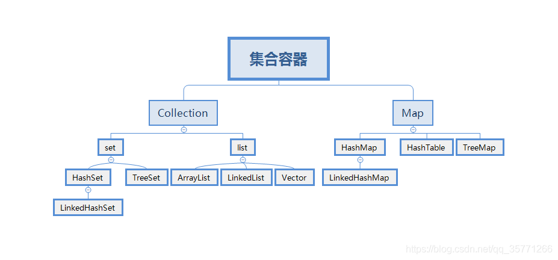

# 0 类与其加载机制和加载器

程序主要有两种运行方式：静态编译与动态解释。
- 静态编译的程序在执行前程序会被提前编译为机器码（或中间字节码），通常将这种类型称为**AOT** （Ahead of time）即 “提前编译”。
- 而解释执行则是在运行时将源码实时翻译为机器码来执行，通常将这种类型称为**JIT**（Just-in-time）即“即时编译”。


## 类及其结构

类头和字段和填充字段

## 类加载（重要）

[查看另一文件](类加载器.md)
## 反射(重要)
[查看反射](反射.md5)

不同类加载器加载的类可以存在同一类名，但不是同一类

# 1.Map解析

## 1.1 HashMap
- 在 Java 7 中使用的是 “数组 + 链表”，发生散列冲突的键值对会用头插法添加到单链表中；  
    
- 在 Java 8 中使用的是 “数组 + 链表 + 红黑树”，发生散列冲突的键值对会用尾插法添加到单链表中。==如果链表的长度大于 8 时且散列表容量大于 64，会将链表树化为红黑树==。在扩容再散列时，如果红黑树的长度低于 6 则会还原为链表；

数据负载因子是0.75

### 1.1.1 结构

1. 数据结构：数组 +链表 + 红黑树(jdk8)


继承自**AbstractMap** 

**2. 默认散列表长度是16，大于数据负载因子后扩容时==原始长度x2==，最消耗性能的点就出现了：原数组中的数据必须重新计算其在新数组中的位置，并放进去，这就是resize，所以使用的时候最好直接指定，防止资源浪费**

3. 超过设置的可容纳的**键值对数**（由负载因子决定，默认0.75 ）时候就会扩容。

4. 不保证是有序的，非同步线程不安全
5. 自定义初始化长度也最好是
6. HashMap 允许空的 key 和 value 值，HashTable 不允许空的 key 和 value 值。HashMap 会把 Null key 当做普通的 key 对待。不允许 null key 重复。
7. hash冲突越少性能越好，所以散列函数必须要好
###### 哈希桶结构

在Hash中同一个hashCode的不同元素保存在同一个哈希桶中，它是通过一个内部类 Node<K,V> implements Map.Entry<K,V>保存的
### *1.1.2* put

1. 获取KEY的hashcode，再通过哈希算法（高位16运算与原低位16异或运算（也就是通过位运算实现取模）），取模生成key，
	```
	(h ^ (h >>> 16)) & HASH_BITS;
	```

![[966be158a940e4b0ba9948e864a912b6.png]]
3. 当key存在时产生hash冲突，生成链表, 节点为node（）。

4. 插入时循环遍历链表，尾插法进行插入，如果到达阈值8时转为红黑树。

5. 允许key为空

6. hashmap的基本单位为entry，数组中存储的值是entry，数组下标为key的hash取模的值.

### 常见hash/散列算法（了解几个即可）

散列函数的构造方法

- 1、直接定址法

**关键码本身和地址之间存在某个线性函数关系时，散列函数取为关键码的线性函数，即：H(key) = a*key+b，a、b均为常数。**

这样的散列函数优点就是简单、均匀，也不会产生冲突，但问题是这需要事先知道关键字的分布情况，适合査找表较小且连续的情况。由于这样的限制，在现实应用中，直接定址法虽然简单，但却并不常用。

- 2、数字分析法

假设关键码完全已知，且每个关键码都是以某个数r为基数（例以10为基数的十进制数）的值，则关键码中若干位恰能构成分布比较均匀的散列地址空间时，可取关键码的若干位的组合作为散列地址。

- 3、除留余数法

通过选择适当的正整数p，按计算公式H(K)=Kmodp来计算关键码K的散列地址。

若关键码个数为n，散列表表长为m（一般m>=n），通常选p为小于或等于表长m的最大素数或不包含小于20的质因子的合数，一般也要求p>=n。

这种方法计算最简单，也不需根据全部关键码的分布情况研究如何从中析取数据，最常用。

- 4、平方取中法

将关键码K平方，取K^2中间几位作为其散列地址H(K)的值。

假如有以下关键字序列{421，423，436}，平方之后的结果为{177241，178929，190096}，那么可以取{72，89，00}作为Hash地址。

- 5、折叠法

将关键码从低位到高位（或从高位到低位）分割成位数相等的几段，最后一段可以短些，然后将这些段构成的数值按照某种叠加方法求和。最后，在散列地址范围限制下，取求和结果的最后几位作为关键码的散列函数值。

叠加方法：

（1）移位叠加：将各段数值最后一位对齐相加

（2）间界叠加：从各个数值段的一端到另一端来回折叠后（奇数段位正序，偶数为倒序），以最后一位对齐后相加

例：

key=12360324711202065,哈希表长度为1000，则应把关键字分成3位一段，在此舍去最低的两位65，分别进行移位叠加和折叠叠加，求得哈希地址为105和907，如图所示。

1   2   3                    1   2   3

6   0   3                    3   0   6

2   4   7                    2   4   7

1   1   2                    2   1   1

+）      0   2   0            +）  0   2   0

        ———————————————————————————————————

                    1   1   0   5                    9   0   7

 

（a）移位叠加             (b) 间界叠加

- 6、随机数法

采用随机函数作为散列函数H(Key)=random(Key)，其中random为随机函数。

当关键码长度不等时，采用该方法较恰当。

### 1.1.3 **get**

hash算法获取下标，比较key内容和hashcode。

### 1.1.4 红黑树

解决链表过长效率低下。**链表超过8时转红黑树**

红黑树插入慢。低于8时多了插入性能低，查询带来的性能提升不足以弥补。

导言：
对于二叉搜索树，如果插入的数据是随机的，那么它就是接近平衡的二叉树，平衡的二叉树，它的操作效率（查询，插入，删除）效率较高，时间复杂度是O（logN）。==但是可能会出现一种极端的情况，那就是插入的数据是有序的（递增或者递减），那么所有的节点都会在根节点的右侧或左侧，此时，二叉搜索树就变为了一个链表(退化成链表)，它的操作效率就降低了==，时间复杂度为O(N)，所以可以认为二叉搜索树的时间复杂度介于O（logN）和O(N)之间，视情况而定。

那么为了应对这种极端情况，红黑树就出现了，它是具备了某些特性的二叉搜索树，能解决非平衡树问题，红黑树是一种接近平衡的二叉树（**说它是接近平衡因为它并没有像AVL树的平衡因子的概念，它只是靠着满足红黑节点的5条性质来维持一种接近平衡的结构，进而提升整体的性能，并没有严格的卡定某个平衡因子来维持绝对平衡）。**


性质
- 节点是红色或黑色
- 根是黑色
- 叶子节点（外部节点，空节点）都是黑色，这里的叶子节点指的是最底层的空节点（外部节点），**图中的那些null节点才是叶子节点，null节点的父节点在红黑树里不将其看作叶子节点**
- 红色节点的子节点都是黑色
	- 红色节点的父节点都是黑色
	- 从根节点到叶子节点的所有路径上不能有 2 个连续的红色节点
- 从任一节点到叶子节点的所有路径都包含相同数目的**黑色**节点

#### 为什么使用红黑树？
平衡二叉树是一种追求“完全平衡”的二叉树，它们最长子树和最短子树的高度之差不会超过1，红黑树是最长子树不超过最短子树的2倍即可。
就是降低维持平衡带来的成本。
新插入的节点为==红色节点==，插入到对应位置后，在进行红黑树的旋转、变色进行维持红黑树。

### **HashMap 的多线程程序中会出现什么问题？**

- **数据覆盖问题**：如果两个线程并发执行 put 操作，并且两个数据的 hash 值冲突，就可能出现数据覆盖（线程 A 判断 hash 值位置为 null，还未写入数据时挂起，此时线程 B 正常插入数据。接着线程 A 获得时间片，由于线程 A 不会重新判断该位置是否为空，就会把刚才线程 B 写入的数据覆盖掉）。事实上，这个未同步数据在任意多线程环境中都会存在这个问题；  
    
- **环形链表问题：** 在 HashMap 触发扩容时，并且正好两个线程同时在操作同一个链表时，==就可能引起指针混乱，形成环型链条==（因为 Java 7 版本采用头插法，在扩容时会翻转链表的顺序，而 Java 8 采用尾插法，再扩容时会保持链表原本的顺序）。
////////////待补充
![[v2-8967735f3b3da71eea178d5620596b3b_720w.webp]]
## 1.1.4 HashTable，HashSet

**HashMap和HashTable的区别**

相同点：都是存储key-value键值对的

不同点：

- HashMap允许Key-value为null，**hashTable不允许；**
- 
- hashMap没有考虑同步，是线程不安全的。hashTable是线程安全的，给api套上了一层**synchronized**修饰;（效率低下）
- 
- HashMap继承于AbstractMap类，hashTable继承与Dictionary类。
- 
- 迭代器(Iterator)。HashMap的迭代器(Iterator)是fail-fast迭代器，而Hashtable的enumerator迭代器不是fail-fast的。**所以当有其它线程改变了HashMap的结构（增加或者移除元素），将会抛出ConcurrentModificationException。**

- 容量的初始值和增加方式都不一样：HashMap默认的容量大小是16；增加容量时，每次将容量变为"原始容量x2"。Hashtable默认的容量大小是11；增加容量时，每次将容量变为"原始容量x2 + 1"；
- 
- 添加key-value时的hash值算法不同：HashMap添加元素时，是使用自定义的哈希算法。Hashtable没有自定义哈希算法，而直接采用的key的hashCode()。

## 1.2 ConcurrentHashMap

`java.util.concurrent.ConcurrentHashMap`属于 JUC 包下的一个集合类，可以实现线程安全。
### 1.7以及之前

**引入了一个“分段锁”的概念 ，具体可以理解为把一个大的Map拆分成N个小的HashTable，根据key.hashCode()来决定把key放到哪个HashTable中。** 相当实现双重hash
可以说，ConcurrentHashMap 是一个二级哈希表。在一个总的哈希表下面，有若干个子哈希表。


JDK1.7 中，ConcurrentHashMap 是由 **Segment** 数组结构和 **HashEntry** 数组结构组成。 
ConcurrentHashMap底层数据结构.

![[20200807200123141.png]]

![[e4dacaf3cc5c4ea49822916204eb5bb0.png]]

ConcurrentHashMap中的分段锁称为Segment，它即类似于HashMap的结构。它内部拥有一个HashEntry数组，数组中的每个元素又是一个链表；同时又是一个**ReentrantLock（Segment继承了ReentrantLock）。**
![[20200807201722260.png]]

可重入锁（`ReentrantLock` ）分段锁segment
诸如get、put、remove等常用操作只锁住当前需要用到的Segment。这样，原来只能一个线程进入，现在却能同时有16个写线程执行，并发性能的提升是显而易见的【锁的粒度更小】。然后加锁是通过给Segment添加ReentrantLock可重入锁（只有等待当前线程完全执行完成，其他线程才能获取到该锁。）

内部再放HashEntry数组（也就是table 哈希表）
```java
static final class Segment<K,V> extends ReentrantLock implements Serializable {

	private static final long serialVersionUID = 2249069246763182397L;
	
	// 和 HashMap 中的 HashEntry 作用一样，真正存放数据的桶
	transient volatile HashEntry<K,V>[] table;
	
	transient int count;
	transient int modCount;
	transient int threshold;
	final float loadFactor;

	// ...
}

```

 JDK1.8 中，ConcurrentHashMap 选择了与 HashMap 相同的**数组**+**链表**+**红黑树**结构 

### Get
Get 操作比较简单：
  1、Key 通过 Hash 之后定位到具体的 Segment；
  2、**再通过一次 Hash 定位到具体的元素上；**
  3、**由于 HashEntry 中的 value 属性是用 volatile 关键词修饰的，保证了内存可见性，所以每次获取时都是最新值。**

 ConcurrentHashMap 的 get 方法是非常高效的，因为整个过程都不需要加锁。
### Put
1、加锁操作；  
2、遍历该 HashEntry，如果不为空则判断传入的 key 和当前遍历的 key 是否相等，相等则覆盖旧的 value。  
3、为空则需要新建一个 HashEntry 并加入到 Segment 中，同时会先判断是否需要扩容。  
4、释放锁；

### JDK1.8下
**JDK8相比与JDK7主要区别如下**

多了一个“桶”（bucket）的概念，是 `ConcurrentHashMap` 存储数据的基本单元，它是一个==数组==中的一个元素，每个桶可以指向一个==链表或红黑树的头节点==。

**取消了segment数组分段的概念，直接用table保存数据，锁的粒度更小，减少并发冲突的概率。HashEntry 列表改为 一个一个的Node。由segment锁改为数组的每个哈希桶。
**优化了ConcurrentHashMap的链表太长导致查询效率降低的问题**它是通过 **CAS 和锁分段技术**Synchronized 来保证线程安全的，**并且缩小了锁的粒度，查询性能也更高**。

采用table数组元素作为锁，从而实现了对每一行数据进行加锁，进一步减少并发冲突的概率，**并发控制使用Synchronized和CAS来操作**。

**存储数据时采用了数组+ 链表+红黑树的形式。**

#### Get
1、根据计算出来的 hashcode 寻址，如果就在桶上那么直接返回值。  
2、如果是红黑树那就按照树的方式获取值。  
3、都不满足那就按照链表的方式遍历获取值。
#### Put

1、根据 key 计算出 hashcode，然后开始遍历 table；
2、判断是否需要初始化；
3、f 即为当前 key 定位出的 Node，**如果为空表示当前位置可以写入数据，利用 CAS 尝试写入，失败则自旋保证成功。**
4、如果当前位置的 hashcode == MOVED == -1,则需要进行扩容。扩容需要rehash
5、如果都不满足，则利用 synchronized 锁写入数据。
7、如果数量大于 TREEIFY_THRESHOLD 则要转换为红黑树。
![[2020080720541110.png]]

## 1.3 LinkedHashMap
![[20170512160734275.png]]

![[20170512155609530.png]]

## Array/LinkedBlockingQueue
它的特性是在任意时刻只有一个线程可以进行take或者put操作，并且BlockingQueue提供了超时return null的机制，在许多生产场景里都可以看到这个工具的身影。

- ArrayBlockingQueue 由数组支持的  有界  队列
	- 基于ReentrantLock保证线程安全，根据Condition实现队列满时的阻塞
    
- LinkedBlockingQueue 由链接节点支持的可选  有界  队列
    
- PriorityBlockingQueue 由优先级堆支持的无界优先级队列
    
- DelayQueue 由优先级堆支持的、基于时间的调度队列
- 
## SynchronousQueue


# 接口与抽象类
在 JVM（Java 虚拟机）层面上，接口和抽象类在字节码表示和一些行为上有一些区别。以下是主要的区别：

1. 字节码表示：在编译后的字节码中，接口和抽象类分别用不同的关键字表示。在字节码级别，接口使用`ACC_INTERFACE`这个访问修饰符，而抽象类则是使用`ACC_ABSTRACT`。这表明在 JVM 中，接口和抽象类是区分开来的。
    
2. 继承关系：在 JVM 层面，接口和抽象类遵循不同的继承规则。==一个类可以实现（implements）多个接口，而从一个抽象类继承时只能继承一个（extends）。这是由于 Java 的单继承特性。==同时需要注意的是，在编译后的字节码中，接口只能继承其他接口。
    
3. 方法实现：接口和抽象类中的方法也有一定的差别。抽象类可以包含抽象方法和已经实现的方法，而接口在 Java 8 之前只能包含抽象方法。从 ==Java 8 开始，接口允许有默认方法（default methods）和静态方法，但这些方法都有方法体，不能是抽象的==。
    
4. 成员变量：抽象类可以包含各种访问修饰符修饰的成员变量，包括 public, protected, package-private (默认) 和 private。而接口的成员变量始终是隐式的 public, static, final，不能有包级别（package-private）或 protected 变量。在字节码层面，这些区别由不同的访问修饰符表示。
    
5. 初始化块：抽象类可以包含静态和实例初始化块，而接口不能。这是因为接口不能包含具体的实现细节，而初始化块可能会涉及这些细节。

# 线程池

合理利用线程池能够带来三个好处。
- 降低资源消耗。通过重复利用已创建的线程降低线程创建和销毁造成的消耗。
- 提高响应速度。当任务到达时，任务可以不需要的等到线程创建就能立即执行。
- 提高线程的可管理性。线程是稀缺资源，如果无限制的创建，不仅会消耗系统资源，还会降低系统的稳定性，使用线程池可以进行统一的分配，调优和监控。但是要做到合理的利用线程池，必须对其原理了如指掌。
## start和run

当线程多时，线程池效率比新线程效率高。区别在于重复创建线程

## ThreadPoolExecutor构造函数参数详细介绍

```java
public ThreadPoolExecutor(int corePoolSize,
                          int maximumPoolSize,
                          long keepAliveTime,
                          TimeUnit unit,
                          BlockingQueue<Runnable> workQueue,
                          ThreadFactory threadFactory,
                          RejectedExecutionHandler handler)

```


### 1. int corePoolSize（核心线程数）

线程池新建线程的时候，如果当前线程总数小于corePoolSize，则新建的是核心线程，如果超过corePoolSize，则新建的是非核心线程；**核心线程默认情况下会一直存活在线程池中，即使这个核心线程啥也不干(闲置状态)**；如果设置了 allowCoreThreadTimeOut 为 true，那么核心线程如果不干活(闲置状态)的话，超过一定时间(时长下面参数决定)，就会被销毁掉。

### 2.int maximumPoolSize（线程池能容纳的最大线程数量）

线程总数 = 核心线程数 + 非核心线程数。

### 3.long keepAliveTime（非核心线程空闲存活时长）

非核心线程空闲时长超过该时长将会被回收，主要应用在缓存线程池中，当设置了 **allowCoreThreadTimeOut 为 true 时，对核心线程同样起作用。**

### 4.TimeUnit unit 

空闲线程的存活时间（keepAliveTime 的单位）它是一个枚举类型，常用的如：TimeUnit.SECONDS（秒）、TimeUnit.MILLISECONDS（毫秒）。


### 6.ThreadFactory threadFactory（线程工厂）
用来创建线程池中的线程，通常用默认的即可

### 7.RejectedExecutionHandler handler（拒绝策略）

在线程池已经关闭的情况下和**任务太多导致最大线程数和任务队列已经饱和**，无法再接收新的任务，在上面两种情况下，只要满足其中一种时，在使用 **execute() 来提交新的任务时将会拒绝，线程池提供了以下 4 种策略：**(也可以自定义)

- AbortPolicy：默认策略，在拒绝任务时，会抛出RejectedExecutionException。

- CallerRunsPolicy：只要线程池未关闭，该策略直接在调用者线程中，运行当前的被丢弃的任务。

- DiscardOldestPolicy：该策略将丢弃最老的一个请求，也就是即将被执行的任务，并尝试再次提交当前任务。

- DiscardPolicy：该策略默默的丢弃无法处理的任务，不予任何处理。

线程池遵循的原则：

其会优先创建核心线程，执行任务，当核心线程增加CorePoolSize后，我们会把任务添加到work Queue中，当work Queue里面的任务也塞满了，线程池就会创建非核心线程执行去执行任务，当线程达到maximumPoolSize时候和work queue也达最大值时候我们会执行对应的拒绝策略


### BlockingQueue workQueue（任务队列）

当所有**的核心线程都在干活时，新添加的任务会被添加到这个队列中等待处理**，如果队列满了，则新建**非核心线程**执行任务

#### 常用的workQueue类型：

4. PriorityBlockingQueue：一个具有优先级得无限阻塞队列。

（1）SynchronousQueue：
	**一个不存储元素的阻塞队列。**每个插入操作必须等到另一个线程调用移除操作，否则插入操作一直处于阻塞状态，吞吐量通常要高于LinkedBlockingQueue，静态工厂方法Executors.newCachedThreadPool使用了这个队列。
    ​这队列接收到任务时会**直接交给线程处理​，而不保留它，如果所有的线程都在工作，那就创建一个新的线程来处理这个任务**，​为了保证不出现线程数达到maxnumPoolSize而不能新建线程的错误，所以使用这个类型 的队列时，maxnumPoolSize一般指定成Integer.MAX_VALUE，即无限大，然后核心线程数​corePoolSize​一般是0. 
    **如果是只想开启核心线程数去处理的话，那么我们除了制定线程数之外，还要定义拒绝策略策略，处理线程数已到达最大值时的异常处理。​

（2）LinkedBlockingQueue：
	一个基于**链表结构的阻塞队列**，此队列按FIFO （先进先出） 排序元素，吞吐量通常要高于ArrayBlockingQueue。静态工厂方法Executors.newFixedThreadPool()使用了这个队列。
	这个队列接收到任务的时候，如果当前线程数小于核心线程数，则新建线程(核心线程)处理任务；如果当前线程数等于核心线程数，则进入队列等待。​由于这个队列没有最大值限制，即所有超过核心线程数的任务都将被添加到队列中，**这也就导致了 maximumPoolSize 的设定失效**，因为总线程数永远不会超过 corePoolSize。​

 （3）ArrayBlockingQueue：
	 是一个基于**数组结构的有界阻塞队列**，可以限定队列的长度，接收到任务的时候，如果没有达到 corePoolSize 的值，则新建线程(核心线程)执行任务，如果达到了，则入队等候，如果队列已满，则新建线程(非核心线程)执行任务，又如果总线程数到了 maximumPoolSize，并且队列也满了，则发生错误。此队列按 FIFO（先进先出）原则对元素进行排序。

 （4）DelayQueue：
	 队列内元素必须实现 Delayed 接口，这就意味着你传进去的任务必须先实现 Delayed 接口。这个队列接收到任务时，首先先入队，只有达到了指定的延时时间，才会执行任务。

## 2.1 四种创建线程方式

本质上只有一种
2.1.1 继承thread类

**thread本身是实现了runnable接口**，提供了更多方法（setname等），最后调用start

**join方法**

```java
public class JoinDemo {

		public static void main(String[] args) {
			//初始化线程t1,由于后续有匿名内部类调用这个对象,需要用final修饰
			final Thread t1 = new Thread(new Runnable() {

				@Override
				public void run() {
					System.out.println("t1 is running");
				}
			});
			//初始化线程t2,由于后续有匿名内部类调用这个对象,需要用final修饰
			final Thread t2 = new Thread(new Runnable() {

				@Override
				public void run() {
					try {
						//t1调用join方法,t2会等待t1运行完之后才会开始执行后续代码
						t1.join();
					} catch (InterruptedException e) {
						e.printStackTrace();
					} finally {
						System.out.println("t2 is running");
					}
				}
			});
			//初始化线程t3
			Thread t3 = new Thread(new Runnable() {

				@Override
				public void run() {
					try {
						//t2调用join方法,t3会等待t2运行完之后才会开始执行后续代码
						t2.join();
					} catch (InterruptedException e) {
						e.printStackTrace();
					} finally {
						System.out.println("t3 is running");
					}
				}
			});
			//依次启动3个线程
			t1.start();
			t2.start();
			t3.start();
		}
	}

```

![[c83d70cf3bc79f3d57910653b60ae21d738b299c.webp]]

### 2.1.2 实现runnable接口

Thread thread = new Thread(xxxrunnable);

thread.start()；

### 2.1.3 实现Callable接口 

传入类型   -> 重写call() -> 新建futureTask传入实现的callable  ->新建thread传入参数futureTask -> start -> futureTask.get

```java
public class ThreadDemo implements Callable<类型>{
    @Override
    public 类型 call() throw Exception{
        return 结果；
    }
}
```

```java
//获取
//传入callable对象
FutureTask fu = new FutureTask<?>(new ThreadDeom());
//创建thread
Thread t = new XXThread( fu );
t.start();


类型 result = task.get();
```


### 2.1.4 创建线程池

使用已有的三个线程池或者自定义

例：ExecutorService  service =  executors.newCachedThreadPool();

service.execute(new Runnable());

## 2.2 线程池

jdk1.5开始添加executor类，executor创建各种类型线程池。

### 2.2.1 线程池类型

**三大默认类型**

实质上是返回

new ThreadPoolExecutor();

```java
//多态中参数最多的一个构造函数
public ThreadPoolExecutor(
//核心数，超出先放队列
int corePoolSize ，

//最大核心数，队列满时，超出核心数可以再创建直到最大数。
//队列的依然在队列中，把新添加的任务放进新创建的核心中
int maximumPoolSize ,
    
//非核心线程空闲存活时长
long keepAliveTime ，

// 时间单位
TimeUnit unit，

// 任务队列
BlockingQueue<Runnable> workQueue,
    
//线程工厂
ThreadFactory threadFacoty ,
    
 //拒绝策略
RejectdExecutionHandler handler
)

```

优先级 核心，队列，新创建。


无法执行的任务->拒绝策略

#### **1.cachedThreadPool**

最快，尽最**大能力创建相应的线程**，**资源消耗高**

ThreadPoolExecutor（ 0， max， 60L，SynchronousQueue(同步队列) ）


#### 2.fixedThreadPool

需要传入参数Executor.newFixedThreadPool(nThread);

线程复用，每次只处理设置的任务数

ThreadPoolExecutor（ nThread， nThread， 60L，LinkedBlockingQueue ）

创建的LinkedBlockingQueue过长，可能内存溢出


#### 3.singleThreadPool

效率过低最慢，同上，创建的LinkedBlockingQueue过长，可能内存溢出

每次只执行一个任务

ThreadPoolExecutor（ 1， 1， 0L，LinkedBlockingQueue ）


### **2.2.2.自定义线程池**

通过给 ThreadPoolExecutor传入自定义参数，获取executor，再获取ExecutorService 执行 runnable


##### 4.1需要定义线程工厂（实现ThreadFactory）

```java
private static final ThreadFactory sThreadFactory = new ThreadFactory() {

    //初始值1
    private final AtomicInteger mCount = new AtomicInteger(1);

    @Override
    public Thread newThread(Runnable r) {
        return new Thread(r, "new Task" + mCount.getAndIncrement());
    }
};
```

##### 4.2 工作队列

定义好任务队列长度，防止内存溢出

```java
private static final BlockingDeque<Runnable> sPoolWorkQueue = new LinkedBlockingDeque<>(8);
```

##### 4.3 定义拒绝策略

当任务队列满的时候，已达最大线程数，排队队列满。抛出的异常处理

```java
 private class RejectedHandler implements RejectedExecutionHandler {

        @Override
        public void rejectedExecution(Runnable r, ThreadPoolExecutor executor) {
            ToastUntil.showToast("操作过于频繁，稍后再试" , AppContext.getContext() );
        }
    }
```


### 2.2.3 execute和submit

execute和submit传入参数不同。

submit可以获取返回值furture对象。


## 2.3线程状态

**1. 新建状态(New):** 线程对象被创建后，就进入了新建状态。例如，Thread thread = new Thread()。

**2. 就绪状态(Runnable):** 也被称为“可执行状态”。线程对象被创建后，其它线程调用了该对象的start()方法，从而来启动该线程。例如，thread.start()。处于就绪状态的线程，随时可能被CPU调度执行。

**3. 运行状态(Running):** 线程获取CPU权限进行执行。需要注意的是，线程只能从就绪状态进入到运行状态。

**4. 阻塞状态(Blocked):** 阻塞状态是线程因为某种原因放弃CPU使用权，暂时停止运行。直到线程进入就绪状态，才有机会转到运行状态。阻塞的情况分三种：

- (01) 等待阻塞 -- 通过调用线程的wait()方法，让线程等待某工作的完成。
- (02) 同步阻塞 -- 线程在获取synchronized同步锁失败(因为锁被其它线程所占用)，它会进入同步阻塞状态。
- (03) 其他阻塞 -- 通过调用线程的sleep()或join()或发出了I/O请求时，线程会进入到阻塞状态。当sleep()状态超时、join()等待线程终止或者超时、或者I/O处理完毕时，线程重新转入就绪状态。

**5. 死亡状态(Dead):** 线程执行完了或者因异常退出了run()方法，该线程结束生命周期。

### 从虚拟机内核角度

# 3. final finally finalize


final关键字

finally异常最终运行

finalize， finalize方法是会回收前的最后一次保活机，把自己赋值给某一变量

# 4. String, StringBuffer,  StringBuilder

字符串广泛应用 在Java 编程中，在 Java 中字符串属于**对**象**，Java 提供了 **String 类来创建和操作字符串。

需要注意的是，**String的值是不可变的**，这就导致每次对String的操作都会生成**新的String对象**
**1) String的创建原理**

由于String在Java世界中使用过于频繁，Java为了避免在一个系统中产生大量的String对象，引入了字符串常量池。其运行机制是：**创建一个字符串时，首先检查常量池中是否有值相同的字符串对象，如果有则不需要创建直接从常量池中查找到的对象引用；如果没有则新建字符串对象，返回对象引用，并且将新创建的对象放入池中**。但是，通过**new方法创建的String对象是不检查字符串池的**，而是直接在堆区或栈区创建一个新的对象，也不会把对象放入池中。**上述原则只适用于通过直接量给String对象引用赋值的情况。**

举例：String str1 = "897"; //**通过直接量赋值方式，放入字符串常量池**  
String str2 = new String(“897”);//**通过new方式赋值方式，不放入字符串常量池**


由于 StringBuilder 相较于 StringBuffer 有速度优势，**所以多数情况下建议使用 StringBuilder 类**。然而在应用程序要求线程安全的情况下，则必须使用 StringBuffer 类。 


StringBuilder s = new StringBuilder (“abc”)；

StringBuffer s = new StringBuffer(“abc”); 

**小结**： 

（1）如果要操作少量的数据用 String；

（2）多线程操作字符串缓冲区下操作大量数据 StringBuffer；

（3）**单线程操作字符串缓冲区下操作大量数据 StringBuilder**。

# 5. collection和collections

**java.util.Collection 是一个 集合框架的父接口**。它提供了对集合对象进行基本操作的通用接口方法。Collection接口在Java 类库中有很多具体的实现。Collection接口的意义是为各种具体的集合提供了最大化的统一操作方式。
  Collection   
├List   
│├LinkedList   
│├ArrayList   
│└Vector   
│　└Stack   
└Set 
其里面包含的方法有：

 

2、java.util.Collections 是一个包装类。它包含有各种有关集合操作的 静态多态方法。此类 不能实例化，就像一 个工具类，服务于Java的Collection框架。 他提供一系列静态方法实现对各种集合的搜索、排序、线程安全化等操作。

1、java.util.Collection 是一个 集合接口。它提供了对集合对象进行基本操作的通用接口方法。Collection接口在Java 类库中有很多具体的实现。Collection接口的意义是为各种具体的集合提供了最大化的统一操作方式。
  Collection   
├List   
│├LinkedList   
│├ArrayList   
│└Vector   
│　└Stack   
└Set 

2、java.util.Collections 是一个包装类。它包含有各种有关集合操作的 静态多态方法。此类 不能实例化，就像一 个工具类，服务于Java的Collection框架。


## collection

java.util下的集合容器



**hashset:**

1. **不允许重复**
2. 允许值为null,但是只能有一个
3. **无序**的。
4. 没有索引，所以不包含索引操作的方法

**LinkedHashSet**：

跟HashSet一样都是基于哈希表实现。只不过linkedHashSet在**hashSet的基础上多了一个链表**，这个链表就是用来维护容器中每个元素的顺序的。有以下特点：

           1.**不允许重复**

           2.允许值为null,但是只能有一个

           3.**有序**的。

           4.没有索引，所以不包含索引操作的方法


**TreeSet**

是SortedSet接口的唯一实现类，**是基于二叉树实现的。TreeSet可以确保集合元素处于排序状**态。TreeSet支持两种排序方式，自然排序 和定制排序，其中自然排序为默认的排序方式。向TreeSet中加入的应该是同一个类的对象。有以下特点：

           1.不允许重复

           2.不允许null值

           3.没有索引，所以不包含索引操作的方法


# 大数[BigInteger](https://so.csdn.net/so/search?q=BigInteger&spm=1001.2101.3001.7020)
# 6. equals和==

== 比较地址，equals的方法可以自己实现。

## 重写hashcode和equals

hashcode还有个就是作为map中的key是根据hashcode进一步计算的

# 7. 浅拷贝和深拷贝

## 浅拷贝

(1) 对于基本数据类型的成员对象，因为基础数据类型是值传递的，所以是直接将属性值赋值给新的对象。基础类型的拷贝，其中一个对象修改该值，不会影响另外一个。
 (2) 对于引用类型，比如数组或者类对象，因为引用类型是引用传递，所以浅拷贝只是把内存地址赋值给了成员变量，它们指向了同一内存空间。改变其中一个，会对另外一个也产生影响。

 

##  深拷贝

 实现Colonable接口


 

 

# 9. 强引用，软引用，弱引用，虚引用

## (一) 强引用(StrongReference)

强引用是使用最普遍的引用。如果一个对象具有强引用，那垃圾回收器绝不会回收它。如下：

    Object strongReference = new Object();

当内存空间不足时，Java虚拟机宁愿抛出OutOfMemoryError错误，使程序异常终止，也不会靠随意回收具有强引用的对象来解决内存不足的问题。 
如果强引用对象不使用时，需要弱化从而使GC能够回收，如下：

    strongReference = null;

显式地设置strongReference对象为null，或让其超出对象的生命周期范围，则gc认为该对象不存在引用，这时就可以回收这个对象。具体什么时候收集这要取决于GC算法。

    public void test() {
        Object strongReference = new Object();
        // 省略其他操作
    }
## (二) 软引用(SoftReference)

如果一个对象只具有**软引用**，则**内存空间充足**时，**垃圾回收器**就**不会**回收它；如果**内存空间不足**了，就会**回收**这些对象的内存。只要垃圾回收器没有回收它，该对象就可以被程序使用。

> 软引用可用来实现内存敏感的高速缓存。

## (三) 弱引用(WeakReference)

弱引用与软引用的区别在于：只具有弱引用的对象拥有更短暂的生命周期。在垃圾回收器线程扫描它所管辖的内存区域的过程中，一旦发现了只具有弱引用的对象，**不管当前内存空间足够与否，都会回收它的内存**。不过，由于垃圾回收器是一个优先级很低的线程，因此不一定会很快发现那些只具有弱引用的对象。

    String str = new String("abc");
    WeakReference<String> weakReference = new WeakReference<>(str);
    str = null;

JVM首先将软引用中的对象引用置为null，然后通知垃圾回收器进行回收：

    str = null;
    System.gc();


## (四) 虚引用(PhantomReference)

**虚引用**顾名思义，就是**形同虚设**。与其他几种引用都不同，**虚引用**并**不会**决定对象的**生命周期**。如果一个对象**仅持有虚引用**，那么它就和**没有任何引用**一样，在任何时候都可能被垃圾回收器回收。


# 10. 泛型

## 概念

jdk1.5之后引入的语法糖，能提升开发效率，让程序员更加方便地使用泛型是java语法糖的一种。

跟c++的template的类似，只存在源码当中，编译后已经不存在。是使用擦除法实现的伪泛型。

编译器会**在编译期执行类型检查并插入转型代码** 

## super和extends

<‘? super T>表示包括T在内的任何T的父类，<‘? extends T>表示包括T在内的任何T的子类，下面我们详细分析一下两种通配符具体的区别。

 下界<‘? super T>不影响往里存，但往外取只能放在Object对象里


PECS原则：

生产者（Producer）使用extends，消费者（Consumer）使用super。 

最后看一下什么是PECS（Producer Extends Consumer Super）原则，已经很好理解了：

- 频繁往外读取内容的，适合用上界Extends。
- 经常往里插入的，适合用下界Super。
## 泛型擦除

# 11. List

- collection下的抽象类

## ArrayList

**自动增长容量的数组**，==默认长度10==. 而后的数组扩容才是按照当前容量的==**1.5倍**进行扩容；==

最大容量 -2的31次方~2的31次方减1。

原理：

## LinkedList

双向链表 。插入删除快，通过节点之间的传递关系来维持整个linkedlist。
原理：
## vector

向量


# 12. int和integer

**非new生成的Integer变量和new Integer()生成的变量比较时，结果为false**。

```java
Integer i = new Integer(100); 
Integer j = new Integer(100);
 System.out.print(i == j); //false 

Integer i = new Integer(100); 
int j = 100；
System.out.print(i == j); //true 

```


①当变量值在-128~127之间时，**非new生成的Integer变量指向的是java常量池中的对象**，**而new Integer()生成的变量指向堆中新建的对象**，两者在内存中的地址不同；


②当变量值在**-128~127**之间时，非new生成Integer变量时，java API中最终会按照new Integer(i)进行处理（参考下面第3条），最终两个Interger的地址同样是不相同的） 

3. 对于两个非new生成的Integer对象，进行比较时，如果两个变量的值在区间-128到127之间，则比较结果为true，如果两个变量的值不在此区间，则比较结果为false 


# 13. JVM


## 结构


## 13.1 内存模型（JMM）

内存模型（Java Memory Model，简称 JMM ）是定义了**线程和主内存之间的抽象关系**，是在底层处理器内存模型的基础上（确保了正确同步的Java 代码可以在不同体系结构的处理器上正确运行。），定义自己的多线程语义。它明确指定了一组排序规则，来保证线程间的可见性。**一句话概述：Java 内存模型描述的是多线程对共享内存修改后彼此之间的可见性。**

**在java的内存模型中有区分为 主内存 和 工作内存，Java内存模型规定所有变量存储在主内存中，每条线程都有自己的工作内存。**

**主内存:** 主要包括`本地方法区`和 `堆`

- Java 内存模型规定了`所有变量都存储在主内存(Main Memory)中`（此处的主内存与介绍物理硬件的主内存名字一样，两者可以互相类比，但此处仅是虚拟机内存的一部分）。

**工作内存:** `每个线程`都有一个工作内存，工作内存中主要包括两个部分，一个是属于`该线程私有的栈`和 `对主存部分变量拷贝的寄存器`(包括程序计数器PC和cup工作的高速缓存区)。

- 每个线程都有自己的`工作内存(Working Memory，又称本地内存.)`，线程的工作内存中保存了该线程使用到的变量，该变量是`主内存中的共享变量的副本拷贝`。
- (工作内存是 JMM 的一个抽象概念，并不真实存在。它涵盖了缓存，写缓冲区，寄存器以及其他的硬件和编译器优化。)
![[20190930102455859.png]]

## Java内存模型和硬件内存架构之间的桥接

Java内存模型与硬件内存架构之间存在差异。硬件内存架构没有区分线程栈和堆。对于硬件，所有的线程栈和堆都分布在主内存中。部分线程栈和堆可能有时候会出现在CPU缓存中和CPU内部的寄存器中。
![[v2-1a7b7bb752799b6c067a0eaca0a1a9b2_720w.jpg]]


而主内存和工作内存之间的交互分为8个原子操作分别是

### java中的原子性操作

**lock,unlock,read,load,assign,use,store,write。**
jvm虚拟机关于线程内存、主存之间数据移动规则，提出如下8个原子性操作：

```java
1. read(读取)：
   从主存中读取数据
2. load(载入)：
   将主存读取到的数据写入工作内存中
3. use(使用)：
   从工作内存读取数据做计算
4. assign(赋值)：
   将计算好的值重新赋值到工作内存中
5. store(存储)：
   将工作内存数据写入主存
6. write(写入)：
   将store过去的变量值赋值给主存中的变量(更新主存)
7. lock(锁定)：
   将主存变量加锁，标识为线程独占状态
8. unlock(解锁)：
   将主存变量解锁，解锁以后其它线程就可以锁定该变量。
```
  
1. `所有的变量`都存储在`主内存`中(虚拟机内存的一部分)，`对于所有线程都是共享`的
2. `每个线程都有自己的工作内存，工作内存中保存的是主存中某些变量的值的副本拷贝`，`线程对变量的所有操作都必须在工作内存中进行，不能直接读写主内存中的变量`。对象一般只是引用的拷贝。
3. 线程之间`无法直接访问对方的工作内存中的变量值的`，线程间变量的传递均需要通过`主内存`来完成。


	这种划分与Java运行时内存区域中堆、栈、元空间等的划分是不同层次的划分，两者基本没有关系。硬要联系的话，大致上主内存对应Java堆中对象的实例数据部分、工作内存对应栈的部分区域；从更低层次上说，主内存对应物理硬件内存、工作内存对应寄存器和高速缓存。

## 13.2 Java内存结构--运行时内存区域

内存结构是指 Jvm 运行时将 数据分区域存储，强调对 内存空间的划分。


根据JVM规范，JVM 内存共分为**虚拟机栈，堆，方法区(jdk1.7,  1.8更改为元空间)，程序计数器，本地方法栈**五个部分。

  


### 虚拟机栈
线程私有
栈结构，每个方法运行的时候以**栈帧**的单位存放在虚拟机栈中。
栈帧主要由
- **局部变量表**（基本数据类型，对象**引用**ref），
- **操作数表**（例如加减），
- **动态链接**（链接到方法区），
- **返回地址**。

没有gc

-Xss:设置栈大小  1m或 128k等等。规定了每个线程虚拟机栈及堆栈的大小，一般情况下，256k是足够的，此配置将会影响此进程中并发线程数的大小。


**会出现stackoverflow**

**也会出现oom，但很少**(比如创建大量线程)

例子：无限递归

public void abc（）{

​	abc()；

}
或者无限自增


### **本地方法栈 **

**会出现stackoverflow，也会出现oom**

与虚拟机栈相似，区别在于执行本地(native)方法

### **程序计数器**
线程私有
**（当前线程执行程序字节码的位置， 行号。无gc， 为一个在jvm中没有oom的区域）。**
如果执行的是Native方法这个计数器的值为空。


> 线程公有

### 方法区（元空间

sun hotpot称为永久区（1.7 之前。

不过元空间与永久代最大的区别在于:元空间不在虚拟机设置的内存中，而是使用本地内存 

很少回收。

可通过-XX：MetaspaceSize 设置大小-例10M


- 主要存储***类信息***、***常量池***、***静态变量***、*JIT**编译后的代码***等数据。方法区理论上来说是**堆的逻辑组成部分**；

- **运行时常量池**——是方法区的一部分，用于存放编译期生成的各种字面量和符号引用；

  

### 堆空间


堆内存用来存放由new创建的对象实例和数组，**此内存区域的唯一目的就是存放对象实例** ****

。堆内存中产生的内存由java垃圾回收器回收。Java堆可以处于物理上不连续的内存空间，只要逻辑上连续的即可。在实现上，既可以实现固定大小的，也可以是扩展的。如果堆中没有内存完成实例分配，并且堆也无法完成扩展时，将会抛出OutOfMemoryError异常。


-Xmx调节堆大小。表示java堆可以扩展到的最大值，在很多情况下，通常将-Xms和-Xmx设置成一样的，**因为当堆不够用而发生扩容时，会发生内存抖动影响程序运行时的稳定性。**

-Xms 调节堆最小值。表示初始化JAVA堆的大小及该进程刚创建出来的时候，他的专属JAVA堆的大小，一旦对象容量超过了JAVA堆的初始容量，JAVA堆将会自动扩容到-Xmx大小。


### 对象访问

目前主流的访问方式有使用**句柄访问**和**直接指针**访问两种。


**通过句柄访问对象:** 


 
句柄池中包含了**实例数据**和**类型数据**，**类型数据在方法区**中 

1. 对于方式一而言，reference中存储的地址是稳定的地址，对象移动（垃圾回收时）不需要修改其值，仅需要修改对象句柄的地址；

2. 而对于方式二，则需要修改reference中存储的地址。最大好处就是速度快，它节约了一次指针定位的时间开销;**HotSpot采用第二种**。

### 分区：

```
1.新生代（Young Generation）NewSize和MaxNewSize分别可以控制年轻代的初始大小和最大的大小
2.老年代（Old Generation）
3.永久代（Permanent Generation）【1.8以后采用元空间，就不在堆中了】
```

## 13.3 GC和GC ROOT

GC的线程优先级非常低

![[20210322160015821.png]]
### 引用计数法

给对象增加一个引用计数器，引用的时候加1，取消引用的时候减一。python中使用

### 可达性分析法

以GC ROOT为起点， 从节点开始搜索，搜索的走过的路径称为引用链，当一个对象没有任何引用链，则称为不可达。

如果面试难度高--> 扩展：GC ROOT算法--->
**三色法**
  三色标记算法是在GC在**并发标记**过程中，因为标记期间应用线程还在继续跑，对象之间的引用可能会发生变化，多标和漏标的情况都会发生。三色标记是把GCroot可达性分析遍历对象过程中遇到的对象，按照是否访问过标记成三种颜色。

- 黑色
	- 对象本身和所有的引用都被扫描过。**是存活安全的，不能被回收。**黑色不能不经过灰色直接指向白色。

- 灰色
	- **对象本身被扫描过，至少还有一个引用没有被扫描。**

- 白色
	- 对象没有被扫描过。**在可达性分析刚刚开始的阶段，所有对象都是白色的**。**扫描结束后对象还是白色就代表不可达可以被回收。


### **常见的GC Root**

1. **通过System Class Loader或者Boot Class Loader加载的class对象，通过自定义类加载器加载的class不一定是GC Root**

2. **处于激活状态的线程**

3. **虚拟机栈中的对象(基础类型)**

4. **JNI栈中的对象**

5. **JNI中的全局对象**

6. **正在被用于同步的各种锁对象**

7. JVM自身持有的对象，比如**系统类加载器**等。


### GC算法

CG一般分两种:
Minor GC 和 Full GC 的区别

    普通GC（minor GC）：只针对新生代区域的 GC , 指发生在新生代的垃圾收集动作 ，因为大多数 Java对象存活率都不高 ，所以 Minor GC 非常频繁 ，一般回收速度也比较快。

    老年代GC（major GC ）：指发生在老年代的GC，出现了Major GC，经常会伴随至少一次的Minor GC（但并不是绝对的）。
	Full GC：对全部区进行回收。Full GC的速度一般要比Minor GC慢上10倍以上。
#### 1. mark sweep 标记清除法

   最基础的收集算法。分为标记和清除两个阶段，首先标记出需要回收的对象，标记完成后再统一回收。
  缺点是会产生大量空间碎片。
   

#### 2. 复制算法

![[20210322155921150.png]]

把**存活的对象复制到另外一块同样大小的内存上**。**再把已经使用过的内存空间一次性清理。**
From和to也可以认为就是suvicor分为了s1和s2两块。
现在这个算法一般用在新生代Eden/Survivor上的。

##### MinorGC的过程（复制—>清空—>互换）
- 复制
    当Eden区满的时候会触发**第一次GC，把还活着的对象拷贝到幸存者From区**，当Eden区**再次触发GC的时候会扫描Eden区和From区**，对这两个区域进行垃圾回收， **经过这次回收后还存活的对象，则直接复制到To区域（如果有对象的年龄达到了老年代区，则复制到老年代区）**，同时把这些对象的年龄+1。

- 清空Eden，From或者To区
- To和From的互换
	- To和From互换主要是需要一块区域用来存储Eden中第一次被回收的对象。
#### 3. 进化的算法-- 标记-整理法

把存活的对象都向一边移动，然后直接清理掉端界以外的内存。**比较适合老年代，避免过多的复制操作。**
  
#### 4. 分代收集法
根据不同存活周期将不同内存划分成几块，一般是**Eden，Survivor和Old。**
然后再根据不同特点进行不同的GC算法。

分代算法就是根据不同代的特点采用以上3种中的不同算法的组合。
- 年轻代 ( Young Gen )
	年轻代特点是区域相对老年代较小，对象存活率低 , 这种情况使用复制算法，速度是最快的 , 效率很高

- 老年代 ( Tenure Gen )

	老年代的特点是区域较大，对像存活率高 。
	这种情况 ，存在大量存活率高的对像，复制算法明显变得不合适。老年代一般是由 标记清除 或者是  标记清除与标记整理  的混合实现 。
##### **什么时候对象会进入老年代？**

新创建出来的对象一开始都会停留在新生代中，但随着JVM的运行，有些存活的长的对象会慢慢的移动到老年代中。

- **根据对象年龄**

JVM会给对象增加一个年龄（age）的计数器，对象每“熬过”一次GC，年龄就要+1，待对象到达设置的阈值（默认为15岁）就会被移移动到老年代，可通过-XX:MaxTenuringThreshold调整这个阈值。

- **动态年龄判断**

根据对象年龄有另外一个策略也会让对象进入老年代，不用等待15次GC之后进入老年代，他的大致规则就是，假如当前放对象的Survivor，**一批对象的总大小大于这块Survivor内存的50%**，那么**大于这批对象年龄的对象**，就可以直接进入老年代了。

- **大对象直接进入老年代**

如果设置了-XX:PretenureSizeThreshold这个参数，那么如果你要创建的对象大于这个参数的值，比如分配一个超大的字节数组，此时就直接把这个大对象放入到老年代，不会经过新生代。

这么做就可以避免大对象在新生代，屡次躲过GC，还得把他们来复制来复制去的，最后才进入老年代，这么大的对象来回复制，是很耗费时间的。
### 垃圾收集器
垃圾收集的目标范围整个**新生代（Minor GC）** 或者 **整个老年代（Major GC）** 或者 **整个Java堆（Full GC）**。

七个不同的垃圾收集器，两两相交的收集器说明可以搭配使用。(来自《深入理解java虚拟机》)
我们可以在配置；垃圾回收cc
![[8a5372135ca8476b80f304f0b32beb4e.png]]


#### Serial收集器
单线程的收集器，收集的时候话挂起其他线程，直到它收集线程。dk1.3之前唯一的新生代垃圾收集器。
#### Serial Old 垃圾回收器
Serial垃圾回收器的老年版本。Serial和Serial Old搭配回收垃圾过程：
![[f7c663345dee4662ad89fa7452a15447.png]]
#### ParNew
Serial收集器的多线程版本，使用复制算法。
特点是**可控线程数** -XX:ParallelGCThreads
#### Parallel Scavenge收集器
**针对新生代的并行复制算法**，特点是**可控制吞吐量**（= 运行时间 / (运行时间 +  GC时间)）

-XX: MaxGCPauseMilis 最大垃圾回收时间
-XX:GCTimeRadio 直接设置吞吐率大小

#### Parallel Old 垃圾收集器
Parallel Scavenge的老年代版本，使用**标记整理法**
jdk1.6之后可以使用Parallel Scavenge和Parallel Old搭配使用。Parallel Scavenge和Parallel Old搭配垃圾回收过程：
![[d3d6ef544a6e4e96b756066ab33c4709.png]]

#### CMS
使用多线程标记清除法，**不用暂停线程**。
工作机制复杂，主要是**为了最大程度获取最短暂的垃圾回收停顿时间**：
- 初始标记: 标记GC roots直接关联的对象，需要stop the world
- 并发标记：GC roots 跟踪，和用户线程一起动作，**不暂停工作线程**
- 重新标记：修正并发标记期间，因用户线程运行导致的一些变动，需要stop the world挂起所有工作线程。
- 并发清除：清除不可达对象，和用户线程一起工作，不需要暂停线程。

CMS垃圾收集器优点就是并发收集，低停顿。缺点就是在并发阶段，占用了一部分线程而导致了程序变慢，降低了总的吞吐量。

补充：
CMS部分参数设置：

    -XX:+UseConcMarkSweepGC 启用cms垃圾收集器
    -XX:ConcGCThreads：并发的GC线程数
    -XX:+UseCMSCompactAtFullCollection 开关参数，默认开启(1.9废弃)。FullGC之后做压缩整理（减少碎片）
    -XX:CMSFullGCsBeforeCompaction：多少次FullGC之后压缩一次，默认是0(JDK 9废弃)，代表每次FullGC后都会压缩一 次
    -XX:CMSInitiatingOccupancyFraction: 当老年代使用达到该比例时会触发FullGC（jdk1.6之后默认是92%，这是百分比）
    -XX:+CMSParallelRemarkEnabled 重新标记阶段多线程执行，减少STW时间。
    -XX:+CMSParallellnitialMarkEnabled 初始标记阶段多线程执行，减少STW时间。
    -XX:+CMSScavengeBeforeRemark 在CMSGC之前启动一次minor gc，减少老年代对年轻代的饮用，降低CMS GC标记的时间，标记阶段占用GC耗时80%的时间。
    -XX:+UseCMSInitiatingOccupancyOnly 只使用设置的回收阈值(-XX:CMSInitiatingOccupancyFraction设定的值)。不设置，第一次使用设定值，后续自动调整。


#### G1

Garbage First(G1)垃圾收集器把java堆划分成多个大小相等的独立区域(Region)，最多2048个Region。1个region的大小就是堆大小除2048，一般是2M(手动修改)。每一个Region都可以根据需求，扮演新生代的Eden区、Survivor区，或者老年代。垃圾收集器对扮演不同角色的Region采用不同的策略去处理。
 G1新增加了H(Humongous)区(相当于老年代的一部分)，用来存储大对象。超过1个region的50%就属于
 大对象，进入H区。大对象过大可以跨越使用多个Region存储。


G1垃圾收集器适合50%以上的堆被存活对象占用 、对象分配和晋升的速度变化非常大、垃圾回收时间特别长超过1秒、8GB以上的堆内存(建议值) 、停顿时间是500ms以内等场景。

1. 采用标记--整理算法，不会产生内存碎片。
2. 可以精确控制停顿时间，不牺牲吞吐量的情况下，能达到最小停顿时间。
3. 分代收集，G1一个垃圾收集器管理整个堆，保留分代概念。

三种回收：
- youngGC：Eden区域满了不会直接触发youngGC，**先计算回收时间，小于设置的G1停顿时间**，**增加Region给Eden区**，增加的超过60%堆内存或者达到停顿时间在触发youngGC。

- mixedGC：老年代的GC。内存使用率达到-XX:InitiatingHeapOccupancyPercent配置的值触发mixedGC，回收所有的young区和部分old区和大对象。
**使用复制算法。存活的对象保存到别的region内，别的region存储不下活的对象触发fullgc。**

- fullGC：**停止应用程序，使用单线程进行标记、清理和压缩整理。**空闲出一批Region给下一次mixedGC使用。

### 总结
没有最好的算法，只有最合适的算法

- 年轻区域特点是区域相对老年代较小，对像存活率低

    这种情况复制算法的回收整理，速度是最快的。复制算法的效率只和当前存活对像大小有关，因而很适用于年轻代的回收。而复制算法内存利用率不高的问题，通过hotspot中的两个survivor的设计得到缓解。

- 老年代的特点是区域较大，对像存活率高

    存在大量存活率高的对像，复制算法明显变得不合适。一般是由  标记清除  或者是  标记清除与标记整理   的混合实现。
    Mark阶段的开销与存活对像的数量成正比，这点上说来，对于老年代，标记清除或者标记整理有一些不符，但可以通过多核/线程利用，对并发、并行的形式提标记效率
# 14. 注解

会需要一些**元注解**（meta-annotation），如

**@Target** 注解的地方

**@Retention **保留策略


@**Target** 表示该注解用于什么地方，可能的值在枚举类 ElemenetType 中，包括：

     ElemenetType.CONSTRUCTOR-----------------------------构造器声明 
     ElemenetType.FIELD ----------------------------------域声明（包括 enum 实例） 
     ElemenetType.LOCAL_VARIABLE------------------------- 局部变量声明 
     ElemenetType.METHOD ---------------------------------方法声明 
     ElemenetType.PACKAGE --------------------------------包声明 
     ElemenetType.PARAMETER ------------------------------参数声明 
     ElemenetType.TYPE----------------------------------- 类，接口（包括注解类型）或enum声明 


@**Retention** 表示在什么**级别**保存该注解信息。可选的参数值在枚举类型 RetentionPolicy 中，包括：

     RetentionPolicy.SOURCE-------------注解将被编译器丢弃 ，只留源码中
     RetentionPolicy.CLASS -------------注解在class文件中可用，但会被VM丢弃 
     RetentionPolicy.RUNTIME ---------VM将在运行期也保留注释，因此可以通过反射机制读取注解的信息。


@**Documented** 将此注解包含在 javadoc 中 ，它代表着此注解会被javadoc工具提取成文档。在doc文档中的内容会因为此注解的信息内容不同而不同。相当与@see,@param 等。

@**Inherited** 允许子类继承父类中的注解。

# 15. 字节码分析
1. 魔数和版本号。

        class文件开头的4个字节是魔数(0xCAFEBABE),用于确定该文件是否是一个能被虚拟机接受的文件。

        紧接着是版本号,用于标识这个class文件遵循哪个版本的class文件格式。